# Tételek (Msc, 2024 június)

## Áfonya

Jelölések:

- M: automata

- L(M): nyelv, amit az automata fejez ki

- Σ<sup>∗</sup>: összes megkonstruálható szó

- M= (Q, Σ, δ, q<sub>0</sub>, F)
  
  - Q: automata állapothalmaza
  
  - Σ: input ABC
  
  - δ: átmenetek halmaza
  
  - q<sub>0</sub>: kezdő állapot
  
  - F: végállapotok halmaza

- 1. **Felismerhető Nyelv**: Egy nyelv felismerhetőnek tekinthető, ha létezik olyan véges automata (DFA vagy NFA), amely pontosan azokat a szavakat fogadja el, amelyek a nyelv részét képezik. Ebben az esetben L a nyelv, amelyet az M automata felismer.
  
  2. **Összefüggő Automata**: Egy automata összefüggő, ha minden állapota elérhető a kezdőállapotból (q<sub>0</sub>​) valamely bemeneti szó hatására, amely a Σ<sup>∗</sup>-ból származik. Ez biztosítja, hogy az automata minden része hasznosul a nyelv felismerésében.
  
  3. **Homomorf Kép**: Egy M′ automata M homomorf képe, ha létezik egy homomorfizmus (azaz egy állapot-leképező függvény) ϕ (fí) az M automata és M′ között, amely a tranzíciók és az elfogadó állapotok között is megfelelő kapcsolatot tart fenn. A homomorfizmus garantálja, hogy ha M egy szót elfogad, akkor M′ is elfogadja azt, és fordítva, tehát L(M)=L(M′).

- 

- 

- 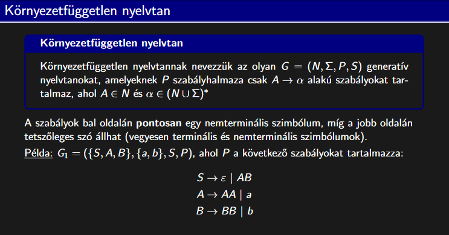
  
  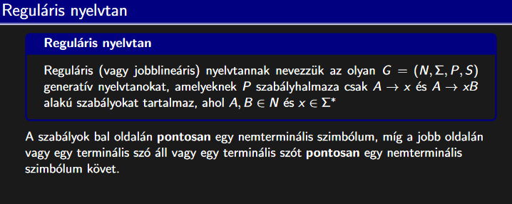
  
  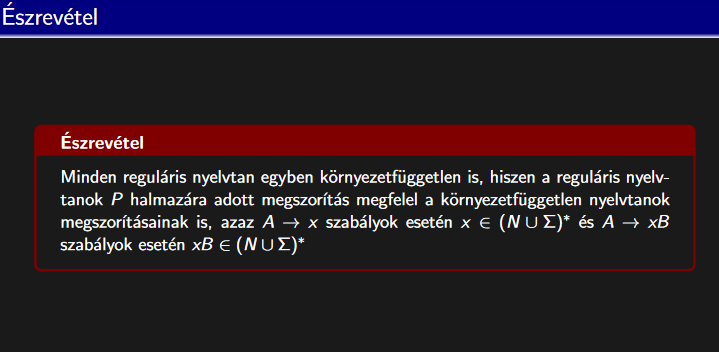
  
  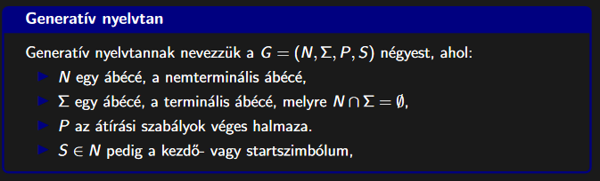
  
  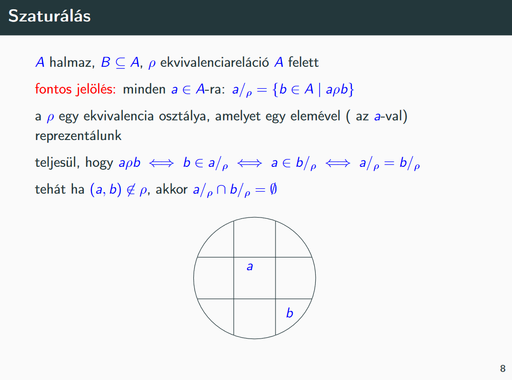
  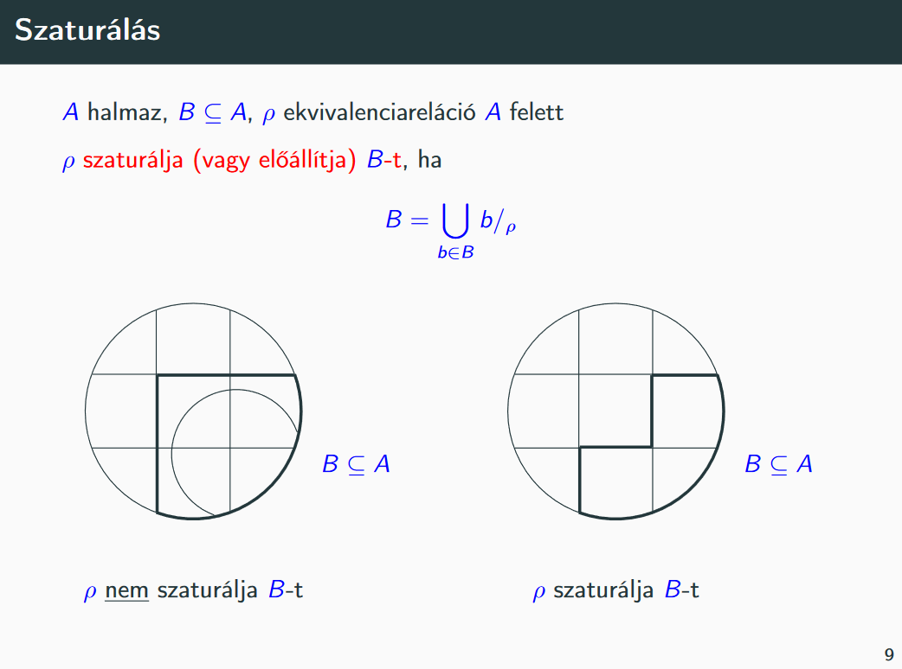
  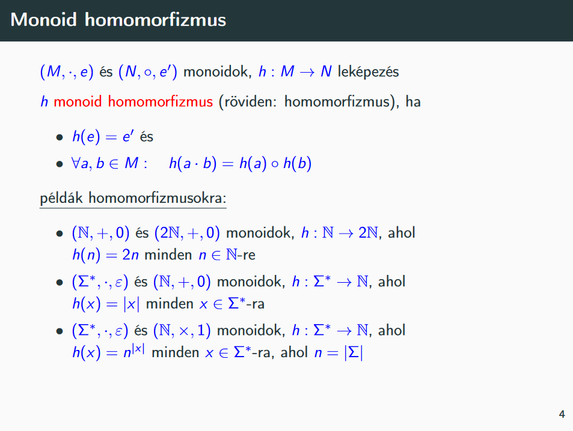
  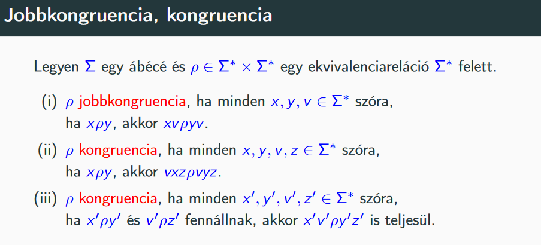
  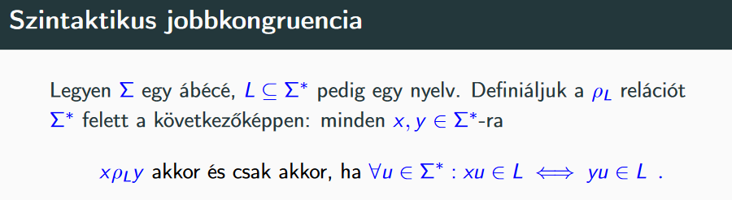
  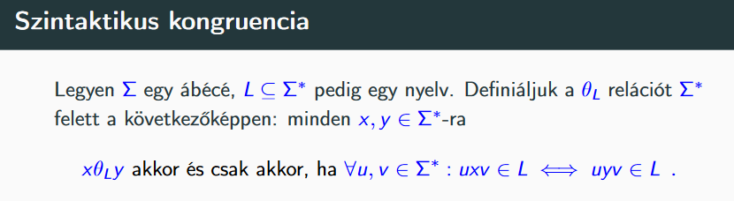
  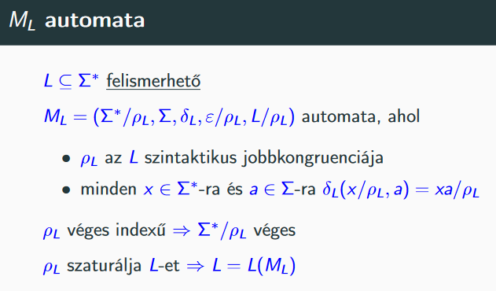
  
  A képen az M<sub>L</sub>​ automata leírása látható, amely egy speciális típusú automata, amelyet egy adott nyelv, L, felismerésére használnak. Az M<sub>L</sub>​ automata a következő részekből áll:
  
  - **Állapotok:** Az állapotok halmaza Σ∗/ρ<sub>L</sub>​ a Σ<sup>∗</sup> karakterláncokon értelmezett ρL​ reláció szerinti osztályokból áll. Itt ρ<sub>L​</sub> a nyelv L szintaktikus jobbkongruenciája, amely egy olyan ekvivalencia reláció, amely szerint két sztring ekvivalens, ha bármely szó hozzáfűzésével a nyelvben maradnak vagy együtt kilépnek belőle.
  
  - **Ábécé:** Σ, amely az automata által felismert szimbólumok halmazát jelenti.
  
  - **Átmenetifüggvény:** δL​, amely meghatározza az állapotátmeneteket. A függvény egy adott állapotból (ami egy ekvivalenciaosztály) és egy karakterből kiindulva meghatározza a következő állapotot (szintén egy osztály). A definíció szerint δL​(x/ρL​,a)=xa/ρL​, tehát ha x egy osztályt képvisel, és a egy karakter, akkor az xa konkatenációjának osztálya adja a következő állapotot.
  
  - **Kezdőállapot:** ϵ/ρL​, ami az üres sztring osztálya.
  
  - **Elfogadó állapotok:** L/ρL​, amelyek azokat az osztályokat tartalmazzák, amelyek olyan sztringekből állnak, amelyek elemei a L nyelvnek.
  
  További fontos jellemzők:
  
  - **Véges indexű:** Σ∗/ρL​ véges, ami azt jelenti, hogy véges számú ekvivalenciaosztály van, így az automata állapotainak száma is véges.
  
  - **Szaturálja L-et:** A ρL​ reláció szaturálja az L nyelvet, ami azt jelenti, hogy az L nyelv pontosan azokból a szavakból áll, amelyeket az ML​ automata elfogad. Ezért ρL​ teljes mértékben kompatibilis L-lel, tehát L pontosan az ML​ által elfogadott szavak halmaza.

- **Monoid**:
  
  - Az algebra egyik alapvető struktúráját jelöli, amely magában foglal egy halmazt és egy, a halmazon értelmezett asszociatív bináris műveletet. Ezenkívül a monoidnak rendelkeznie kell egy olyan egységelemmel, amely a művelet szempontjából neutrális, vagyis amikor bármely elemmel kombinálják a művelet során, az eredeti elemet adja vissza. Tehát egy monoidot a következő tulajdonságok definiálják:
    
    1. **Halmaz**: Legyen M egy nem üres halmaz.
    2. **Bináris Művelet**: Legyen ⋅ egy bináris művelet M halmazon, tehát ⋅:M×M→M. Ez a művelet minden a,b∈M esetén meghatározza a⋅b-t, ami szintén M-ben van.
    3. **Asszociativitás**: A művelet asszociatív, ami azt jelenti, hogy minden a,b,c∈M esetén teljesül az (a⋅b)⋅c=a⋅(b⋅c) egyenlőség.
    4. **Egységelem**: Létezik egy e∈M elem (nevezik egységelemnek vagy neutrális elemnek), amelyre minden a∈M esetén teljesül, hogy e⋅a=a⋅e=a.
    
    ### Példák Monoidokra
    
    - **Számok összeadása**: A természetes számok (N) halmaza az összeadás műveletével monoidot alkot, ahol az egységelem az 0, mert 0+a=a+0=a minden a∈N esetén.
    - **Számok szorzása**: A pozitív egész számok (N+) szorzása szintén monoid, az egységelem itt az 1, mivel 1⋅a=a⋅1=a minden a∈N+ esetén.
    - **Sztringek konkatenációja**: A sztringek halmaza (például az ASCII karakterekből álló sztringek) a konkatenáció műveletével monoidot alkot, ahol az egységelem az üres sztring (""), mert bármely sztring konkatenálása az üres sztringgel önmagát adja eredményül.

### 

# 1. Automaták minimalizálása

Egy M automatát minimálisnak nevezünk, ha bármely vele ekvivalens M ′ automata esetén M -nek legfeljebb annyi állapota van, mint M ′-nek.

ϕ = fí

**<u>Minimális automata egyértelműségének bizonyítása</u>**

1. **Automata Definíciója és δ∗ Jelölés**:
   
   - M=(Q, Σ, δ, q<sub>0</sub>​, F) egy véges automata.
   - δ<sup>∗</sup>(q,x)=qxM​ azt az állapotot jelöli, amelybe az M automata a q állapotból az x szó (bemeneti sztring) hatására kerül. Ez kiterjeszti a δ tranzíciós függvényt, hogy szavakat (nem csak szimbólumokat) is kezeljen.

2. **Összefüggő Automata**:
   
   - Az M′ automata, amely M összefüggő része, a következőkből áll: 
     M′=(Q′,Σ,δ′,q<sub>0</sub>​,F′).
   - Q′={q<sub>0</sub>​x ∣ x∈Σ<sup>∗</sup>} az összes olyan állapot, amit a kezdőállapotból elérhetünk, bármilyen Σ<sup>∗</sup>-beli szóval.
   - δ′ az M tranzíciós függvényének megszorítása az Q′-beli állapotokra.
   - F′=F∩Q′ az elfogadó állapotok az M′ automata számára.
   - Ha M összefüggő, az azt jelenti, hogy az M automata minden állapota elérhető a kezdőállapotból.

3. **Homomorfizmus és Izomorfizmus**:
   
   - Két automata közötti leképezést ϕ: Q → Q′ homomorfizmusnak nevezzük, ha teljesülnek a következő feltételek:
     1. ∀q ∈ Q, a ∈ Σ: ϕ(δ(q, a)) = δ′(ϕ(q), a), ami azt jelenti, hogy ϕ "megőrzi" a tranzíciós viselkedést.
        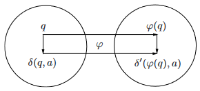
        Ha az M automata q állapotából a a szimbólum hatására egy új állapotba (δ(q,a)) lép, és ezt az állapotot leképezzük a ϕ függvénnyel, akkor az eredményül kapott állapotnak meg kell egyeznie azzal az állapottal, amibe az M′ automata az M automata q állapotának képe (ϕ(q)) és az a szimbólum alkalmazása után lép.
     2. ϕ(q<sub>0​</sub>)=q<sub>0</sub>′​, azaz a kezdőállapotok megfelelnek egymásnak.
     3. ϕ<sup>−1</sup>(F′)=F, az elfogadó állapotok megőrzése. (Végállapotot végállapotba, kezdőállapotot kezdőállapotba visz)
        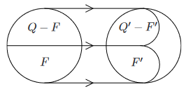
   - Ha ϕ ráképezés, akkor azt mondjuk, hogy M ′ az M homomorf képe. Ha ϕ bijekció, akkor izomorfizmusnak hívjuk és azt mondjuk, hogy M és M′ izomorfak, jele M ∼= M ′
   - Bizonyítható, hogy ha ϕ homomorfizmus, akkor az (1) tulajdon-
     ság nemcsak egy a ∈ Σ input szimbólumra, hanem tetszőleges x ∈ Σ∗ szóra is teljesül: minden q ∈ Q állapot esetén ϕ(δ∗(q, x)) = δ′∗(ϕ(q), x).
   
   **Ha van M és M' között homomorfizmus akkor egy van (ha összefüggőek).**
   
   **Homomorfizmus M és M' között csak akkor van ha ugyanazt a nyelvet ismerik fel.**
- **Lemma**: Legyenek M = (Q, Σ, δ, q<sub>0</sub>, F ) és M′=(Q′, Σ, δ′, q′<sub>0</sub>, F ′) automaták. Ha van homomorfizmus M -ből M ′-be, akkor L(M ) = L(M ′).
  
  - ebből sejtehtő már hogy az $M_L$ lesz az $L$-et felsimerő minimális automata
  
  $M_L=(\Sigma^*/\rho_L, \Sigma, \delta_L, \epsilon/\rho_L, L/\rho_L)$
  
  - Nerode Myhill tétel: ha $L$ véges indexű akkor $\rho_L$ szintaktikus jobbkongruencia véges indexű
  
  - ($\rho$: ró)
  
  - $M_L$ állapotai $\rho_L$ osztályai (a $\Sigma^*$-ot $\rho_L$ véges sok osztályra bontja)
  
  - $\Sigma$ az inputhalmaz
  
  - $\delta_L$ az átmenetfüggvény
  
  - $\epsilon/\rho_L$ $\rho_L$-nek az az osztálya amelyik az üres szót tartalmazza
  
  - $L/\rho_L$ azon osztályok halmaza amelyek egyesítéseként az $L$ előáll (részhalmaza $\Sigma^*/\rho_L$-nek)
  
  - $\rho_L$ szaturálja $L$-et
  
  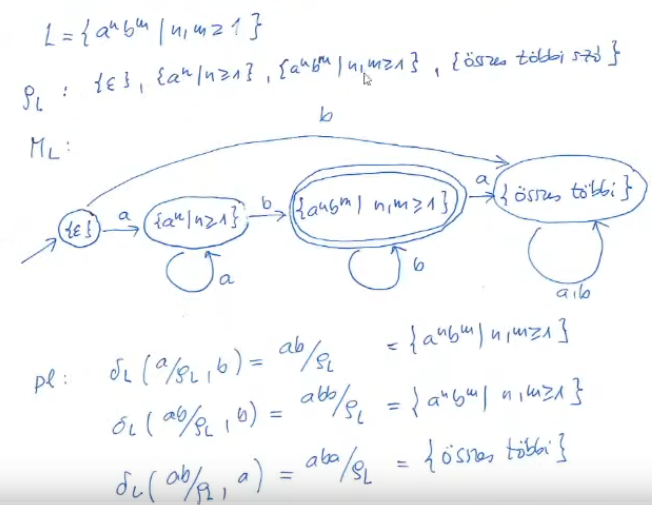
  
  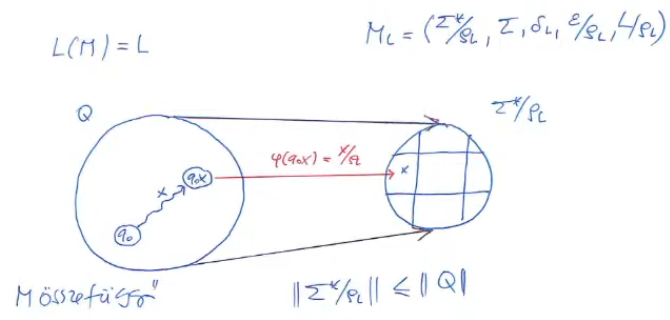

- Legyen L ⊆ Σ∗ egy tetszőleges felismerhető nyelv és tekintsük az
  ML = (Σ<sup>∗</sup>/ρ<sub>L</sub>, Σ, δ<sub>L</sub>, ε/ρ<sub>L</sub>, L/ρ<sub>L</sub>) automatát, ahol ρ<sub>L</sub> az L szintaktikus jobbkongruenciája és minden x ∈ Σ∗ esetén δL(x/ρ<sub>L</sub>, a) = xa/ρ<sub>L</sub>.
  
  - **Lemma:** M = (Q, Σ, δ, q<sub>0</sub>, F ) pedig tetszőleges összefüggő automata, amelyik L-et ismeri fel. Akkor M<sub>L</sub> az M homomorf képe.

**Tétel**. Legyen L ⊆ Σ<sup>∗</sup> egy felismerhető nyelv. Akkor

1) M<sub>L</sub> az L-et felismerő minimális állapotszámú automata.
2) Az L-et felismerő minimális automata izomorfizmus erejéig egyértelműen meghatá-
   rozott.

**Következmény**. Legyen L ⊆ Σ<sup>∗</sup> egy felismerhető nyelv és legyen K<sub>L</sub> = {M |
M automata és L(M ) = L}. Egy M<sub>0</sub> automata akkor és csak akkor minimális K<sub>L</sub>-ben,
ha minden K<sub>L</sub>-beli automata összefüggő részének homomorf képe.

#### A minimális állapotszámú automata algoritmikus meghatározása

#### Kongruencia automatákon

#### Definíció (2.19)

**(a) Legyen $ M = (Q, \Sigma, \delta, q_0, F) $** egy automata és **$ \rho \subseteq Q \times Q $** egy ekvivalenciareláció $ Q $-n.

A $ \rho $ egy kongruencia $ M $-en, ha:

1. **Átmeneti feltétel:**
   
   - $\forall p, q \in Q, \forall a \in \Sigma$-ra, ha $ p \rho q $, akkor $\delta(p, a) \rho \delta(q, a) $.
   - Ez azt jelenti, hogy ha két állapot $ p $ és $ q $ ekvivalens $ \rho $ szerint, akkor az $ a $ szimbólumra történő átmenet után is ekvivalensek maradnak.
   
   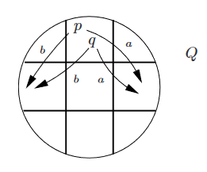

2. **Szaturálási feltétel:**
   
   - $ \rho $ szaturálja $ F $-et, azaz $\forall p, q \in Q$-ra ha $ p \rho q $, akkor $ p \in F \iff q \in F $.
   - Ez azt jelenti, hogy ha két állapot $ p $ és $ q $ ekvivalens $ \rho $ szerint, akkor mindkettő benne van vagy mindkettő nincs a végállapotok halmazában ($ F $).
   
   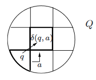

#### (b) Faktorautomata

Legyen $ M = (Q, \Sigma, \delta, q_0, F) $ egy automata, és $ \rho $ pedig egy kongruenciareláció $ M $-en. $ M $-nek a $ \rho $ által meghatározott faktorautomatája a következő automata: 

$ M / \rho = (Q / \rho, \Sigma, \delta_\rho, q_0 / \rho, F / \rho) $

- **Állapothalmaz ($ Q / \rho $)**: Az eredeti automata állapotainak ekvivalencia osztályai a $ \rho $ reláció szerint.
- **Ábécé ($ \Sigma $)**: Ugyanaz a bemeneti szimbólumkészlet, mint az eredeti automatáé.
- **Átmenetfüggvény ($ \delta_\rho $)**: Az új átmenetfüggvény, ahol $\delta_\rho([q], a) = [\delta(q, a)]$. Azaz az átmenet az ekvivalencia osztályok között történik.
- **Kezdőállapot ($ q_0 / \rho $)**: Az eredeti kezdőállapot ekvivalencia osztálya.
- **Végállapotok ($ F / \rho $)**: Az eredeti végállapotok ekvivalencia osztályai.

### Magyarázat

1. **Kongruencia $ M $-en:**
   
   - Egy ekvivalenciareláció $ Q $ halmazon akkor kongruencia az automatán, ha az átmenetek megőrzik az ekvivalenciát, és az ekvivalens állapotok vagy mindketten végállapotok, vagy egyikük sem.

2. **Faktorautomata:**
   
   - Az eredeti automata egyszerűsített változata, ahol az állapotok az eredeti automata állapotainak ekvivalencia osztályai. Ez az új automata ugyanúgy viselkedik, mint az eredeti, de kevesebb állapottal rendelkezik.

**Következmény:** Legyen $ M = (Q, \Sigma, \delta, q_0, F) $ egy automata, $ \rho $ pedig egy kongruenciareláció $ M $-en. Akkor $ L(M) = L(M / \rho) $.

#### 2.20. Lemma

Legyen $ M = (Q, \Sigma, \delta, q_0, F) $ egy automata.

#### (a) Állítás:

**Ha $ \rho $ kongruenciareláció $ M $-en, akkor $ M / \rho $ az $ M $ homomorf képe.**

#### (b) Állítás:

**Ha $ M' = (Q', \Sigma, \delta', q'_0, F') $ az $ M $ homomorf képe, akkor az $ M $ automatán van olyan $ \rho $ kongruencia, hogy $ M / \rho \cong M' $.** ($\cong$ : izomorf)

A kongruencia relációt $ker(\phi)$-vel jelölöm (fí)

#### Magyarázat

#### Homomorfizmus fogalma automaták között:

Egy homomorfizmus két automata között egy olyan leképezés, amely megőrzi az automata struktúráját, vagyis az állapotokat, átmeneteket, és a kezdő- és végállapotokat úgy képezi le, hogy az automata viselkedése megmarad.

#### (a) Állítás magyarázata:

- Ha $ \rho $ egy kongruenciareláció $ M $ automatán, akkor az $ M $ automata ekvivalenciaosztályok szerint való faktorizálása, $ M / \rho $, egy olyan automata, amely homomorf képe az $ M $ automatának.
- Ez azt jelenti, hogy van egy struktúramegőrző leképezés $ M $ és $ M / \rho $ között, amely megtartja az átmeneteket és az állapotok viselkedését.

#### (b) Állítás magyarázata:

- Ha van egy $ M' $ automata, amely homomorf képe az $ M $ automatának, akkor létezik egy $ \rho $ kongruenciareláció $ M $-n, amely alapján $ M $ faktorizálható úgy, hogy az $ M / \rho $ izomorf $ M' $-vel (azaz strukturálisan azonos vele).
- Más szavakkal, ha egy egyszerűsített verziója az $ M $ automatának homomorf képe, akkor létezik egy megfelelő kongruencia, amely ezt az egyszerűsítést pontosan létrehozza.


Van egy módszerünk arra, hogy egy automata minimális faktorautomatáját előállítsuk a homomorfizmus magja (kernel) alapján. Ez a faktorautomata minimális lesz, és felismeri az eredeti automata által elfogadott nyelvet. Az algoritmikus megközelítés lehetővé teszi a minimális automata hatékony kiszámítását.

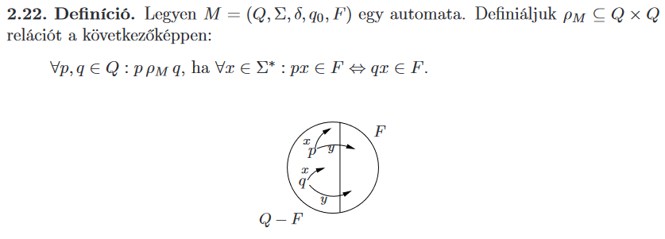

#### Algoritmus (egyszerűen leírva)

##### 1. Kezdeti felosztás

Először felosztjuk az automatát két állapotcsoportra: az elfogadó állapotokra és a nem elfogadó állapotokra. Ez a kezdeti felosztás kialakítja az algoritmus alapját.

##### 2. Finomítás

Ezt követően a felosztást finomítjuk. Ha bármely szimbólumra két állapot különböző csoportokba vezet, azokat külön csoportokba soroljuk. Ez a lépés addig ismétlődik, amíg a felosztás stabil nem lesz, azaz további finomítás már nem lehetséges.

##### 3. Átmenetifüggvény újradefiniálása

Az újonnan létrehozott állapotcsoportok alapján újra kell definiálni az átmenetifüggvényt, amely az eredeti automata átmeneteit tükrözi, de már az új, minimalizált állapothalmazon.

##### 4. Az új automatának tesztelése

Az algoritmus végén az új, minimalizált automata tesztelése történik meg, hogy megbizonyosodjunk arról, hogy azonos nyelvet ismer fel, mint az eredeti automata.

Példa: [Minimization of DFA (Example 2) - YouTube](https://www.youtube.com/watch?v=ex9sPLq5CRg&ab_channel=NesoAcademy)

#### Algoritmus

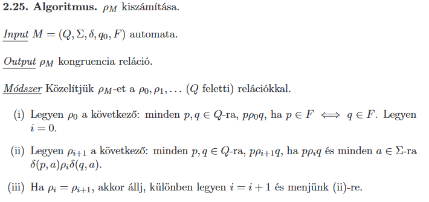

##### Bemenet

- **M = (Q, Σ, δ, q0, F)**: Egy determinisztikus véges automata, ahol:
  - **Q** az állapotok halmaza,
  - **Σ** az ábécé (bemeneti szimbólumok halmaza),
  - **δ** az átmenetifüggvény,
  - **q0** a kezdőállapot,
  - **F** az elfogadó állapotok halmaza.

##### Kimenet

- **ρ<sub>M</sub>**: A Q állapothalmaz feletti kongruenciareláció, amely az állapotok olyan csoportosítását adja meg, amelyek közötti átmenetek és elfogadó tulajdonságok azonosak maradnak.

##### Lépések

1. **Inicializáció (ρ<sub>0</sub>):** Kezdetben a ρ<sub>0</sub> relációt úgy állítjuk be, hogy két állapot, p és q, akkor van ρ0 relációban, ha mindkettő elfogadó vagy mindkettő nem elfogadó. Ez alapvetően a végső állapotok szerinti elsődleges csoportosítást jelenti.

2. **Iteratív Finomítás (ρ<sub>i</sub>+1):** Ezt követően iteratív lépésekben finomítjuk a relációt:
   
   - Minden iterációban (ρ<sub>i</sub>+1-nek meghatározása) a p és q állapotok közötti kapcsolatot úgy vizsgáljuk, hogy p és q az előző iterációban, ρ<sub>i</sub>-ben ekvivalensek voltak, és minden lehetséges bemeneti szimbólumra, a ∈ Σ-ra, a δ(p, a) és δ(q, a) által elért állapotok is ρi relációban állnak.

3. **Konvergencia Vizsgálata:** Az algoritmus akkor áll le, amikor a ρi reláció nem változik tovább, azaz ρ<sub>i</sub> = ρ<sub>i</sub>+1. Ez azt jelenti, hogy további finomítás már nem lehetséges, és a reláció stabilizálódott.

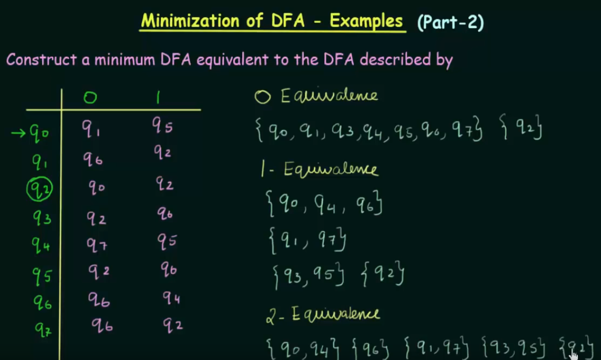

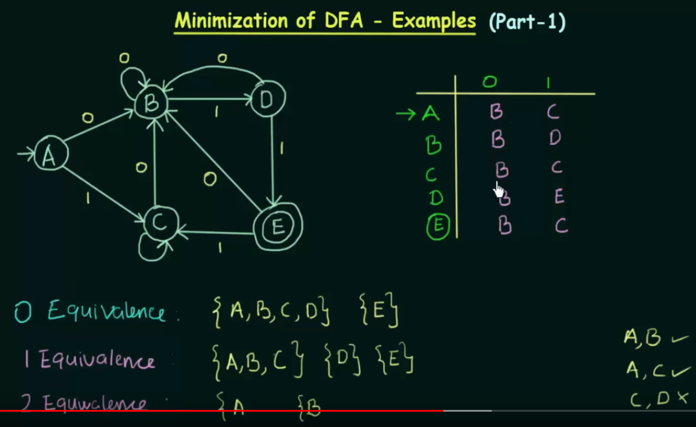

##### Terminálás és Korrektség

- **Terminálás:** Az algoritmus mindig megáll, mivel a relációk száma véges, és minden iterációban a reláció szigorodik vagy változatlan marad.
- **Korrektség:** A Lemma 2.26 biztosítja, hogy az algoritmus a megfelelő ρ<sub>M</sub> relációt számolja ki, azaz megtalálja azon állapotekvivalenciákat, amelyek fenntartása mellett az automata ugyanazt a nyelvet ismeri fel.

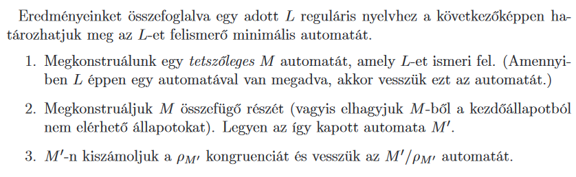

## 2. Parikh tétele és következményei.

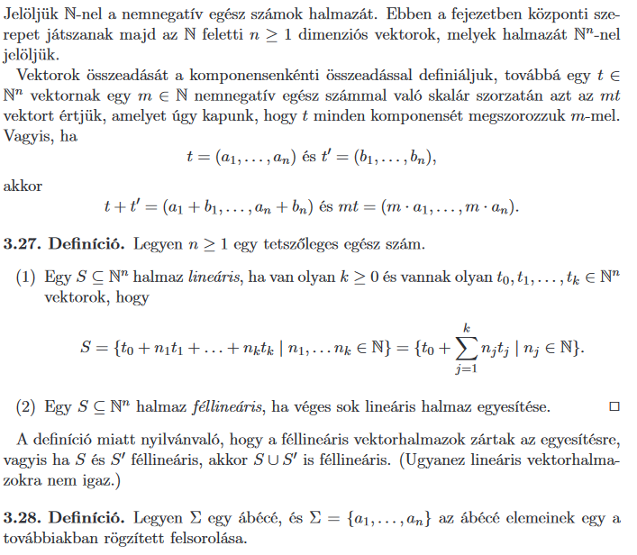

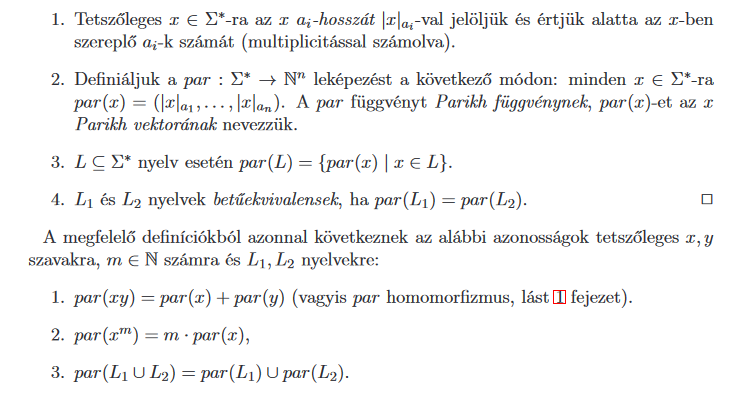

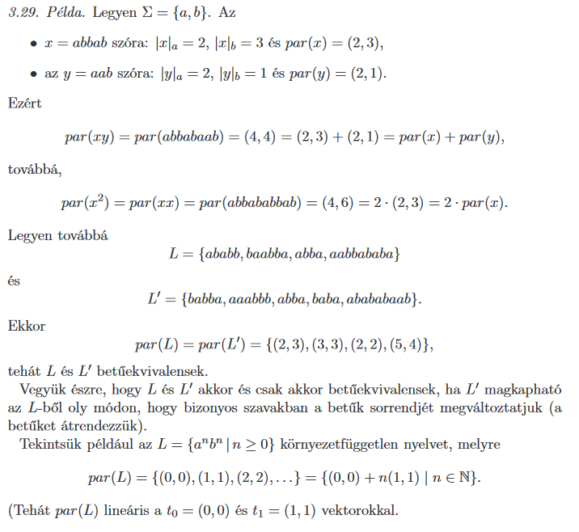

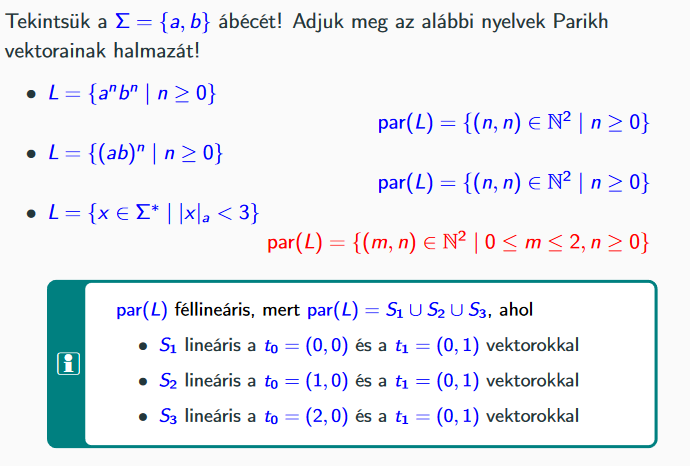

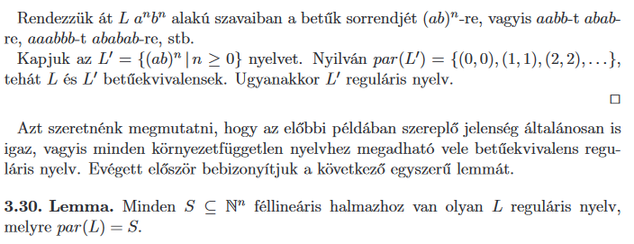

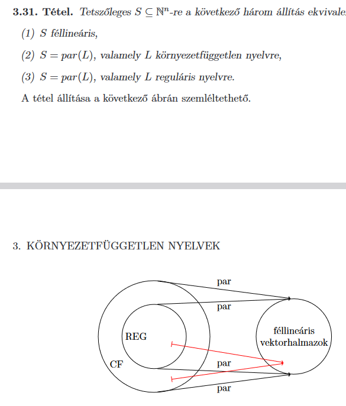

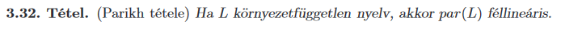

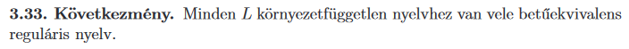

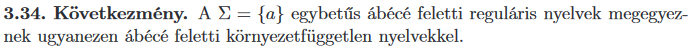

## Lineáris programozás alkalmazásai

##### Bevezető

*Példa:*

Az operációkutatás feladatának szemléltetéséhez tekintsük a következő gyakorlati
problémát. Adott egy műhely, amely asztalokat, székeket és szekrényeket gyárt. A
gyártás során kétféle anyagot használnak fel, egyfajta lemezt és egyfajta deszkát.
Ezek korlátozott mennyiségben állnak rendelkezésre.
A feladat: olyan termékösszetétel meghatározása, amely mellett a műhely nyeresége
maximális.
Ehhez egy matematikai modellt konstruálhatunk. Jelölje
𝑥<sub>1</sub>, 𝑥<sub>2</sub>, 𝑥<sub>3</sub> a gyártásra kerülő asztalok, székek, szekrények számát,
𝑙<sub>1</sub>, 𝑙<sub>2</sub>, 𝑙<sub>3</sub> egy asztal, egy szék, egy szekrény készítéséhez szükséges lemezek számát,
𝑑<sub>1</sub>, 𝑑<sub>2</sub>, 𝑑<sub>3</sub> egy asztal, egy szék, egy szekrény készítéséhez szükséges deszkák
számát,
𝑐<sub>1</sub>, 𝑐<sub>2</sub>, 𝑐<sub>3</sub> egy asztal, egy szék, egy szekrény gyártásából származó nyereséget,
𝑙, 𝑑 a rendelkezésre álló lemezek és deszkák számát.
A tekintett probléma egy úgynevezett optimumszámítási modellel írható le. Amely
matematikai szempontból egy feltételes szélsőérték feladat


##### 1.2 A modellalkotás elemei

A vizsgálat tárgyát képező tevékenységet felbontjuk véges sok, úgynevezett elemi
tevékenységre. Elemi tevékenységen a teljes tevékenység azt a pontosan körülhatárolt
részét értjük, amelyet tovább bontani már nem szándékozunk. Jelölje az elemi
tevékenységeket 𝐸<sub>1</sub>, . . . , 𝐸<sub>𝑛</sub>

Minden egyes 𝐸<sub>𝑖</sub> elemi tevékenységhez rendeljünk hozzá egy 𝑥<sub>𝑖</sub> valós változót, amely
azt reprezentálja, hogy 𝐸<sub>𝑖</sub> milyen mértékben vesz részt a teljes tevékenységben. Az 𝒙<sub>𝒊</sub>
változót az 𝐸<sub>𝑖</sub> elemi tevékenység szintjének, **intenzitásának** nevezzük. Példánkban a legyártandó termékek száma az illető elemi tevékenység intenzitása,
amelyeket az (𝑥<sub>1</sub>, 𝑥<sub>2</sub>, 𝑥<sub>3</sub>) vektorral írhatjuk le.

***Feltétel***: a döntési változókra vonatkozó  egyenletek vagy egyenlőtlenségek, amelyek korlátozzák azok lehetséges  értékeit.

***Lehetséges megoldás:*** egyrészt az 𝑥<sub>𝑖</sub> változókra (𝑖 = 1, . . . , 𝑛), másrészt az (𝑥<sub>1</sub>, ..., 𝑥<sub>𝑛</sub>), vektorváltozóra vonatkozó feltételeket kell meghatározni. Egy (<u>𝑥</u><sub>1</sub>, . . . , <u>𝑥</u><sub>n</sub>) valós
vektort a feladat lehetséges megoldásának nevezünk, ha 𝑥 az intenzitásértékekre
vonatkozó összes, az előzőekben meghatározott feltételt kielégíti. A lehetséges
megoldások halmazát a továbbiakban 𝐿-lel fogjuk jelölni.

***Célfüggvény:*** Fogalmazzuk meg ezt a célt, azaz adjunk meg egy olyan 𝑧: 𝐿 → V valós függvényt, amely a lehetséges megoldások "értékét", "jóságát" jellemzi a kitűzött cél szempontjából. A függvényt célfüggvénynek nevezzük.1.3 Az optimumszámítási modellekkel megadott matematikai feladatok megoldására

##### 1.3 Az optimumszámítási modellekkel megadott matematikai feladatok megoldására

𝐿 halmazon keressük a célfüggvény szélsőértékét. Maximumkeresés esetén
maximumfeladatról, minimumkeresésnél minimumfeladatról beszélünk.

Maximum feladatnál egy maximumhelyet optimális megoldásnak, a maximum értékét
pedig optimumnak nevezzük. (Ugyanezen elnevezéseket használjuk minimum feladat
esetén is.) Tehát 𝐱̅ ∈ 𝐿 optimális megoldása egy maximum feladatnak, ha 𝑧(𝐱̅ ) ≥ 𝑧(𝐱)
teljesül bármely 𝐱 ∈ 𝐿 lehetséges megoldásra, és ebben az esetben az optimum 𝑧(𝐱̅ ).

##### 2.2. A lineáris programozás általános feladata, standard feladat

# 

##### Áttekintés

A lineáris programozási feladat célja egy lineáris függvény maximumának vagy minimumának meghatározása adott lineáris feltételek mellett. Ezek a feltételek egyenlőségek vagy egyenlőtlenségek formájában jelennek meg. Mivel minden maximum probléma átalakítható egy minimum problémává (és fordítva), a továbbiakban csak minimum problémákkal foglalkozunk.

##### Minimum feladat formája

A lineáris programozási feladatok általános formája a következő:

$$
\begin{aligned}
& a_{11}x_1 + \dots + a_{1m}x_m \leq b_1 \\
& \vdots \\
& a_{k1}x_1 + \dots + a_{km}x_m \leq b_k \\
& a_{(k+1)1}x_1 + \dots + a_{(k+1)m}x_m = b_{k+1} \\
& \vdots \\
& a_{l1}x_1 + \dots + a_{lm}x_m = b_l \\
& a_{(l+1)1}x_1 + \dots + a_{(l+1)m}x_m \geq b_{l+1} \\
& \vdots \\
& a_{n1}x_1 + \dots + a_{nm}x_m \geq b_n \\
& \alpha + c_1x_1 + \dots + c_mx_m = z \rightarrow \min
\end{aligned}

$$

##### Mátrixos formában

Mátrixos és vektoros alakban a feladat a következőképpen írható fel:
$
\begin{aligned}
& A_1x \leq b^{(1)} \\
& A_2x = b^{(2)} \\
& A_3x \geq b^{(3)} \\
& \alpha + cx = z(x) \rightarrow \min
\end{aligned}
$
ahol $ A_1 $, $A_2 $, $A_3$ mátrixok, és $ b^{(1)} $, $ b^{(2)} $, $ b^{(3)} $ vektorok, valamint $ c $ a célfüggvény együtthatóit tartalmazza.

- $ A_1 $ mátrix: Ez a mátrix a $\leq$ típusú egyenlőtlenségek együtthatóit tartalmazza.
  
  Például, ha a feltételek a következők:
  
  $\begin{aligned}
   2x_1 + 3x_2 &\leq 5 \\
   4x_1 + x_2 &\leq 11
   \end{aligned}$
  
  akkor az ( A_1 ) mátrix:
  
  $A_1 = \begin{pmatrix}
   2 & 3 \\
   4 & 1
   \end{pmatrix}$
  
  és a ( b^{(1)} ) vektor:
  
  $b^{(1)} = \begin{pmatrix}
   5 \\
   11
   \end{pmatrix}$

- Többi ugyanígy, csak $\geq$ és $=$ tartamató feltételekkel

##### Vektor és mátrix méretek

Az egyes vektorokat és mátrixokat külön nem jelöljük meg sor- vagy oszlopvektorként, mivel a kontextusból ez egyértelmű. Például $ c = (c_1, ..., c_m) $ és $ x $ oszlopvektor, amelynek komponensei $ x_1, ..., x_m $. Az $ A_1 $ mátrix például $ k \times m $ méretű.

##### Feltételek normalizálása

Ha a feladatban az egyenlőségek vagy egyenlőtlenségek jobb oldala negatív, akkor ezeket megszorozhatjuk $-1$-gyel, hogy a feltételrendszer pozitív legyen. Ezáltal a feltételrendszerhez tartozó lehetséges megoldások halmaza nem változik, és a két feladat optimális megoldása megegyezik.

##### Nemnegatív változók bevezetése

A változók $ u $ és $ v $ nemnegatív különbségével újraírhatjuk a feladatot:
$
\begin{aligned}
& A_1(u - v) \leq b^{(1)} \\
& A_2(u - v) = b^{(2)} \\
& A_3(u - v) \geq b^{(3)} \\
& u \geq 0, v \geq 0 \\
& \alpha + c(u - v) = \tilde{z}(u, v) \rightarrow \min
\end{aligned}
$
Ez a formálás lehetővé teszi a lineáris programozási feladat megoldását nemnegatív változók használatával, ami egyszerűsíti a megoldási módszerek alkalmazását.

##### Eljárás a Standard Feladatra Való Visszavezetésre

1. lépés. Ha a megoldandó feladat maximum feladat, akkor szorozzuk meg a célfüggvényt −1-gyel, és keressük ennek az új célfüggvénynek a minimumát.
2. lépés. Ha szerepel negatív mennyiség a jobboldalon, akkor szorozzuk meg a megfelelő egyenlőséget vagy egyenlőtlenséget −1-gyel.
3. lépés. Ha szerepelnek olyan változók a feladatban, amelyekre nincs előírva
   nemnegativitási feltétel, akkor helyettesítsük rendre ezeket a változókat két nemnegatív változó különbségével.
4. lépés. Minden egyes egyenlőtlenség baloldalához adjunk hozzá illetve vonjunk ki egy nemnegatív változót attól függően, hogy a tekintett egyenlőtlenségben ≤ illetve ≥ szerepel, és változtassuk az egyenlőtlenségeket egyenlőségekre.

Két standard feladatot ekvivalensnek nevezünk, ha a lehetséges megoldások halmazai egybeesnek, és ezen a közös L halmazon a két célfüggvény megegyezik.

***Standard alak:***

$\begin{aligned}
& Ax = b \\
& x \geq 0 \\
& \alpha + cx = z(x) \rightarrow \min
\end{aligned}$

**Kanonikus alak:**

$\begin{aligned}
& A_1x \leq b^{(1)} \\
& A_2x = b^{(2)} \\
& A_3x \geq b^{(3)} \\
& x \geq 0 \\
& \alpha + cx = z(x) \rightarrow \min
\end{aligned}$

##### Szimplex Algoritmus

A szimplex algoritmus a lineáris programozási feladatok megoldására használt eljárás, amelyet George B. Dantzig fejlesztett ki. Az algoritmus lépésről lépésre javítja a célfüggvény értékét, amíg el nem éri az optimális megoldást. Az alábbiakban részletesen bemutatom a szimplex algoritmus lépéseit:

##### 1. lépés: Optimális megoldás ellenőrzése

- **Feltétel:** Ha a kanonikus alakú feladat célfüggvénye nem tartalmaz negatív együtthatót, akkor a bázismegoldás már optimális.
- **Teendő:** Ha nincs negatív együttható a célfüggvényben, az eljárás véget ér, és a jelenlegi megoldás optimális. Ha van negatív együttható, folytatjuk a 2. lépéssel.

##### 2. lépés: Belépő változó kiválasztása

- **Feltétel:** Vegyük a célfüggvény negatív együtthatói közül a legkisebbet (legnagyobb abszolút értékű negatív együttható). Jelölje $ c_j $ ezt az együtthatót.
- **Teendő:** 
  - Ha minden $ a_{rj} \leq 0 $ (ahol $ r = 1, ..., n $), akkor a célfüggvény alulról nem korlátos, és az eljárás véget ér, mert nincs optimális megoldás. 
  - Ellenkező esetben folytassuk a 3. lépéssel.

##### 3. lépés: Kilépő változó kiválasztása és generáló elem meghatározása

- **Feltétel:** Határozzuk meg a következő hányadosok minimumát: $ \min \{ b_r / a_{rj} : a_{rj} > 0, 1 \leq r \leq n \} $. Jelölje $ b_{k1} / a_{k1j}, ..., b_{ks} / a_{ksj} $ a minimummal egyenlő értékeket.
- **Teendő:** 
  - Válasszuk a legkisebb sorindexű $ a_{ktj} $ elemet generáló elemként (ahol $ t = 1, ..., s $).
  - Hajtsuk végre az alábbi átalakításokat:
    - Az $ r_k $ egyenlet új formája: $ r_k' = \frac{1}{a_{kj}} r_k $
    - Az összes többi egyenlet új formája: $ r_i' = r_i - \frac{a_{ij}}{a_{kj}} r_k $ (ahol $ 1 \leq i \leq n, i \neq k $)
    - A célfüggvény új formája: $ z' = z - \frac{c_j}{a_{kj}} r_k $
  - Folytassuk az eljárást az 1. lépéssel a kapott új kanonikus alakú feladattal.

**Lehetséges kanonikus alakú feladat:**

Egy standard feladatot lehetséges kanonikus alakú feladatnak nevezünk, ha sor- és oszlopcserékkel, valamint a változók átjelölésével az alábbi formában írható fel:

$\begin{aligned}
& x_1 + a_{1, n+1}x_{n+1} + \ldots + a_{1, n+m}x_{n+m} = b_1 \\
& x_2 + a_{2, n+1}x_{n+1} + \ldots + a_{2, n+m}x_{n+m} = b_2 \\
& \vdots \\
& x_n + a_{n, n+1}x_{n+1} + \ldots + a_{n, n+m}x_{n+m} = b_n \\
& x_j \geq 0 \quad (j = 1, \ldots, n + m), \quad b_i \geq 0 \quad (i = 1, \ldots, n) \\
& \alpha + c_{n+1}x_{n+1} + \ldots + c_{n+m}x_{n+m} = z(x) \rightarrow \min
\end{aligned}
$

Mitől lesz lehetséges kanonikus alakú?

1. **Egyenletek szerkezete**: Minden egyenletben a $ x_i $ változók különállóan szerepelnek az $ a_{i, n+1}x_{n+1}, \ldots, a_{i, n+m}x_{n+m} $ kifejezésekkel együtt. Ez azt jelenti, hogy a bal oldalon minden egyenlet egy változót tartalmaz az  $ x_1, x_2, \ldots, x_n $ közül, és minden ilyen változó együtthatója 1.

2. **Nemnegativitási feltételek**: Az összes változóra ($ x_j $) és az egyenletek jobb oldali értékeire ($ b_i $) nemnegativitási feltételek vonatkoznak.

3. **Célfüggvény**: A célfüggvény $ \alpha + c_{n+1}x_{n+1} + \ldots + c_{n+m}x_{n+m} $ formában van felírva, ahol a $ c $ együtthatók a célfüggvény együtthatói.

#### Példa átalakításra

Tegyük fel, hogy van egy standard lineáris programozási feladatunk:
$
\begin{aligned}
& 2x_1 + 3x_2 + x_3 = 5 \\
& x_1 + 2x_2 + 4x_3 = 6 \\
& x_1, x_2, x_3 \geq 0 \\
& z = x_1 + 4x_2 + 3x_3 \rightarrow \min
\end{aligned}
$

Ahhoz, hogy ezt lehetséges kanonikus alakú feladattá alakítsuk, szükség lehet sor- és oszlopcserékre, valamint a változók átjelölésére. Tegyük fel, hogy a jelenlegi formát át tudjuk alakítani úgy, hogy az egyenletek bal oldalán lévő változók mindegyikének együtthatója 1 legyen, és ezek különállóan szerepeljenek.

Az átalakítás után a lehetséges kanonikus alakú feladat így nézhet ki:

$\begin{aligned}
& x_1 + \frac{3}{2}x_2 + \frac{1}{2}x_3 = \frac{5}{2} \\
& x_2 + \frac{1}{2}x_1 + 2x_3 = 3 \\
& x_1, x_2, x_3 \geq 0 \\
& z = x_1 + 4x_2 + 3x_3 \rightarrow \min
\end{aligned}
$

**Bázisváltozó:** az egyenletek bal oldalán lévő változók

**Nem bázis változók:** a célfüggvényben lévő változók

**Degenerált bázismegoldás:** a bázisváltozók közük legalább az egyiknek értéke 0

##### Részletes Példa

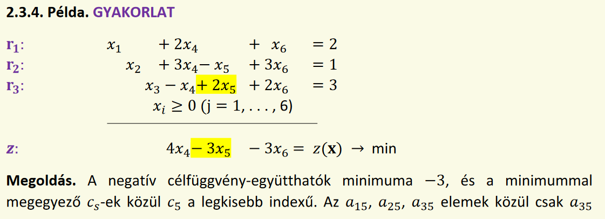

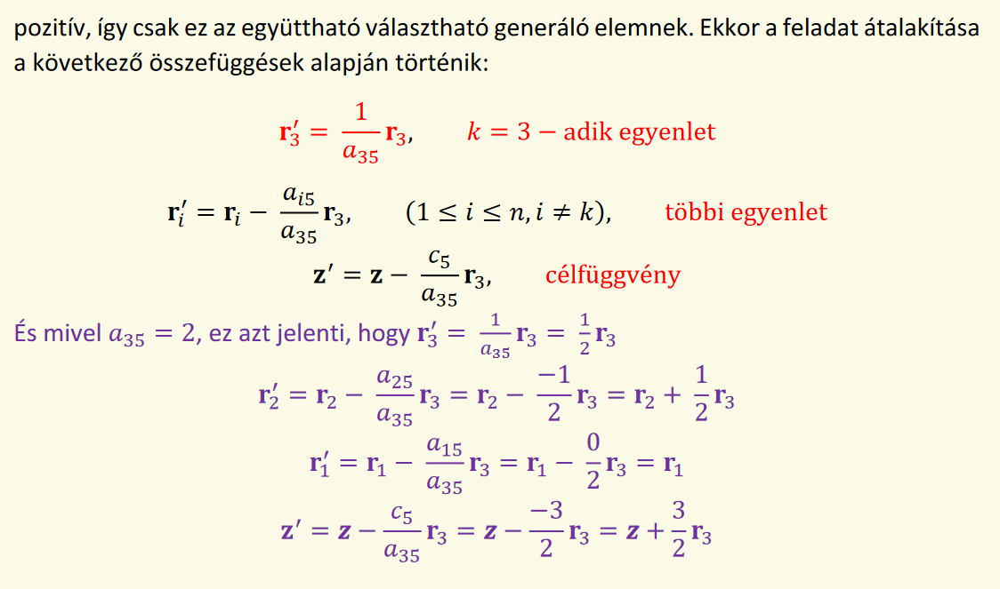


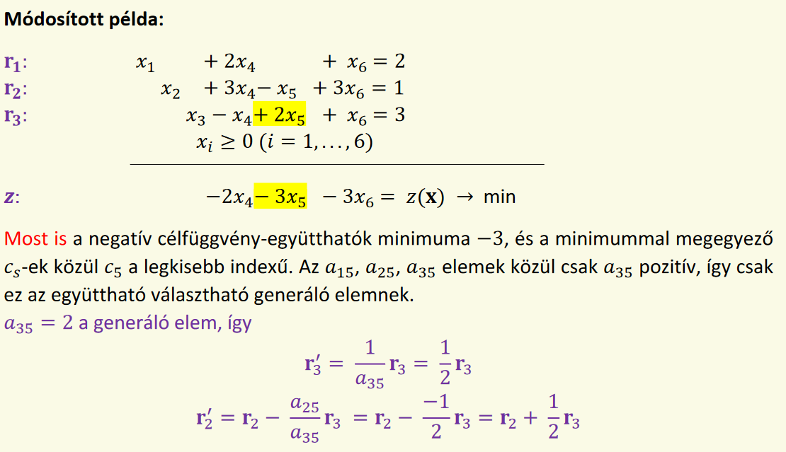

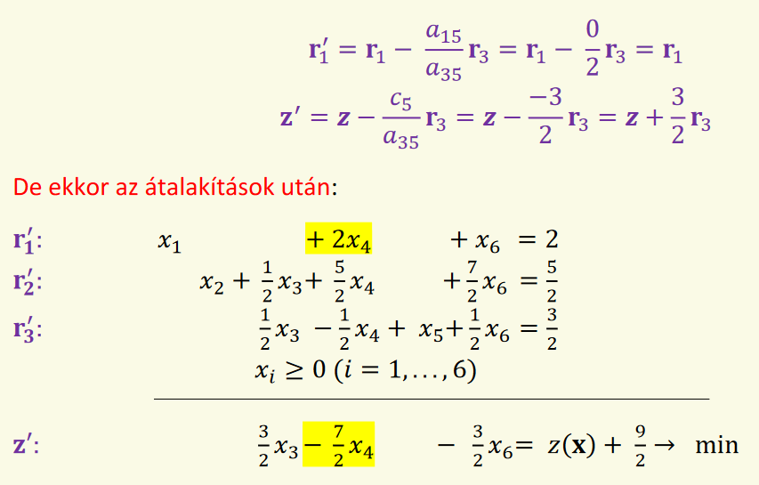

Magyarázat a $+9/2$-re a jobb oldalon: $0-(\frac{-3}{2}*3)$. Minden lépésnél a jobb oldalt is figyelembe kell venni! (Még fentebb számolódott)

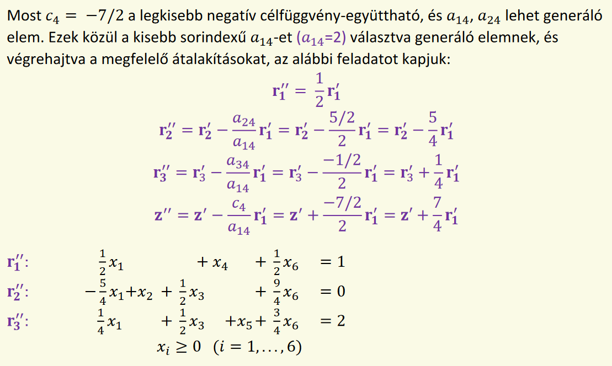

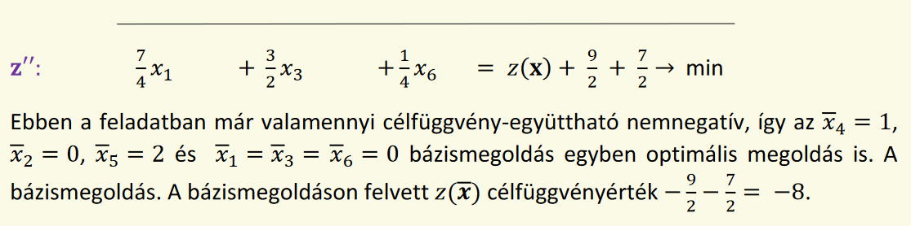

# 3. Dualitás, duális szimplex algoritmus. Egészértékű programozás

### Dualitás

A "dualizmus" rész részletesen tárgyalja a lineáris programozási feladatok közötti kapcsolatot. Minden lineáris programozási feladathoz hozzárendelhető egy másik, úgynevezett duális feladat, amely a következő tulajdonságokkal rendelkezik:

1. A duális feladat ugyanazokat a paramétereket tartalmazza, mint az eredeti (prímál) feladat.
2. A duális feladat duálisa megegyezik az eredeti feladattal.

##### Prímál és Duál Feladatok

A prímál feladat általános alakja:
$ Ax \leq b, \quad x \geq 0 $
$ cx = z(x) \to \max $

A hozzá tartozó duális feladat:
$ yA \geq c, \quad y \geq 0 $
$ yb = w(y) \to \min $

##### Dualitási Tételek

- **Gyenge dualitási tétel:** Ha $ x$ a prímál feladat lehetséges megoldása és $ y $ a duális feladat lehetséges megoldása, akkor $ z(x) \leq w(y) $.
- **Erős dualitási tétel:** Ha bármelyik feladatnak (prímál vagy duál) létezik optimális megoldása, akkor mindkettőnek létezik, és az optimumértékek megegyeznek.
- **Komplementaritási tétel:** $ x $ és $ y $ akkor és csak akkor optimális megoldások, ha $ y_i (b_i - \sum a_{it}x_t) = 0 $ minden $ i $-re és $ x_t (\sum a_{it} y_i - c_t) = 0 $ minden $ t $-re.
  
  (alternatívan: $y^T(b-Ax)=0$ és $x^T(A^Ty-c)=0$)

##### Következmények

- Ha a duális feladat célfüggvénye alulról nem korlátos, akkor a prímál feladatnak nincs lehetséges megoldása.
- A szimplex módszer használatával a prímál feladat megoldásának utolsó iterációjában kiolvasható a duális feladat egy optimális megoldása.

##### Példa primál és duál párra

A prímál feladat:
$ x_1 + x_2 \leq 5 $
$ x_1 + 3x_2 \leq 7 $
$ x \geq 0 $
$ 2x_1 + x_2 \to \max $

A duális feladat:
$ y_1 + y_2 \geq 2 $
$ y_1 + 3y_2 \geq 1 $
$ y \geq 0 $
$ 5y_1 + 7y_2 \to \min $

A fenti példák és tételek bemutatják, hogy a lineáris programozásban a prímál és duális feladatok hogyan kapcsolódnak egymáshoz, és hogyan lehet ezeket felhasználni optimális megoldások megtalálására.

##### Komplementaritási tétel használata ellenőrzésre

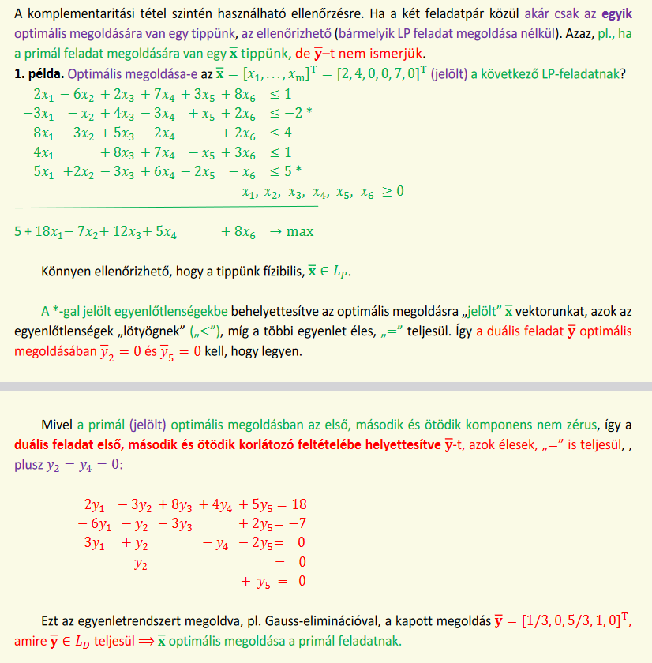

Kiegészítés:

$\begin{aligned}
2(2) - 6(4) + 2(0) + 7(0) + 3(7) + 8(0) &= 4 - 24 + 0 + 0 + 21 + 0 = 1 \\
-3(2) - 1(4) + 4(0) - 3(0) + 1(7) + 2(0) &= -6 - 4 + 0 - 0 + 7 + 0 = -3 \quad (*) \\
8(2) - 3(4) + 5(0) - 2(0) + 2(0) &= 16 - 12 + 0 - 0 + 0 = 4 \\
4(2) + 8(0) + 7(0) - 1(7) + 3(0) &= 8 + 0 + 0 - 7 + 0 = 1 \\
5(2) + 2(4) - 3(0) + 6(0) - 2(7) - 1(0) &= 10 + 8 - 0 + 0 - 14 - 0 = 4 \quad (*) \\
\end{aligned}$

Megjegyzés: a primál feladat 1., 2. és 5. sorai lettek transzponálva a duális feladathoz, mivel az $x$ vektorban (a tippelt megoldásban) azok az értékek nem nullák

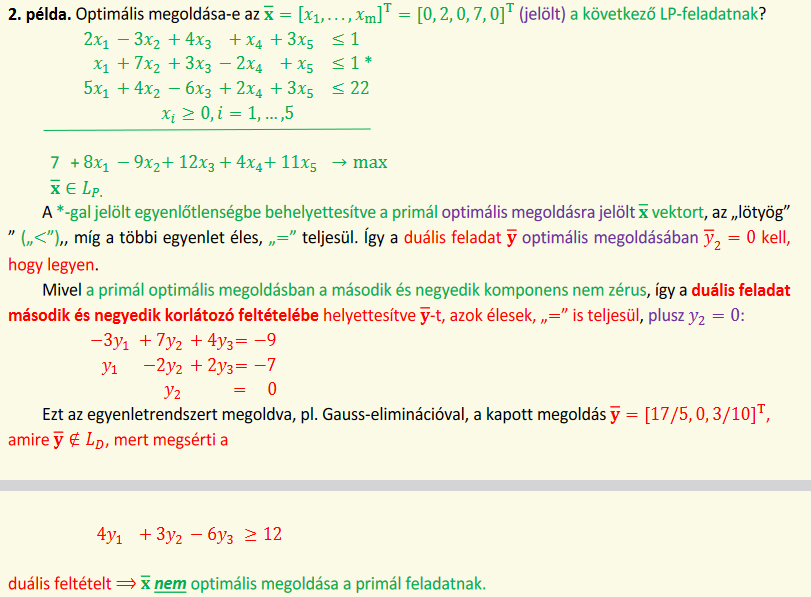

Megjegyzés: nem feltétlen kell elég az $y_2=0$ feltétel.

**Mikor lehet érdemes áttérni a duális feladatra és azt megoldani?**

- Tapasztalati megfigyelés. A szimplex algoritmus megoldása során az iterációszám a sorok (korlátozó feltételek) 𝑛 számával arányos. Így, ha egyébként más nem motivál minket, választhatjuk a kevesebb sorból álló (kevesebb korlátozó feltételt tartalmazó) feladatot.

- Ha primál feladatban negatív jobboldalak vannak, és kétfázisú szimplex módszert kellene használni, a duális feladatban meg nem, ez is indokolhatja, hogy inkább a duál feladat megoldását választjuk.

- Ha új sorokat (korlátozó feltételeket) kell hozzáadni a primál feladat feltételrendszeréhez. Egy gyakorlati feladatnál ez nem ritka, hogy menet közben új feltételeket kell hozzávenni az LP-hez.

##### Árnyékár

A **dualitás** gazdasági értelmezése során a primál probléma egy gyártási terv modellje, ahol m terméket állítanak elő n erőforrás felhasználásával. A cél a profit maximalizálása az erőforrások korlátozott rendelkezésre állása mellett. 

###### Primál Probléma

A primál probléma a következő egyenletekből áll:

- $ A x \leq b $
- $ x \geq 0 $
- $ z = c^T x \rightarrow \max $

###### Duális Probléma

A duális probléma ehhez kapcsolódva:

- $ A^T y \geq c $
- $ y \geq 0 $
- $ b^T y = w(y) \rightarrow \min $

###### Árnyékár (Marginal Price)

Az árnyékár, más néven marginális ár, egy erőforrás értékét jelenti a gyártó számára, és kifejezi, hogy mennyivel nő a profit, ha egy egységgel növeljük az adott erőforrás mennyiségét. Ezt Paul Samuelson nevezte el árnyékárnak, és ez a primál-duál optimális megoldások közötti kapcsolat révén értelmezhető.

###### Gazdasági Következmények

- Az árnyékár az az ár, amelyet a gyártó maximálisan megfizethet egy erőforrásért.
- Ha az erőforrás piaci ára alacsonyabb, mint az árnyékár, érdemes megvásárolni azt a termelés bővítéséhez.
- Ha a piaci ár magasabb, akkor érdemes eladni az erőforrást vagy csökkenteni a termelést.

###### Érzékenységvizsgálat

Az érzékenységvizsgálat elemzi, hogy az LP feladat paramétereinek változása hogyan befolyásolja az optimális megoldást és az optimális értéket. Ez különösen fontos lehet új tevékenységek bevezetésekor vagy meglévő paraméterek módosításakor.

###### Fontos Megjegyzések

- Az árnyékár fogalma csak addig érvényes, amíg az adott bázis optimális marad.
- Az optimális megoldás szerkezete és értékei változhatnak a paraméterek változásával.

### Duális szimplex algoritmus

A duális szimplex algoritmus olyan típusú feladatok megoldására alkalmazható, amelyek az alábbi formában adottak:
$ E y + A x = b, \, x \geq 0, \, y \geq 0 \, (c \geq 0) $
$ c^T x = z \rightarrow \min $

**Lépések**:

1. **Első lépés**: Ha a feladat egyenleteinek jobboldalai nemnegatívak, az eljárás véget ér (STOP1), a feladat bázismegoldása optimális megoldás.

2. **Második lépés**: Válasszuk ki a negatív $ b_t $-k minimumát (a jobboldalon), és jelölje $ b_k $ a minimummal megegyező $ b_t $-k közül a legkisebb indexűt. Ha $ a_{ks} \geq 0 \, (s = 1, \ldots, m) $, az eljárás véget ér (STOP2), mivel a feladatnak nincs lehetséges megoldása. Ellenkező esetben a harmadik lépés következik.

3. **Harmadik lépés**: Ha $ \min \left\{ \frac{c_s}{-a_{ks}} \colon a_{ks} < 0, \, 1 \leq s \leq m \right\} = \frac{c_{j1}}{-a_{kj1}} = \ldots = \frac{c_{jr}}{-a_{kjr}} $, akkor válasszuk az $ a_{kjt} $ elemek közül a legkisebb oszlopindexűt generáló elemnek, majd hajtsuk végre az előírt átalakításokat (képen lentebb). Az új feladattal folytassuk az eljárást az első lépéssel (GOTO 1).
   
   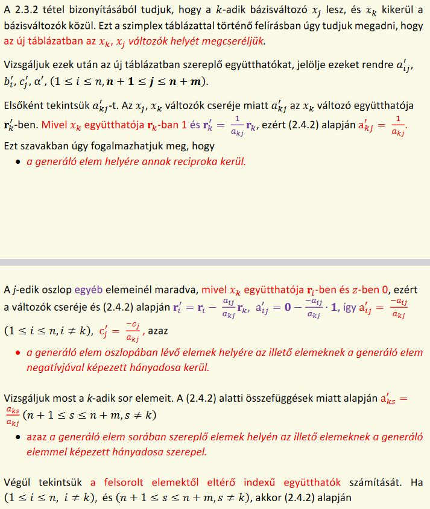
   
   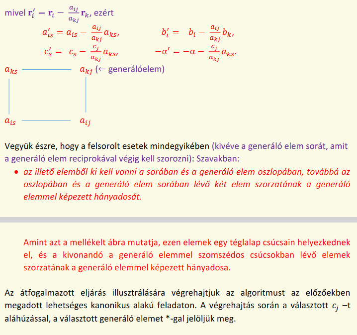

#### Példa

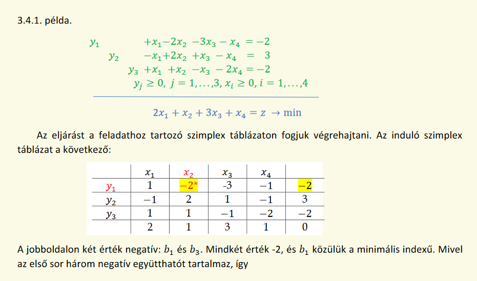

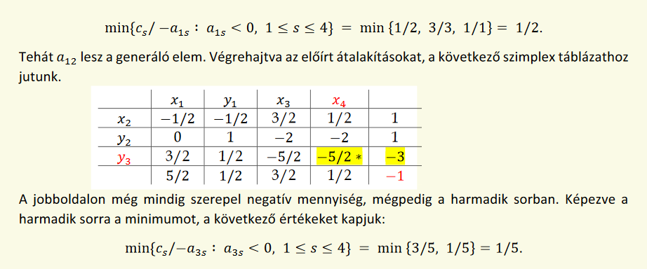

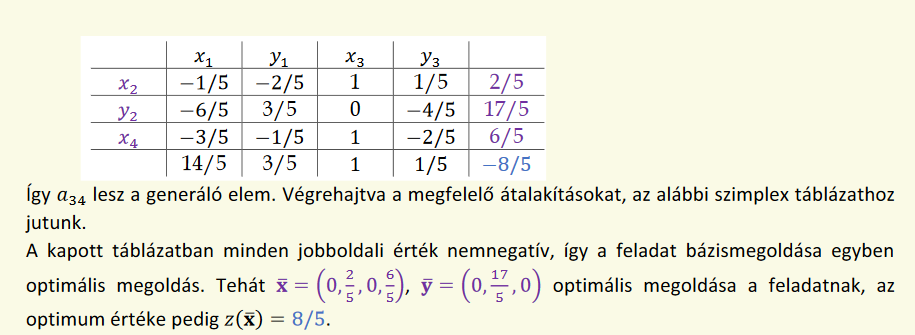

**Algoritmus előnyei:**

1. **Jobboldali vektorral szembeni rugalmasság**: Az algoritmus alkalmazható olyan esetekben is, amikor a jobboldali $ b $ vektor nemnegativitása nincs biztosítva, hanem a célfüggvény-együtthatók $ c $ vektorának nemnegativitása a kritérium.

2. **Optimális megoldás leolvasása**: A duális szimplex algoritmus végén kapott szimplex táblázatból közvetlenül leolvasható az eredeti feladat optimális megoldása, mivel a szimplex táblázatok csak elrendezési és előjelbeli különbségeket mutatnak.

3. **Kétfázisú módszer helyett egyszerűbb megoldás**: Bizonyos esetekben, például amikor a (3.2.1) primál feladatban negatív jobboldali elemek vannak, a kétfázisú szimplex módszer alkalmazása helyett a duális szimplex algoritmus egyszerűbb megoldást kínál.

4. **Iterációszám csökkentése**: Tapasztalati megfigyelések szerint a szimplex algoritmus iterációszáma arányos a sorok (korlátozó feltételek) számával. Ha a primál feladatnak több korlátozó feltétele van, mint a duál feladatnak, akkor érdemes lehet a duál feladatot megoldani, amely kevesebb iterációt igényel.

### Egészértékű programozás, Gomory-módszer (cutting plane method – metsző sík módszer, Ralph Gomory – 1958)

#### Az alapfeladat és relaxációja

Az egészértékű programozás (ILP - Integer Linear Programming) lineáris programozási változatával foglalkozik a dokumentum. Az alábbi típusú feladatokat vizsgálja:

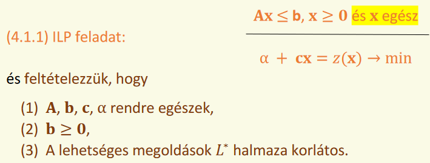

Feltételezzük, hogy $\mathbf{A}$, $\mathbf{b}$, $\mathbf{c}$, és $\alpha$ egész számok, $\mathbf{b} \geq 0$, és a lehetséges megoldások halmaza korlátos.

#### Branch and Bound

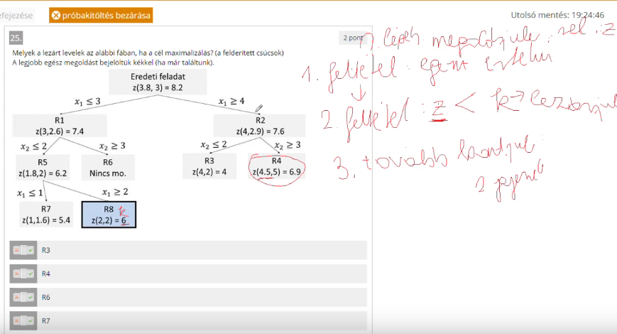

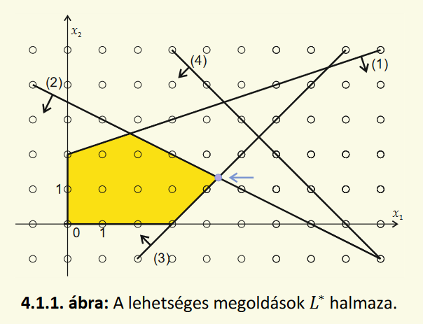

#### Gomory-módszer

A Gomory-módszer egy metszési eljárás, amelynek célja az ILP feladat megoldása a következő módon:

1. **Relaxáció:** A probléma egészértékűségi feltételének elhagyása után oldjuk meg a relaxált LP feladatot. Ha az optimális megoldás egész, akkor ez az ILP megoldása is.
2. **Metszési síkok bevezetése:** Ha a relaxált LP megoldása nem egész, akkor további feltételekkel bővítjük a feladatot. Ezeket a feltételeket metszési síkoknak nevezik, amelyek nem vágnak le egész megoldásokat.
3. **Iteráció:** A metszési síkokat addig adjuk hozzá, amíg az aktuális relaxált feladat optimális megoldása egész lesz.

#### Gomory-féle metszési eljárás lépései:

1. **Előkészítő rész:** Oldjuk meg a relaxált feladatot a szimplex algoritmussal. Ha az optimális megoldás egész, akkor vége az eljárásnak. Ellenkező esetben az iterációs eljárás következik.
2. **Iterációs rész:** Vegyük az első olyan egyenletet, amelyben a bázisváltozó nem egész. Ebből az egyenletből képezzünk egyenlőtlenséget, és vegyük ennek a Gomory-metszetét. Szorozzuk az egyenlőtlenséget −1-gyel, és vezessünk be egy új változót. Az így kapott egyenlettel bővítsük a feladatot, majd oldjuk meg a duális szimplex algoritmussal. Ha az optimális megoldás egész, akkor vége az eljárásnak. Ellenkező esetben folytatjuk az iterációt.

#### Példa az eljárásra:

Az egyik példában, amikor a szimplex táblázat egy változója nem egész, például $ x_2 $, a következő metszési feltételt kapjuk:

$x_2 - \frac{1}{2}u_1 + \frac{1}{2}y_2 \geq \frac{1}{2}
$

Az iteráció során ezeket a feltételeket bevezetve és a duális szimplex algoritmust alkalmazva végül egy egész megoldáshoz jutunk.


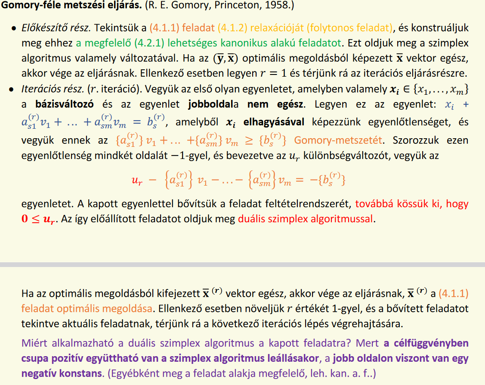

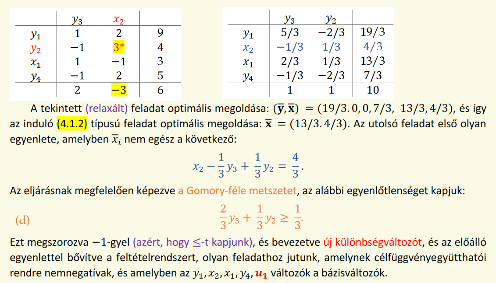

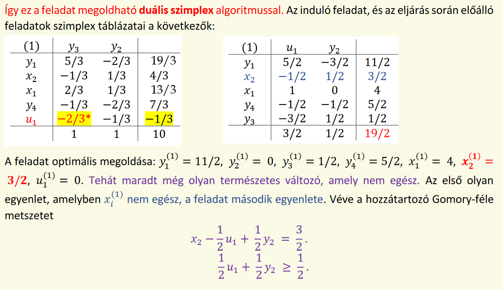


#### Hátrányok:

- Nagy iterációs lépésszám, amely a feladat méreteitől függően növekszik.
- A feladat méretének növekedése minden egyes lépésben.
- Számítástechnikai nehézségek, mint például a kerekítési hibák, amelyek az együtthatók egész vagy nem egész voltának eldöntését komplikálják.

A Gomory-módszer jelentős hozzájárulás az egészértékű programozás területén, különösen a metszési síkok módszerének kidolgozása révén.

#### Dual all-integer algorithm


# 4. Hozzárendelési és szállítási feladat

## Hozzárendelési feladat

A hozzárendelési feladat egy speciális egészértékű lineáris programozási probléma, amely számos gyakorlati alkalmazással rendelkezik. A legismertebb feladat a munkák optimális kiosztása adott számú dolgozó és ugyanennyi munka között, ahol minden dolgozó különböző költségekkel tudja elvégezni a feladatokat. A cél, hogy minden dolgozó pontosan egy munkát kapjon, az összes munkát kiosszák, és a munkavégzés összköltsége minimális legyen.

#### Formális Modell

Jelölések:

- $ n $ a dolgozók száma.
- $ c_{ij} $ az $ i $-edik dolgozó által végzett $ j $-edik munka költsége.
- $ x_{ij} = \begin{cases} 
  1, & \text{ha az } i \text{-edik dolgozó hajtja végre a } j \text{-edik munkát,} \\
  0, & \text{különben.}
  \end{cases} $

#### Észrevételek

- Minden dolgozó pontosan egy munkát fog végrehajtani, és minden munka kiosztásra kerül.
- A probléma megoldásai olyan 0 és 1 elemekből álló mátrixok, amelyek minden sora és oszlopa pontosan egy 1-est tartalmaz.
- Az ilyen mátrixok száma $ n! $, ami biztosítja, hogy mindig létezik optimális megoldás.
- A feladat költségmátrixa $ C $, amelyet $ H(C) $-vel jelölünk.

#### Magyar Módszer

A magyar módszer H. W. Kuhn által 1955-ben publikált algoritmus, amely lényegesen hatékonyabb a lehetséges mátrixok előállításánál és vizsgálatánál. Kuhn algoritmusa Egerváry Jenő és König munkáján alapul, akik a páros gráfok maximális párosítási problémáit vizsgálták.

#### Iterációs Eljárás

A magyar módszer iterációs eljárásának célja egy olyan mátrixsorozat előállítása, amely rendelkezik a következő tulajdonságokkal:

1. $ C \sim C(0) $

2. $ C(t) \sim C(t+1) $ minden $ t = 0, \ldots, k-1 $

3. $ C(t) \geq 0 $ minden $ t = 0, \ldots, k $

4. $ C(k) $-ban ki van jelölve egy $ n $-elemű független 0-rendszer.
- Egy mátrix valamely sorát (oszlopát) kötött sornak (oszlopnak) nevezzük, ha
  mellette (felette) egy „+” jel áll.

- A mátrix valamely elemét szabad elemnek nevezzük, ha nincs semmiféle jellel
  ellátva, és sem a sora, sem az oszlopa nincsen lekötve.

- Speciálisan, ha az illető (szabad) elem 𝟎, akkor szabad 𝟎-ról beszélünk.

- Végül használni fogjuk a 𝐂 ≥ 𝟎 jelölést, ha a C mátrix minden eleme nemnegatív.

A $ \mathbf{C} \sim \mathbf{D} $ jelölés azt jelenti, hogy a $\mathbf{C}$ és $\mathbf{D}$ mátrixok ekvivalensek. Két mátrix ekvivalens, ha léteznek olyan $\alpha_i$ (sor állandók) és $\beta_j$ (oszlop állandók) valós számok, amelyek kielégítik a következő feltételt minden $ 1 \leq i \leq n $ és $ 1 \leq j \leq m $ indexpárra:

$ c_{ij} = d_{ij} + \alpha_i + \beta_j $

Ez azt jelenti, hogy a $\mathbf{C}$ mátrix elemei az $\mathbf{D}$ mátrix elemeiből úgy állíthatók elő, hogy hozzáadunk egy-egy állandót minden sor és minden oszlop elemeihez.

### Alkalmazás

Az ekvivalencia reláció $( \mathbf{C} \sim \mathbf{D} )$ használata lehetővé teszi, hogy a hozzárendelési feladat különböző költségmátrixokkal is megoldható legyen, ugyanazon eljárás alapján. Az ekvivalencia segít az optimalizálási folyamatban, mivel egyszerűsíthetjük a mátrixot anélkül, hogy megváltoztatnánk az eredeti probléma megoldását.


#### Lépések

1. Előkészítés: Minden sorból és oszlopból vonjuk ki a minimum értéket, hogy $ C(0) $-t kapjuk.
2. Iteráció: 
   - Független 0-rendszert jelölünk ki.
   - Ha nincs elég független 0, akkor redukciós lépést alkalmazunk.
   - Megállás akkor, ha az \( n \) elemű független 0-rendszer kialakul.


**Példa:**


## Szállítási feladat

A szállítási probléma egy klasszikus optimalizálási probléma, amelynek célja a termékek egy vagy több forrásból egy vagy több célba történő szállításának költségminimalizálása. A feladat során figyelembe kell venni a források kapacitásait és a célok igényeit, valamint a szállítási költségeket.

A feladat megoldása lineáris programozási módszerekkel történik, és gyakran használnak különböző algoritmusokat, mint például a szimplex módszert vagy a speciális szállítási algoritmusokat, hogy megtalálják a legkisebb költséggel járó megoldást.

A feltöltött képen egy példafeladat látható. Nézzük meg részletesen ezt a példát:

### Példafeladat

A Powercónak 3 erőműtelepe van, amelyek 4 város szükségletét látják el. Az egyes erőművek adott mennyiségű (kWh) elektromos energiát képesek szolgáltatni. Adott az egyszerre megjelenő csúcsfogyasztási igény ezekben a városokban. 1 millió kWh áram szállítása egy erőműből egy városba a távolságuktól függ.

#### Adatok:

- 1. erőmű: 35 millió kWh
- 2. erőmű: 50 millió kWh
- 3. erőmű: 40 millió kWh

#### Városok csúcsigényei (millió kWh):

- 1. város: 45
- 2. város: 20
- 3. város: 30
- 4. város: 30

#### Szállítási költségek (1 millió kWh-ra, adott városba):

| Honnan/Város | 1. város | 2. város | 3. város | 4. város |
| ------------ | -------- | -------- | -------- | -------- |
| 1. erőmű     | 8        | 6        | 10       | 9        |
| 2. erőmű     | 9        | 12       | 13       | 7        |
| 3. erőmű     | 14       | 9        | 16       | 5        |

#### Feladat

Adjuk meg egy lineáris programozási feladatot (LP), ami minimalizálja a költséget, és a városok csúcsigényeit kielégíti!

### Matematikai Formuláció

#### Döntési változók

Legyen $ x_{ij} $ az a mennyiség, amelyet az $ i $-edik erőműből az $ j $-edik városba szállítanak.

#### Célfüggvény

Minimalizáljuk a teljes szállítási költséget:
$ \text{Minimize} \quad \sum_{i=1}^{3} \sum_{j=1}^{4} c_{ij} x_{ij} $
ahol $ c_{ij} $ az egységnyi költség az $ i $-edik erőműből az $ j $-edik városba szállítani.

#### Korlátok

1. Az erőművek kapacitásának korlátai:
   $ \sum_{j=1}^{4} x_{ij} \leq \text{Erőmű}_i \quad \forall i $
- 1. erőmű: $ x_{11} + x_{12} + x_{13} + x_{14} \leq 35 $

- 2. erőmű: $x_{21} + x_{22} + x_{23} + x_{24} \leq 50$

- 3. erőmű: $x_{31} + x_{32} + x_{33} + x_{34} \leq 40$
2. A városok igényeinek kielégítése:
   $\sum_{i=1}^{3} x_{ij} = \text{Város}_j \quad \forall j$
- 1. város: $ x_{11} + x_{21} + x_{31} = 45$

- 2. város: $x_{12} + x_{22} + x_{32} = 20$

- 3. város: $x_{13} + x_{23} + x_{33} = 30$

- 4. város: $x_{14} + x_{24} + x_{34} = 30$
3. Nemnegativitási feltételek:
    $x_{ij} \geq 0 \quad \forall i, j$ 

Ezekkel a korlátokkal és célfüggvénnyel megadható a szállítási probléma lineáris programozási modellje.


- Kétfázisú szimplex módszerrel megoldható, de degenerált a feladat a sok 0 miatt, így egyszerűbb módszer is adható.

- Ez lesz a disztribúciós módszer, vagy más néven szállítási szimplex módszer.

**Disztribúciós módszer**

A disztribúciós módszer, más néven a MODI (Modified Distribution) módszer, egy hatékony algoritmus a szállítási problémák optimalizálására. A módszer a kezdeti megoldás optimalizálását célozza, hogy elérjük a minimális költséget. A disztribúciós módszer a szállítási táblázatban történő allokációk elosztásának módosításával dolgozik.

### Lépések a Disztribúciós módszerhez

1. **Kezdeti megoldás meghatározása**:
   
   - Használjunk egy kezdeti megoldási módszert, mint például az Északi-sarkpont módszer, a Legkisebb költség módszer vagy a Vogel-approximitás módszer, hogy meghatározzuk a kezdeti alapvető megoldást.

2. **Potenciálok (u és v értékek) kiszámítása**:
   
   - A potenciálok $u_i$ és $v_j$ értékek segítségével kiszámítjuk az egyes cellák csökkentett költségeit. Kezdjük egy tetszőleges $u_i$ vagy $v_j$ értékkel, általában 0 -val.
   - Az összes potenciál értéket úgy kell meghatározni, hogy a foglalt cellák esetén teljesüljön a $ u_i + v_j = c_{ij} $ egyenlet, ahol $c_{ij}$ az adott cella költsége.

3. **Csökkentett költségek ($\Delta_{ij}$) kiszámítása**:
   
   - A csökkentett költséget a következőképpen számoljuk ki minden üres cellára: $ \Delta_{ij} = c_{ij} - (u_i + v_j) $.
   - Ha minden $\Delta_{ij} \geq 0$, akkor a jelenlegi megoldás optimális.

4. **Optimalizációs lépések végrehajtása**:
   
   - Ha van olyan cella, ahol $\Delta_{ij} < 0$, akkor egy zárt hurkot (loopot) keresünk, amely az üres cellából indul és visszatér oda.
   - Az egyes irányokban váltakozó \(+\) és \(-\) jelekkel végrehajtjuk a szükséges módosításokat, hogy csökkentsük a költségeket.

5. **Új megoldás kiszámítása**:
   
   - Frissítjük az allokációkat a zárt hurok mentén és újra számoljuk a potenciálokat.
   - Ismételjük meg a csökkentett költségek számítását és ellenőrizzük az optimalitást.

6. **Iteráció folytatása**:
   
   - A fenti lépéseket addig ismételjük, amíg minden $\Delta_{ij} \geq 0$ nem lesz, jelezve, hogy elértük az optimális megoldást.

### Példa a disztribúciós módszer alkalmazására

A feltöltött kép alapján a következő kezdeti megoldást kaphatjuk a Vogel-approximitás módszerrel:

#### Kezdeti megoldás (példa)

|          | 1. város | 2. város | 3. város | 4. város | Készlet |
| -------- | -------- | -------- | -------- | -------- | ------- |
| 1. erőmű | 20       | 0        | 0        | 15       | 35      |
| 2. erőmű | 25       | 20       | 0        | 5        | 50      |
| 3. erőmű | 0        | 0        | 30       | 10       | 40      |
| Igény    | 45       | 20       | 30       | 30       |         |

### Potenciálok kiszámítása

Legyen $ u_1 = 0 $.

- $ u_1 + v_1 = 8 $ ⇒ $ v_1 = 8 $
- $ u_1 + v_4 = 9 $ ⇒ $ v_4 = 9 $
- $ u_2 + v_1 = 9 $ ⇒ $ u_2 = 1 $
- $ u_2 + v_2 = 12 $ ⇒ $ v_2 = 11 $
- $ u_2 + v_4 = 7 $ ⇒ $ v_4 = 6 $ (de $ v_4 $ már 9, így ellenőrizzük az összes potenciált)
- $ u_3 + v_3 = 16 $ ⇒ $ u_3 = -3 $
- $ u_3 + v_4 = 5 $ ⇒ $ v_4 = 8 $ (javítjuk: $ v_4 = 9 $)

### Csökkentett költségek

Kiszámoljuk az $\Delta_{ij}$-ket, majd megkeressük a legkisebb $\Delta_{ij}$-t, és frissítjük az allokációt a zárt hurok alapján.

Ez a folyamat folytatódik addig, amíg minden csökkentett költség nem lesz nem negatív. Az így kapott megoldás lesz a költségminimalizáló megoldás.

A disztribúciós módszer segítségével tehát megtalálhatjuk a legolcsóbb szállítási tervet a kezdeti megoldás optimalizálásával.


# 5. Generikus programozás, sablonok, kifejezés sablonok, metaprogramozás.

[Generics in C++ 1 - Templates Introduction | Modern Cpp Series - YouTube](https://www.youtube.com/watch?v=S2OFJe73fxA&ab_channel=MikeShah)

### Generikus programozás

A generika az az ötlet, hogy a típusok (Integer, String, ... stb. és a felhasználó által definiált típusok) paraméterei lehetnek metódusoknak, osztályoknak és interfészeknek. Például olyan osztályok, mint a tömb, map, stb., amelyek a generikumok segítségével nagyon hatékonyan használhatók. Bármilyen típushoz használhatjuk őket.

A generikus programozás módszerét a kód hatékonyságának növelése érdekében hajtják végre. A generikus programozás lehetővé teszi a programozó számára, hogy általános algoritmust írjon, amely minden adattípussal működik. Ez kiküszöböli a különböző algoritmusok létrehozásának szükségességét, ha az adattípus egész szám, karakterlánc vagy karakter.

Az általános programozás előnyei a következők:

- Kód újrafelhasználhatósága

- Függvény overload elkerülése

- Egyszer megírt függvény többször és több esetben is használható.

A generikus programozás a C++-ban sablonok segítségével valósítható meg. A sablon egy egyszerű és mégis nagyon hatékony eszköz a C++-ban. Az egyszerű ötlet az adattípus paraméterként való átadása, így nem kell ugyanazt a kódot írni különböző adattípusokhoz. Például egy szoftvercégnek szüksége lehet sort() funkcióra különböző adattípusokhoz. Ahelyett, hogy több kódot írnánk és karbantartanánk, írhatunk egy sort()-t, és paraméterként átadhatjuk az adattípust. 

A compiler fogja a kódot generálni

### Sablonok (Templates)

A sablonok olyan mechanizmusok, amelyek lehetővé teszik a generikus kód írását. Két fő típusa van:

1. **Függvény sablonok (Function Templates):**
   Ezek lehetővé teszik, hogy függvényeket írjunk típusparaméterekkel. Így egyetlen függvény definíció számos különböző típusú adatot képes kezelni.
   
   ```cpp
   template<typename T>
   T max(T a, T b) {
       return (a > b) ? a : b;
   }
   ```

2. **Osztály sablonok (Class Templates):**
   Ezek lehetővé teszik, hogy osztályokat írjunk típusparaméterekkel. Így egyetlen osztály definíció különböző típusú adattagokat és tagfüggvényeket tartalmazhat.
   
   ```cpp
   template<typename T>
   class Stack {
   private:
       std::vector<T> elems;
   public:
       void push(T const& elem);
       void pop();
       T top() const;
   };
   ```
   
   ### Sablonspecializáció (Template Specialization)
   
   A sablonspecializáció lehetővé teszi, hogy egy általános sablonhoz speciális viselkedést definiáljunk bizonyos típusokhoz. Ez hasznos lehet, ha az általános eset nem működik megfelelően bizonyos típusoknál.
   
   #### Teljes Specializáció (Full Specialization)
   
   Ez azt jelenti, hogy egy sablon minden paraméterére meghatározunk egy konkrét implementációt.
   
   ```cpp
   template <>
   class Pair<bool> {
   private:
       bool first, second;
   public:
       Pair(bool a, bool b) : first(a), second(b) {}
       bool getFirst() const { return first; }
       bool getSecond() const { return second; }
   
       bool bothTrue() const { return first && second; }
   };
   ```
   
   #### Részleges Specializáció (Partial Specialization)
   
   Ez azt jelenti, hogy egy sablon egyes paramétereire meghatározunk egy konkrét implementációt, de a többi paraméter általános marad.
   
   ```cpp
   template <typename T>
   class Array {
       // Általános implementáció
   };
   
   template <typename T>
   class Array<T*> {
       // Pointer típusokhoz specifikus implementáció
   };
   ```
   
   #### Traits
   
   - Típus-függő deklarációk egybecsomagolása
   
   - Típusokat és értékeket lehet egymáshoz rendelni
     különböző összefüggésekben
   
   - A kód tisztább és karbantarthatóbb marad
   
   
   
   - **Viz osztály**:
     
     - Definiál egy `Viz` nevű struktúrát.
     - Barátként definiálja az `operator<<` függvényt, amely lehetővé teszi, hogy az `ostream` objektumra kiírjuk a "viz" szöveget, amikor egy `Viz` típusú objektumot írunk ki. (többi osztály ugyanígy)
   
   
   
   
   
   Typedef: meglévő típusnak új nevet ad
   
   
   
   **typedef typename Traits::ital_tipus ital_tipus**: Ez a typedef a `Traits` osztályban definiált `ital_tipus` típusra mutat, amely a szereplő kedvenc italának típusát határozza meg.
   
   #### Policy
   
   - Funkcionalitás hozzárendelése sablon argumentumhoz
   
   - Kliens programozók személyre szabhatják a sablon osztályunkat
   
   
   
   
   
   #### Curiously recurring template pattern
   
   - Közös ősosztály helyett „szokatlan módon ismétlődő” saját ősosztály
   
   - Jim Coplien nevéhez fűződik
   
   
   
   
   
   
   
   **CountedClass** és **CountedClass2** két különböző típusú osztály, amelyek mindegyike a `Counted` sablonból származik. Mindkettő saját számlálóval rendelkezik, mivel különböző típusok.

### Kifejezés sablonok (Expression Templates)

A kifejezés sablonok egy speciális technika, amely optimalizálja a sablonalapú kódot, különösen a numerikus számítások terén. Lehetővé teszik a kifejezések reprezentálását és értékelését anélkül, hogy szükségtelen ideiglenes objektumokat hoznánk létre. Ez javítja a teljesítményt azáltal, hogy a kifejezéseket csak egyszer értékeljük ki.

Például, a lineáris algebrai műveletek során:

```cpp
template<typename T>
class Matrix {
    // ...
};

template<typename T>
Matrix<T> operator+(Matrix<T> const& lhs, Matrix<T> const& rhs) {
    // Kifejezés sablonokat használva a matrix összeadás optimalizálható
}
```

Sure, I'd be happy to explain expression templates in C++ in detail.

### What are Expression Templates?

Expression templates are a C++ programming technique used to improve the performance of mathematical expressions involving operator overloading, especially in the context of linear algebra libraries. They allow the compiler to optimize out temporary objects that would otherwise be created during the evaluation of complex expressions.

### Why Use Expression Templates?

1. **Performance**: By avoiding the creation of intermediate temporary objects, expression templates can significantly reduce the overhead associated with multiple operations. This is particularly important in scientific computing and numerical applications where performance is critical.

2. **Readability and Maintainability**: They allow developers to write mathematical expressions in a natural and readable form without sacrificing performance.

### Basic Concept

Consider a simple example where you have a vector class with overloaded operators for addition and multiplication:

```cpp
#include <vector>

class Vector {
    std::vector<double> data;
public:
    Vector(size_t size) : data(size) {}

    // Overloaded operator for vector addition
    Vector operator+(const Vector& other) const {
        Vector result(data.size());
        for (size_t i = 0; i < data.size(); ++i) {
            result.data[i] = data[i] + other.data[i];
        }
        return result;
    }

    // Overloaded operator for scalar multiplication
    Vector operator*(double scalar) const {
        Vector result(data.size());
        for (size_t i = 0; i < data.size(); ++i) {
            result.data[i] = data[i] * scalar;
        }
        return result;
    }

    double& operator[](size_t index) { return data[index]; }
    const double& operator[](size_t index) const { return data[index]; }
};
```

Using this class, an expression like `a + b + c` would create multiple temporary `Vector` objects, resulting in unnecessary memory allocations and copies.

### Introducing Expression Templates

Expression templates address this issue by constructing an abstract syntax tree (AST) of the expression at compile time and evaluating the entire expression in a single pass.

#### Step 1: Define Expression Template Classes

First, we define template classes to represent different kinds of expressions:

```cpp
template <typename L, typename R>
class AddExpr {
    const L& lhs;
    const R& rhs;
public:
    AddExpr(const L& lhs, const R& rhs) : lhs(lhs), rhs(rhs) {}

    double operator[](size_t i) const {
        return lhs[i] + rhs[i];
    }

    size_t size() const { return lhs.size(); }
};

template <typename Vec, typename Scalar>
class MulExpr {
    const Vec& vec;
    Scalar scalar;
public:
    MulExpr(const Vec& vec, Scalar scalar) : vec(vec), scalar(scalar) {}

    double operator[](size_t i) const {
        return vec[i] * scalar;
    }

    size_t size() const { return vec.size(); }
};
```

#### Step 2: Modify the Vector Class

Next, we modify the `Vector` class to return expression templates instead of `Vector` objects for operator overloads:

```cpp
class Vector {
    std::vector<double> data;
public:
    Vector(size_t size) : data(size) {}

    template <typename Expr>
    Vector(const Expr& expr) : data(expr.size()) {
        for (size_t i = 0; i < data.size(); ++i) {
            data[i] = expr[i];
        }
    }

    template <typename R>
    AddExpr<Vector, R> operator+(const R& other) const {
        return AddExpr<Vector, R>(*this, other);
    }

    MulExpr<Vector, double> operator*(double scalar) const {
        return MulExpr<Vector, double>(*this, scalar);
    }

    double& operator[](size_t index) { return data[index]; }
    const double& operator[](size_t index) const { return data[index]; }
};
```

#### Step 3: Using Expression Templates

Now, when you write an expression like `a + b + c`, it will construct an AST and evaluate the expression in a single pass without creating intermediate `Vector` objects:

```cpp
int main() {
    Vector a(10), b(10), c(10);

    // Fill vectors with some values
    for (size_t i = 0; i < 10; ++i) {
        a[i] = i;
        b[i] = i * 2;
        c[i] = i * 3;
    }

    Vector result = a + b + c;

    for (size_t i = 0; i < 10; ++i) {
        std::cout << result[i] << " ";
    }
    std::cout << std::endl;

    return 0;
}
```

### Key Points

1. **Template Metaprogramming**: Expression templates rely heavily on template metaprogramming to construct the AST and defer evaluation until the entire expression is known.

2. **Lazy Evaluation**: By constructing an expression tree, the evaluation of the expression is deferred until necessary, allowing the compiler to optimize the entire expression as a whole.

3. **Flexibility**: The technique can be extended to handle more complex expressions, including those involving different types of operations and combinations of scalars and vectors.

### Conclusion

Expression templates are a powerful technique in C++ that enable the efficient evaluation of complex expressions involving overloaded operators. They leverage template metaprogramming to construct and evaluate expressions at compile time, eliminating the need for temporary objects and improving runtime performance. This approach is widely used in high-performance computing libraries, particularly those dealing with linear algebra and numerical computations.

### Metaprogramozás

A metaprogramozás olyan programozási technika, amely lehetővé teszi a programok számára, hogy programokat írjanak vagy manipuláljanak. C++-ban a metaprogramozás általában sablonok használatával történik, és gyakran a fordítási időben történő számításokat és optimalizációkat jelent.

#### Template Metaprogramozás (TMP)

A TMP technika segítségével számításokat végezhetünk a fordítási idő alatt. Ez lehetővé teszi az optimalizált kód generálását anélkül, hogy futásidőben kellene számításokat végezni. Például a faktoriális számítása TMP segítségével:

```cpp
template<int N>
struct Factorial {
    static const int value = N * Factorial<N - 1>::value;
};

template<>
struct Factorial<0> {
    static const int value = 1;
};

int main() {
    std::cout << Factorial<5>::value << std::endl; // 120
}
// azért static értékek hogy pédányosítás nélkül 
// is hozzáférhessen a fordító
```

A C++11 óta számos új eszköz és technika érhető el a metaprogramozáshoz, például a variadic sablonok, constexpr, és a template aliasok, amelyek megkönnyítik és erőteljesebbé teszik a metaprogramozást.

Ezek a technikák együttesen lehetővé teszik a C++ számára, hogy nagyon rugalmas és hatékony kódot írjunk, amely különböző típusú adatokat és számításokat képes kezelni fordítási és futásidőben egyaránt.

# 5. Standard Template Library megvalósítása és használata: adatfolyamok, manipulátorok, generikus algoritmusok, predikátumok, függvény objektumok, generikus konténerek és iterátorok.

Az STL (Standard Template Library) a C++ programozási nyelv egyik alapvető könyvtára, amely széles körben használt adatstruktúrákat és algoritmusokat biztosít. Az STL célja, hogy újrafelhasználható, típusfüggetlen komponenseket kínáljon, amelyek lehetővé teszik a programozók számára, hogy hatékony és könnyen karbantartható kódot írjanak. Az STL három fő összetevője a következő:

1. **Konténerek (Containers):**
   
   - A konténerek olyan adattárolók, amelyek különböző típusú adatokat képesek tárolni. Az STL-ben számos konténer található, amelyek különböző adatstruktúrákat valósítanak meg, mint például:
     - `vector`: Dinamikus méretű tömb.
     - `list`: Kétirányú láncolt lista.
     - `deque`: Duplán végigjárható sor.
     - `set` és `multiset`: Rendezett halmaz és többszörösen rendezett halmaz.
     - `map` és `multimap`: Kulcs-érték párokat tartalmazó konténerek.
     - `unordered_set` és `unordered_map`: Hash-tábla alapú halmazok és asszociatív konténerek.

2. **Iterátorok (Iterators):**
   
   - Az iterátorok olyan objektumok, amelyek lehetővé teszik a konténerek elemeinek bejárását. Az iterátorok a pointerekhez hasonlóan működnek, és az STL-ben számos típusú iterátor található, mint például:
     - `input iterator`: Csak olvasási hozzáférést biztosít a konténer elemeihez.
     - `output iterator`: Csak írási hozzáférést biztosít.
     - `forward iterator`: Egyirányú bejárást tesz lehetővé.
     - `bidirectional iterator`: Kétirányú bejárást tesz lehetővé.
     - `random access iterator`: Véletlenszerű hozzáférést tesz lehetővé, hasonlóan a pointerekhez.

3. **Algoritmusok (Algorithms):**
   
   - Az algoritmusok a konténerek elemeinek feldolgozására szolgáló műveletek. Az STL-ben számos beépített algoritmus található, amelyek különböző műveleteket valósítanak meg, mint például:
     - Keresés: `find`, `binary_search`.
     - Rendezés: `sort`, `partial_sort`, `nth_element`.
     - Halmazműveletek: `merge`, `union`, `intersection`.
     - Átalakítások: `transform`, `replace`.
     - Felhalmozás: `accumulate`, `inner_product`.

Az STL használata jelentősen növelheti a kód hatékonyságát és olvashatóságát, mivel a programozók a jól bevált adatstruktúrák és algoritmusok újrafelhasználásával koncentrálhatnak a probléma specifikus részleteire, anélkül, hogy újra kellene írniuk az alapvető műveleteket.

### Predikátumok

- Másoláskor szükség lehet arra, hogy csak azokat az elemeket másoljuk át, amelyek megfelelnek bizonyos követelményeknek

- Sok algoritmusnál lehetőség van átadni egy predikátumot, amely egy elemről eldönti, hogy kell-e

- Predikátum: Olyan függvény, amely logikai értéket ad vissza

- Pl.: Kicserélni egy sorozatban azokat az elemeket, amelyek nagyobbak 15-nél
  
  **Példa:**
  
  Feltételes csere - replace_if
  
  ```cpp
  #include <algorithm>
  #include <iterator>
  #include <iostream>
  using namespace std;
  // predikátum
  bool gt15(int x) {
      return x > 15;
  }
  int main() {
      int a[] = {10, 20, 30};
      const size_t S = sizeof a / sizeof a[0];
      replace_if(a, a+S, gt15, 3);
      copy(a, a+S, ostream_iterator<int>(cout," "));
      cout << endl;
      return 0;
  } // 10 3 3
  ```

### Függvény objektumok

- Function objects

- Az előző példákban a gt15 függvény használata eléggé korlátozott
  
  - Pl. szükség lehet gt20-ra vagy gt25-re, ...
  
  - Sok függvényt kellene írni
  
  - Minden értéknek ismertnek kellene lennie fordítási időben (nem lehet pl. újabb paraméterben átadni, mert csak egy értéket fogadhatnak a predikátum függvények)

- A megoldás a függvény objektumok használata
  
  - Olyan osztály, amely megvalósítja a függvényhívás operator-t
  
  ```cpp
  #include <algorithm>
  #include <iterator>
  #include <iostream>
  using namespace std;
  // függvény objektum
  class gt_n {
      int ertek;
  public:
      gt_n(int i) : ertek(i) {}
  
      bool operator()(int x) {
          return x > ertek;
      }
  };
  int main() {
      int a[] = {10, 20, 30};
      const size_t S = sizeof a / sizeof a[0];
      int b[S];
      int* endb = remove_copy_if(a, a+S, b, gt_n(15));
      int* beginb = b;
      copy(beginb, endb, ostream_iterator<int>(cout," "));
      cout << endl;
      return 0;
  } 
  ```

### Függvény objektum adapterek

- Function object adapters

- Az STL tartalmaz egyszerű, hasznos függvény objektumokat

- Ezek együttes használatával összetett predikátumok is készíthetők

- Függvény objektum adapterek segítségével kombinálhatóak a predikátumok

- Valójában speciális függvény sablonok

### Fgv. obj. adapter példa

- Függvény objektum
  
  - greater – igaz, ha az első argumentuma > második

- Függvény objektum adapter kell, mert unáris (egy paraméterű) predikátumra van szükség
  
  - bind2nd – sablonfüggvény, használja a függvényobjektumot a második paraméteren (binder2nd objektumot készít)
  
  - binder2nd – függvényobjektum, amely eltárolja a bind2nd
    két paraméterét
  
  ```cpp
  #include <iostream>
  #include <algorithm>
  #include <functional>
  #include <iterator>
  using namespace std; 
  
  int main() {
      int a[] = {10, 20, 30};
      const int S = sizeof a / sizeof a[0];
      remove_copy_if(a, a+S, ostream_iterator<int>(cout," "), 
                      bind2nd(greater<int>(),15));
      cout << endl;
      return 0;
  } //10
  ```
  
  Ez a sor az `algorithm` könyvtár `remove_copy_if` függvényét használja:
  
  ```cpp
  remove_copy_if(a, a+S, ostream_iterator<int>(cout," ")
                  bind2nd(greater<int>(), 15));
  ```
  
  - `a, a+S`: az `a` tömb elemeinek tartományát adja meg.
  - `ostream_iterator<int>(cout," ")`: egy kimeneti iterátort hoz létre, amely a `cout`-ra ír, és szóközt tesz az elemek közé.
  - `bind2nd(greater<int>(), 15)`: ez a kifejezés egy bináris függvényt alakít át egy egyváltozós függvénnyé, amely a `greater<int>()` (nagyobb) műveletet használja és rögzíti a `15`-ös értéket a második operandusként.
  
  A `remove_copy_if` tehát minden olyan elemet, amely nagyobb, mint `15`, kihagy, és a többi elemet (10) kimásolja a `cout`-ra. Az eredmény a `10` lesz, mivel csak az nem nagyobb, mint `15`.


### Adaptálható függvény objektumok

- Az STL függvény objektum adapterek feltételezik, hogy a függvény objektumok definiálják a következő típusokat
  
  - Unáris függvény objektumok esetében
    
    - argument_type
    
    - result_type
  
  - Bináris függvény objektumok esetében
    
    - first_argument_type
    
    - second_argument_type
    
    - result_type
  
  ```cpp
  template<class Arg, class Result>
  struct unary_function {            
      typedef Arg argument_type;
      typedef Result result_type;
  };
  template<class Arg1, class Arg2, class Result>
  struct binary_function {
      typedef Arg1 first_argument_type;
      typedef Arg2 second_argument_type;
      typedef Result result_type;
  };
  // fuggveny objektum
  template<class T>
  struct greater : binary_function<T, T, bool> {
      bool operator()(const T& x, const T& y) const {return (x > y);}
  };
  ```
  
  

### Függvény pointer adapterek

- Sok STL algoritmus predikátumot vár paraméterül

- Ezek lehetnek
  
  - Függvény pointerek (Olyan pointerek, amelyek egy normál C++ függvényre mutatnak)
  
  - Függvény objektumok (Olyan objektumok, amelyek definiálnak egy `operator()` függvényt, így használhatók úgy, mintha függvények lennének.)

- Függvény pointerek esetében nem használhatók a függvény objektumokhoz készített adapterek
  
  - mert feltételezik a megfelelő típusdefiníciók meglétét
  
  - Másszóval, az adapterek, mint például a `binder2nd`, feltételezik, hogy a predikátum típus tartalmaz bizonyos típusdefiníciókat (pl. `first_argument_type`, `second_argument_type`, `result_type`), amelyeket a `unary_function` és `binary_function` sablonok biztosítanak.

- ptr_fun() – adapter átalakítja a függvény pointereket függvény objektumokká

### Manipulátorok

Az STL (Standard Template Library) manipulátorai olyan függvények vagy objektumok, amelyek a stream-ekkel (például `std::cout`, `std::cin`) való munka során használhatók a formázás és egyéb műveletek elvégzésére. Ezek a manipulátorok megkönnyítik az adatbevitelt és -kiírást, valamint a formázási beállítások módosítását a stream-eken keresztül.

### Alapvető manipulátorok az STL-ben

#### 1. Formázási manipulátorok

- **std::endl**: Újsor karaktert ír ki és üríti a stream-et.
  
  ```cpp
  std::cout << "Hello, World!" << std::endl;
  ```

- **std::setw(n)**: Beállítja a következő kiírandó adat szélességét n karakterre. Ezt a manipulátort az `<iomanip>` fejléccel kell használni.
  
  ```cpp
  #include <iomanip>
  std::cout << std::setw(10) << 123 << std::endl;
  ```

- **std::setfill(c)**: Beállítja a kitöltő karaktert (alapértelmezett a szóköz).
  
  ```cpp
  std::cout << std::setfill('*') << std::setw(10) << 123 << std::endl;
  ```

- **std::setprecision(n)**: Beállítja a lebegőpontos számok pontosságát n számjegyre.
  
  ```cpp
  #include <iomanip>
  std::cout << std::setprecision(4) << 3.14159265 << std::endl;
  ```

#### 2. Állapot manipulátorok

- **std::fixed**: Beállítja a lebegőpontos számok fixpontos formátumát.
  
  ```cpp
  std::cout << std::fixed << std::setprecision(2) << 3.14159265 << std::endl;
  ```

- **std::scientific**: Beállítja a lebegőpontos számok tudományos (exponenciális) formátumát.
  
  ```cpp
  std::cout << std::scientific << 123.45 << std::endl;
  ```

- **std::boolalpha**: Beállítja, hogy a logikai értékeket szöveges formában (true/false) írja ki.
  
  ```cpp
  std::cout << std::boolalpha << true << std::endl;
  ```

- **std::noboolalpha**: Visszaállítja a logikai értékek numerikus kiírását (1/0).
  
  ```cpp
  std::cout << std::noboolalpha << true << std::endl;
  ```

#### 3. Bit- és számrendszer manipulátorok

- **std::hex**: Hexadecimális formátumra állítja a számok kiírását.
  
  ```cpp
  std::cout << std::hex << 255 << std::endl; // kiírja: ff
  ```

- **std::oct**: Oktális formátumra állítja a számok kiírását.
  
  ```cpp
  std::cout << std::oct << 255 << std::endl; // kiírja: 377
  ```

- **std::dec**: Decimális formátumra állítja a számok kiírását.
  
  ```cpp
  std::cout << std::dec << 255 << std::endl; // kiírja: 255
  ```

### Példa a manipulátorok használatára

Az alábbi példa bemutatja néhány gyakori manipulátor használatát:

```cpp
#include <iostream>
#include <iomanip>

int main() {
    int num = 255;
    double pi = 3.14159265;

    // Alapértelmezett kiírás
    std::cout << "Alapértelmezett: " << num << ", " << pi << std::endl;

    // Hexadecimális kiírás
    std::cout << "Hexadecimális: " << std::hex << num << std::endl;

    // Oktális kiírás
    std::cout << "Oktális: " << std::oct << num << std::endl;

    // Visszaállítás decimálisra
    std::cout << std::dec;

    // Pontosság beállítása
    std::cout << "Pi pontossággal (5 tizedesjegy): " << std::setprecision(5) << pi << std::endl;

    // Szélesség és kitöltő karakter beállítása
    std::cout << "Szélesség 10, kitöltő '*': " << std::setfill('*') << std::setw(10) << num << std::endl;

    // Boolalpha használata
    std::cout << "Boolalpha: " << std::boolalpha << true << ", " << false << std::endl;

    return 0;
}
```

Az STL manipulátorai rendkívül hasznosak a stream-ek formázásában és kezelésében. Lehetővé teszik az adatok kiírásának és beolvasásának finomhangolását, legyen szó szélesség, pontosság, formátum vagy egyéb beállításokról. Ezek a manipulátorok megkönnyítik a kód olvashatóságát és karbantarthatóságát, mivel világosan jelzik, hogyan kell az adatokat kezelni a stream-eken keresztül.


### Generikus konténerek

Az STL (Standard Template Library) generikus konténerei a C++ egyik legerősebb és leggyakrabban használt eszközei, amelyek lehetővé teszik különböző típusú elemek tárolását és kezelését egységes módon. A generikus konténerek sablonként vannak megvalósítva, így rugalmasan alkalmazhatók bármilyen adattípusra. Az STL konténerei több különböző típusú tárolási és hozzáférési modellt kínálnak.

### Főbb konténertípusok

1. **Szekvenciális konténerek**:
   Ezek a konténerek az elemeket egy adott sorrendben tárolják.
   
   - **std::vector**:
     Dinamikus tömb, amelynek mérete futásidőben változtatható. Gyors hozzáférést biztosít az elemekhez indexelés segítségével.
     
     ```cpp
     #include <vector>
     std::vector<int> vec = {1, 2, 3, 4, 5};
     vec.push_back(6);
     ```
   
   - **std::deque**:
     Kétszeresen kapcsolt lista és tömb kombinációja, amely lehetővé teszi az elemek hozzáadását és eltávolítását mindkét végéről.
     
     ```cpp
     #include <deque>
     std::deque<int> deq = {1, 2, 3, 4, 5};
     deq.push_front(0);
     deq.push_back(6);
     ```
   
   - **std::list**:
     Duplán láncolt lista, amely hatékony beszúrást és törlést biztosít bárhol a listában, de lassú hozzáférést index alapján.
     
     ```cpp
     #include <list>
     std::list<int> lst = {1, 2, 3, 4, 5};
     lst.push_back(6);
     lst.push_front(0);
     ```
   
   - **std::array**:
     Fix méretű tömb, amely futásidőben nem változtatható.
     
     ```cpp
     #include <array>
     std::array<int, 5> arr = {1, 2, 3, 4, 5};
     ```

2. **Asszociatív konténerek**:
   Ezek a konténerek kulcs-érték párok alapján tárolják az elemeket és gyors keresést biztosítanak.
   
   - **std::set**:
     Egyedi elemek rendezetlen halmaza, amelyben minden elem csak egyszer szerepelhet.
     
     ```cpp
     #include <set>
     std::set<int> myset = {1, 2, 3, 4, 5};
     myset.insert(6);
     ```
   
   - **std::map**:
     Kulcs-érték párokat tartalmazó rendezetlen halmaz, ahol minden kulcs egyedi.
     
     ```cpp
     #include <map>
     std::map<int, std::string> mymap;
     mymap[1] = "one";
     mymap[2] = "two";
     ```
   
   - **std::multiset**:
     Egyedi elemek rendezett halmaza, amelyben az elemek többször is előfordulhatnak.
     
     ```cpp
     #include <set>
     std::multiset<int> mymultiset = {1, 2, 2, 3, 4, 5};
     ```
   
   - **std::multimap**:
     Kulcs-érték párokat tartalmazó rendezetlen halmaz, ahol a kulcsok többször is előfordulhatnak.
     
     ```cpp
     #include <map>
     std::multimap<int, std::string> mymultimap;
     mymultimap.insert({1, "one"});
     mymultimap.insert({1, "uno"});
     ```

3. **Unordered konténerek**:
   Ezek a konténerek hash tábla alapúak és gyors keresést biztosítanak, de az elemek sorrendje nem meghatározott.
   
   - **std::unordered_set**:
     Egyedi elemek rendezetlen halmaza, amely hash táblát használ.
     
     ```cpp
     #include <unordered_set>
     std::unordered_set<int> myunorderedset = {1, 2, 3, 4, 5};
     myunorderedset.insert(6);
     ```
   
   - **std::unordered_map**:
     Kulcs-érték párokat tartalmazó rendezetlen halmaz, amely hash táblát használ.
     
     ```cpp
     #include <unordered_map>
     std::unordered_map<int, std::string> myunorderedmap;
     myunorderedmap[1] = "one";
     myunorderedmap[2] = "two";
     ```
   
   - **std::unordered_multiset**:
     Egyedi elemek rendezetlen halmaza, ahol az elemek többször is előfordulhatnak és hash táblát használ.
     
     ```cpp
     #include <unordered_set>
     std::unordered_multiset<int> myunorderedmultiset = {1, 2, 2, 3, 4, 5};
     ```
   
   - **std::unordered_multimap**:
     Kulcs-érték párokat tartalmazó rendezetlen halmaz, ahol a kulcsok többször is előfordulhatnak és hash táblát használ.
     
     ```cpp
     #include <unordered_map>
     std::unordered_multimap<int, std::string> myunorderedmultimap;
     myunorderedmultimap.insert({1, "one"});
     myunorderedmultimap.insert({1, "uno"});
     ```

### Konténerek használata

A generikus konténerek használatának fő előnyei:

- **Típusbiztonság**: A konténerek típusbiztosak, így a kompiláció során ellenőrzik az adattípusokat.
- **Újrahasznosíthatóság**: A konténerek sablonként vannak megvalósítva, így újrahasznosíthatók különböző adattípusokkal.
- **Hatékonyság**: Az STL konténerek hatékony adatkezelést biztosítanak, beleértve a gyors hozzáférést, beszúrást és törlést.

### Példa a különböző konténerek használatára

```cpp
#include <iostream>
#include <vector>
#include <list>
#include <set>
#include <map>
#include <unordered_set>
#include <unordered_map>

int main() {
    // Vector
    std::vector<int> vec = {1, 2, 3, 4, 5};
    vec.push_back(6);
    for (int v : vec) std::cout << v << " ";
    std::cout << std::endl;

    // List
    std::list<int> lst = {1, 2, 3, 4, 5};
    lst.push_back(6);
    lst.push_front(0);
    for (int l : lst) std::cout << l << " ";
    std::cout << std::endl;

    // Set
    std::set<int> myset = {1, 2, 3, 4, 5};
    myset.insert(6);
    for (int s : myset) std::cout << s << " ";
    std::cout << std::endl;

    // Map
    std::map<int, std::string> mymap;
    mymap[1] = "one";
    mymap[2] = "two";
    for (const auto& p : mymap) std::cout << p.first << " -> " << p.second << " ";
    std::cout << std::endl;

    // Unordered Set
    std::unordered_set<int> myunorderedset = {1, 2, 3, 4, 5};
    myunorderedset.insert(6);
    for (int us : myunorderedset) std::cout << us << " ";
    std::cout << std::endl;

    // Unordered Map
    std::unordered_map<int, std::string> myunorderedmap;
    myunorderedmap[1] = "one";
    myunorderedmap[2] = "two";
    for (const auto& up : myunorderedmap) std::cout << up.first << " -> " << up.second << " ";
    std::cout << std::endl;

    return 0;
}
```

### Iterátorok

Az STL (Standard Template Library) iterátorai olyan objektumok, amelyek lehetővé teszik az elemek bejárását és manipulálását különböző konténerekben egységes módon. Az iterátorok az STL alapvető komponensei, mivel azok segítségével az algoritmusok függetlenek maradnak a konténer konkrét típusától.

### Iterátorok típusai

Az iterátorok több különböző kategóriába sorolhatók, mindegyik saját jellemzőkkel és használati módokkal rendelkezik.

1. **Input iterátorok**
   
   - Egyszeri olvasást tesznek lehetővé az elemekről.
   - Példa: bejárás egy bemeneti adatfolyam (input stream) esetén.
   - Előírás: csak előre léptethetők, és nem lehet őket másolni (nem feltétlenül).

2. **Output iterátorok**
   
   - Egyszeri írást tesznek lehetővé az elemekre.
   - Példa: írás egy kimeneti adatfolyam (output stream) esetén.
   - Előírás: csak előre léptethetők, és nem lehet őket másolni (nem feltétlenül).

3. **Forward iterátorok**
   
   - Kombinálják az input és output iterátorok tulajdonságait.
   - Lehetővé teszik az elemek többszöri olvasását és írását.
   - Példa: egyszerű összefűzött lista (singly linked list).
   - Előírás: másolhatók és több lépésben előre léptethetők.

4. **Bidirectional iterátorok**
   
   - Lehetővé teszik az előre és hátra léptetést.
   - Példa: kétszeresen összefűzött lista (doubly linked list).
   - Előírás: előre és hátra is léptethetők.

5. **Random access iterátorok**
   
   - Lehetővé teszik a véletlenszerű hozzáférést az elemekhez.
   - Példa: dinamikus tömb (vector).
   - Előírás: minden iterátor művelet támogatott, beleértve az indexelést és az előre-hátra léptetést.

### Iterátorok használata

Az iterátorok használata az STL-ben alapvető fontosságú a konténerek elemeinek bejárásához és manipulálásához. Az iterátorokkal végzett műveletek szintaktikailag hasonlóak a pointerekkel végzett műveletekhez.

#### Példa: std::vector iterátor használata

```cpp
#include <iostream>
#include <vector>

int main() {
    std::vector<int> vec = {1, 2, 3, 4, 5};

    // Iterátor használata az elemek bejárásához
    for (std::vector<int>::iterator it = vec.begin(); it != vec.end(); ++it) {
        std::cout << *it << " ";
    }
    std::cout << std::endl;

    return 0;
}
```

#### Példa: std::list iterátor használata

```cpp
#include <iostream>
#include <list>

int main() {
    std::list<int> lst = {1, 2, 3, 4, 5};

    // Iterátor használata az elemek bejárásához
    for (std::list<int>::iterator it = lst.begin(); it != lst.end(); ++it) {
        std::cout << *it << " ";
    }
    std::cout << std::endl;

    return 0;
}
```

### Iterátorok műveletei

Az iterátorok több alapvető műveletet támogatnak, amelyek segítségével bejárhatók és manipulálhatók a konténerek elemei:

- **Dereferálás**: Az iterátor által mutatott elem elérése.
  
  ```cpp
  *it = 10; // Az iterátor által mutatott elem értékének beállítása 10-re
  ```

- **Inkrementálás**: Az iterátor előre léptetése.
  
  ```cpp
  ++it; // Az iterátor előre léptetése a következő elemre
  ```

- **Dekrementálás**: Az iterátor visszaléptetése (bidirectional és random access iterátorok esetén).
  
  ```cpp
  --it; // Az iterátor visszaléptetése az előző elemre
  ```

- **Összehasonlítás**: Az iterátorok összehasonlítása (pl. egyenlőség).
  
  ```cpp
  if (it == vec.end()) { /* ... */ }
  ```

- **Indexelés**: Véletlenszerű hozzáférés az elemekhez (random access iterátorok esetén).
  
  ```cpp
  it += 3; // Az iterátor előreléptetése három elemmel
  int val = it[2]; // Az iterátortól számított második elem elérése
  ```

### Speciális iterátorok

Az STL tartalmaz néhány speciális iterátort is, amelyek különleges feladatokat látnak el:

- **std::istream_iterator**: Bemeneti adatfolyam iterátor.
  
  ```cpp
  std::istream_iterator<int> in_iter(std::cin);
  ```

- **std::ostream_iterator**: Kimeneti adatfolyam iterátor.
  
  ```cpp
  std::ostream_iterator<int> out_iter(std::cout, " ");
  ```

- **std::reverse_iterator**: Fordított iterátor, amely az elemeket fordított sorrendben járja be.
  
  ```cpp
  std::reverse_iterator<std::vector<int>::iterator> r_it = vec.rbegin();
  ```

- **std::back_insert_iterator**: Beszúró iterátor, amely elemeket szúr be egy konténer végére.
  
  ```cpp
  std::back_insert_iterator<std::vector<int>> back_it(vec);
  ```

- **std::front_insert_iterator**: Beszúró iterátor, amely elemeket szúr be egy konténer elejére.
  
  ```cpp
  std::front_insert_iterator<std::list<int>> front_it(lst);
  ```

- **std::insert_iterator**: Beszúró iterátor, amely elemeket szúr be egy konténer adott helyére.
  
  ```cpp
  std::insert_iterator<std::set<int>> insert_it(myset, myset.begin());
  ```

### Összefoglalva

Az iterátorok az STL egyik legfontosabb komponensei, amelyek lehetővé teszik a konténerek elemeinek egységes kezelését és bejárását. Az iterátorok különböző típusai és műveletei rugalmasságot biztosítanak a programozóknak, hogy hatékonyan és biztonságosan dolgozhassanak különböző adatstruktúrákkal. Az iterátorok használata az STL algoritmusokkal együtt erőteljes eszközt biztosít a C++ programozásban.

# Képfeldolgozás haladóknak

# 7. Morfológiai műveletek többszintű képekre; Vázkijelölés: távolság-transzformáció, vékonyítás, Voronoi-váz.

## Morfológiai műveletek kétszintű képekre

**<u>Matematikai morfológia:</u>** eszköztár a képfeldolgozáshoz és a képanalízishez, halmazelméleti módszer geometriai struktúrák kvantitatív leírásához. A módszer kifejlesztői G. Matheron és J. Serra.

A morfológiai műveletek bemenete egy ponthalmaz (pl. egy kép fekete pontjainak halmaza) és egy elemi minta, a szerkesztőelem (structuring element).

A szerkesztőelem szerepe és használata a konvolúciós
maszkéhoz (convolution kerner) hasonlítható.


Segédműveletek: tükrözés és eltolás


## Morfológiai műveletek többszintű képekre

### Dilatáció Többszintű Képekre Lapostetejű Szerkesztőelemmel

#### Definíció

A dilatáció egy olyan morfológiai művelet, amelynek célja az objektumok növelése a képen. Szürkeárnyalatos képeknél a dilatáció során minden pixel értékét a környezetében lévő pixelek maximumával helyettesítjük, egy lapostetejű szerkesztőelem segítségével. A lapostetejű szerkesztőelem minden pontja azonos súllyal rendelkezik, azaz nincs belső struktúrája vagy magassága.

#### Működési Elv

A dilatáció során a lapostetejű szerkesztőelem meghatározott területen belül minden egyes pixel környezetében keressük a maximum értéket, és ezzel helyettesítjük az adott pixel értékét.

#### Matematikai Leírás

Legyen $ I(x, y) $ a bemeneti szürkeárnyalatos kép, és $ B $ a lapostetejű szerkesztőelem. A dilatáció $ I $ képen $ B $ szerkesztőelemmel az alábbi módon történik:

$ (I \oplus B)(x, y) = \max_{(s, t) \in B} \{ I(x-s, y-t) \} $

Ez azt jelenti, hogy minden $ (x, y) $ pontban a kimeneti kép értéke a bemeneti kép azon pontjainak maximuma lesz, amelyek a szerkesztőelem $ B $ által meghatározott területen belül vannak.

#### Példa

Tegyük fel, hogy van egy szürkeárnyalatos kép, ahol az egyes pixelek értékei 0 és 255 között változnak (8 bites képek). Ha a szerkesztőelem egy 3x3-as négyzet, akkor a dilatáció során minden egyes pixel értéke a 3x3-as ablakban lévő pixelek maximum értékével lesz helyettesítve.

1. **Bemeneti Kép:**
   
   ```
   50 50 50
   50 100 50
   50 50 50
   ```

2. **Szerkesztőelem:** 3x3-as négyzet

3. **Dilatáció Után:**
   
   ```
   100 100 100
   100 100 100
   100 100 100
   ```

A középső pixel értéke 100, amely a maximum a 3x3-as ablakban, és ez a maximum érték kiterjed a környező pixelekre is.

#### Alkalmazások

1. **Lyukak Kitöltése:** A dilatáció kitöltheti a kis lyukakat és réseket az objektumokban.
2. **Zaj Eltávolítása:** A kis zajos pontokat eltünteti azáltal, hogy a környező világosabb értékekkel helyettesíti őket.
3. **Objektumok Méretének Növelése:** Az objektumok méretének növelése és kiterjesztése a képen.

#### Vizualizáció

A dilatáció eredményeként a kép világosabb területei kiterjednek, és az objektumok szélei eltolódnak. A kép simább lesz, és a kis lyukak kitöltődnek.

### Példák és Illusztrációk

1. **Bemeneti Kép:** Egy szürkeárnyalatos kép, ahol különböző intenzitású területek vannak.
2. **Szerkesztőelem:** Egy 3x3-as vagy 5x5-ös négyzet vagy más alakzat.
3. **Dilatált Kép:** A dilatáció után a kép világosabb területei kiterjednek, és a sötétebb területek csökkennek.

### Alkalmazás Képfeldolgozási Feladatokban

1. **Előkészítő Lépés:** A dilatációt gyakran használják előkészítő lépésként más képfeldolgozási feladatok előtt, például az objektumok detektálása és azonosítása.
2. **Képszegmentálás:** A dilatáció segíthet a képszegmentálásban az objektumok jobb elkülönítésében és az egymástól távol lévő objektumok kiemelésében.
3. **Formaelemzés:** Az objektumok alakjának és méretének elemzésében segít, különösen, ha fontos a lyukak és zajok eltávolítása.

### Összefoglaló

A dilatáció többszintű (szürkeárnyalatos) képeknél lapostetejű szerkesztőelemmel egy hatékony művelet, amely kiterjeszti a világosabb területeket és eltávolítja a kis lyukakat és zajokat. Ez a technika különösen hasznos a képfeldolgozásban, ahol fontos az objektumok simítása, kiterjesztése és a zaj eltávolítása.


### Erózió Többszintű Képekre Lapostetejű Szerkesztőelemmel

#### Definíció

Az erózió egy olyan morfológiai művelet, amelynek célja az objektumok csökkentése a képen. Szürkeárnyalatos képeknél az erózió során minden pixel értékét a környezetében lévő pixelek minimumával helyettesítjük, egy lapostetejű szerkesztőelem segítségével. A lapostetejű szerkesztőelem minden pontja azonos súllyal rendelkezik, azaz nincs belső struktúrája vagy magassága.

#### Működési Elv

Az erózió során a lapostetejű szerkesztőelem meghatározott területen belül minden egyes pixel környezetében keressük a minimum értéket, és ezzel helyettesítjük az adott pixel értékét.

#### Matematikai Leírás

Legyen $ I(x, y) $ a bemeneti szürkeárnyalatos kép, és $ B $ a lapostetejű szerkesztőelem. Az erózió $ I $ képen $ B $ szerkesztőelemmel az alábbi módon történik:

$ (I \ominus B)(x, y) = \min_{(s, t) \in B} \{ I(x+s, y+t) \} $

Ez azt jelenti, hogy minden $ (x, y) $ pontban a kimeneti kép értéke a bemeneti kép azon pontjainak minimuma lesz, amelyek a szerkesztőelem $ B $ által meghatározott területen belül vannak.

#### Példa

Tegyük fel, hogy van egy szürkeárnyalatos kép, ahol az egyes pixelek értékei 0 és 255 között változnak (8 bites képek). Ha a szerkesztőelem egy 3x3-as négyzet, akkor az erózió során minden egyes pixel értéke a 3x3-as ablakban lévő pixelek minimum értékével lesz helyettesítve.

1. **Bemeneti Kép:**
   
   ```
   100 100 100
   100 150 100
   100 100 100
   ```

2. **Szerkesztőelem:** 3x3-as négyzet

3. **Erózió Után:**
   
   ```
   100 100 100
   100 100 100
   100 100 100
   ```

A középső pixel értéke 150, de a 3x3-as ablakban a minimum érték 100, így minden pixel értéke 100 lesz az erózió után.

#### Alkalmazások

1. **Zaj Eltávolítása:** Az erózió eltávolíthatja a kis világos zajos pontokat a képből.
2. **Struktúrák Finomítása:** Az objektumok széleinek finomítása és a kis kiálló részek eltávolítása.
3. **Objektumok Méretének Csökkentése:** Az objektumok méretének csökkentése és a finom részletek eltávolítása.

#### Vizualizáció

Az erózió eredményeként a kép sötétebb területei kiterjednek, és az objektumok szélei visszahúzódnak. A kép simább lesz, és a kis világos zajok eltűnnek.

### Példák és Illusztrációk

1. **Bemeneti Kép:** Egy szürkeárnyalatos kép, ahol különböző intenzitású területek vannak.
2. **Szerkesztőelem:** Egy 3x3-as vagy 5x5-ös négyzet vagy más alakzat.
3. **Erodált Kép:** Az erózió után a kép sötétebb területei kiterjednek, és a világosabb területek csökkennek.

### Alkalmazás Képfeldolgozási Feladatokban

1. **Előkészítő Lépés:** Az eróziót gyakran használják előkészítő lépésként más képfeldolgozási feladatok előtt, például az objektumok detektálása és azonosítása.
2. **Képszegmentálás:** Az erózió segíthet a képszegmentálásban az objektumok jobb elkülönítésében és az egymástól távol lévő objektumok kiemelésében.
3. **Formaelemzés:** Az objektumok alakjának és méretének elemzésében segít, különösen, ha fontos a zajok eltávolítása és a struktúrák finomítása.

### Összefoglaló

Az erózió többszintű (szürkeárnyalatos) képeknél lapostetejű szerkesztőelemmel egy hatékony művelet, amely kiterjeszti a sötétebb területeket és eltávolítja a kis világos zajokat. Ez a technika különösen hasznos a képfeldolgozásban, ahol fontos az objektumok finomítása, csökkentése és a zaj eltávolítása.

### Dilatáció Többszintű Képekre Nem Lapostetejű Szerkesztőelemmel

- Ha a szerkesztőelem továbbra is csak egy ponthalmaz, tartomány, akkor
  lapostetejű (flat topped) szerkesztőelemről és operátorokról beszélünk

- Ha a szerkesztőelemhez tartozó pontoknak értéke, intenzitása is van (többszintű
  miniképeknek tekinthetők), akkor a szerkesztőelem és a művelet nem-lapostetejű
  (non-flat topped). Megjegyezzük, hogy a lapostetejű szerkesztőelem egy olyan
  nem-lapostetejűnek tekinthető, ahol a szerkesztőelem valamennyi pontjának 0 az értéke.

#### Definíció

A dilatáció többszintű képekre nem lapostetejű szerkesztőelemmel egy olyan morfológiai művelet, amelynek célja az objektumok kiterjesztése a képen. A nem lapostetejű szerkesztőelem különböző értékekkel rendelkezik, amelyek hozzáadódnak a kép pixeleinek értékeihez, lehetővé téve a finomabb és specifikusabb morfológiai műveleteket.

#### Működési Elv

A dilatáció során a nem lapostetejű szerkesztőelem meghatározott területen belül minden egyes pixel környezetében keressük az összeadott értékek maximumát (a pixel értéke és a szerkesztőelem értéke), és ezzel helyettesítjük az adott pixel értékét.

#### Matematikai Leírás

Legyen $ I(x, y) $ a bemeneti szürkeárnyalatos kép, és $ B(s, t) $ a nem lapostetejű szerkesztőelem. A dilatáció $ I $ képen $ B $ szerkesztőelemmel az alábbi módon történik:

$ (I \oplus B)(x, y) = \max_{(s, t) \in B} \{ I(x-s, y-t) + B(s, t) \} $

Ez azt jelenti, hogy minden $ (x, y) $ pontban a kimeneti kép értéke a bemeneti kép és a szerkesztőelem azon pontjainak összegének maximuma lesz, amelyek a szerkesztőelem $ B $ által meghatározott területen belül vannak.


### Erózió Többszintű Képekre Nem Lapostetejű Szerkesztőelemmel

#### Definíció

Az erózió többszintű képekre nem lapostetejű szerkesztőelemmel egy olyan morfológiai művelet, amelynek célja az objektumok csökkentése és a finom struktúrák eltávolítása a képen. A nem lapostetejű szerkesztőelem különböző értékekkel rendelkezik, amelyek kivonódnak a kép pixeleinek értékeiből, lehetővé téve a finomabb és specifikusabb morfológiai műveleteket.

#### Működési Elv

Az erózió során a nem lapostetejű szerkesztőelem meghatározott területen belül minden egyes pixel környezetében keressük az összeadott értékek minimumát (a pixel értéke mínusz a szerkesztőelem értéke), és ezzel helyettesítjük az adott pixel értékét.

#### Matematikai Leírás

Legyen $ I(x, y) $ a bemeneti szürkeárnyalatos kép, és $ B(s, t) $ a nem lapostetejű szerkesztőelem. Az erózió $ I $ képen $ B $ szerkesztőelemmel az alábbi módon történik:

$ (I \ominus B)(x, y) = \min_{(s, t) \in B} \{ I(x+s, y+t) - B(s, t) \} $

Ez azt jelenti, hogy minden $ (x, y) $ pontban a kimeneti kép értéke a bemeneti kép és a szerkesztőelem azon pontjainak különbségének minimuma lesz, amelyek a szerkesztőelem $ B $ által meghatározott területen belül vannak.

#### Példa

Tegyük fel, hogy van egy szürkeárnyalatos kép, ahol az egyes pixelek értékei 0 és 255 között változnak (8 bites képek). Ha a szerkesztőelem egy 3x3-as négyzet, amely különböző értékekkel rendelkezik, akkor az erózió során minden egyes pixel értéke a 3x3-as ablakban lévő pixelek és a szerkesztőelem értékeinek minimum különbségével lesz helyettesítve.

1. **Bemeneti Kép:**
   
   ```
   150 150 150
   150 200 150
   150 150 150
   ```

2. **Szerkesztőelem (3x3-as négyzet, nem lapostetejű):**
   
   ```
   0 0 0
   0 10 0
   0 0 0
   ```

3. **Erózió Után:**
   
   ```
   140 140 140
   140 140 140
   140 140 140
   ```

A középső pixel értéke 200, amelyből kivonjuk a szerkesztőelem középső értékét 10, így a minimális érték 140 lesz, és ez az érték kiterjed a környező pixelekre is.

#### Alkalmazások

1. **Finom Struktúrák Eltávolítása:** Nem lapostetejű szerkesztőelemekkel finomabb és specifikusabb struktúrák eltávolíthatók.
2. **Zaj Eltávolítása:** Az erózió eltávolíthatja a kis világos zajos pontokat a képből.
3. **Objektumok Méretének Csökkentése:** Az objektumok méretének csökkentése és a finom részletek eltávolítása.
4. **Struktúrák Finomítása:** Az objektumok széleinek finomítása és a kis kiálló részek eltávolítása.

#### Vizualizáció

Az erózió eredményeként a kép sötétebb területei kiterjednek, és az objektumok szélei visszahúzódnak. A kép simább lesz, és a kis világos zajok eltűnnek. A nem lapostetejű szerkesztőelem különböző értékei miatt az erózió finomabban és specifikusabban történik.

### Példák és Illusztrációk

1. **Bemeneti Kép:** Egy szürkeárnyalatos kép, ahol különböző intenzitású területek vannak.
2. **Szerkesztőelem:** Egy 3x3-as vagy 5x5-ös négyzet különböző értékekkel.
3. **Erodált Kép:** Az erózió után a kép sötétebb területei kiterjednek, és a világosabb területek csökkennek, a szerkesztőelem értékeinek megfelelően.

### Alkalmazás Képfeldolgozási Feladatokban

1. **Előkészítő Lépés:** Az eróziót gyakran használják előkészítő lépésként más képfeldolgozási feladatok előtt, például az objektumok detektálása és azonosítása.
2. **Képszegmentálás:** Az erózió segíthet a képszegmentálásban az objektumok jobb elkülönítésében és az egymástól távol lévő objektumok kiemelésében.
3. **Formaelemzés:** Az objektumok alakjának és méretének elemzésében segít, különösen, ha fontos a zajok eltávolítása és a struktúrák finomítása.

### Összefoglaló

Az erózió többszintű (szürkeárnyalatos) képeknél nem lapostetejű szerkesztőelemmel egy hatékony művelet, amely kiterjeszti a sötétebb területeket és finomabban eltávolítja a kis világos zajokat. Ez a technika különösen hasznos a képfeldolgozásban, ahol fontos az objektumok finomítása, csökkentése és a zaj eltávolítása, a szerkesztőelem különböző értékeinek segítségével.


### Nyitás (Opening)

#### Definíció

A nyitás egy összetett morfológiai művelet, amely az erózió és dilatáció egymást követő alkalmazásából áll. A nyitás célja az objektumok simítása, a kis zajok eltávolítása, valamint a vékony nyúlványok és szűk szorosok eltávolítása az objektumokból.

#### Működési Elv

A nyitás egy bináris vagy szürkeárnyalatos képen az alábbi lépésekből áll:

1. **Erózió (Erosion):** Először alkalmazunk egy eróziót a bemeneti képre, amely eltávolítja az objektumok külső rétegeit.
2. **Dilatáció (Dilation):** Az eróziót követően dilatációt alkalmazunk a megmaradt objektumokra, hogy visszaállítsuk az objektumok méretét az eredeti állapotukhoz hasonlóan, de a kis zajok és nyúlványok nélkül.

#### Matematikai Leírás

Legyen $ A $ a bemeneti halmaz (az objektum pixelei) és $ B $ a szerkesztőelem. A nyitás $ A $ halmazon $ B $ szerkesztőelemmel az alábbi módon történik:
$ A \circ B = (A \ominus B) \oplus B $
ahol $ \ominus $ jelöli az eróziót és $ \oplus $ a dilatációt.

#### Példa

Tegyük fel, hogy van egy bináris kép, ahol az objektumok fekete pixelek. Ha a szerkesztőelem egy 3x3-as négyzet, akkor a nyitás során:

1. **Erózió:** A 3x3-as négyzet szerkesztőelem minden olyan pixelt eltávolít, amely nem illeszkedik teljesen a fekete pixelekre. Az objektumok szélei összehúzódnak, és a kis zajok eltűnnek.
2. **Dilatáció:** A maradék objektumokat kibővítjük ugyanazzal a 3x3-as négyzettel, hogy visszaállítsuk az objektumok méretét, de a zajok és vékony nyúlványok nélkül.

#### Alkalmazások

1. **Zaj Eltávolítása:** A nyitás eltávolítja a kis zajokat és elszigetelt pontokat a képből.
2. **Határok Simítása:** Az objektumok határainak simítása, ami segít az objektumok jobb elkülönítésében.
3. **Vékony Nyúlványok Eltávolítása:** A vékony nyúlványok és szűk szorosok eltávolítása, amelyek nem részei az objektumok fő struktúrájának.

### Zárás (Closing)

#### Definíció

A zárás egy összetett morfológiai művelet, amely a dilatáció és erózió egymást követő alkalmazásából áll. A zárás célja az objektumok simítása, a kis lyukak és rések kitöltése, valamint az objektumok összekapcsolása.

#### Működési Elv

A zárás egy bináris vagy szürkeárnyalatos képen az alábbi lépésekből áll:

1. **Dilatáció (Dilation):** Először alkalmazunk egy dilatációt a bemeneti képre, amely kibővíti az objektumokat és kitölti a kis lyukakat.
2. **Erózió (Erosion):** A dilatációt követően eróziót alkalmazunk a kibővített objektumokra, hogy visszaállítsuk az objektumok méretét az eredeti állapotukhoz hasonlóan, de a kitöltött lyukakkal és összekapcsolt részekkel.

#### Matematikai Leírás

Legyen $ A $ a bemeneti halmaz (az objektum pixelei) és $ B $ a szerkesztőelem. A zárás $ A $ halmazon $ B $ szerkesztőelemmel az alábbi módon történik:
$ A \bullet B = (A \oplus B) \ominus B $
ahol $ \oplus $ jelöli a dilatációt és $ \ominus $ az eróziót.

#### Példa

Tegyük fel, hogy van egy bináris kép, ahol az objektumok fekete pixelek. Ha a szerkesztőelem egy 3x3-as négyzet, akkor a zárás során:

1. **Dilatáció:** A 3x3-as négyzet szerkesztőelem minden fekete pixel köré egy 3x3-as négyzetet helyez, kibővítve az objektumokat és kitöltve a kis lyukakat.
2. **Erózió:** A kibővített objektumokat visszacsökkentjük az erózióval, hogy az objektumok mérete visszaálljon az eredeti állapotukhoz hasonlóan, de a kitöltött lyukakkal és összekapcsolt részekkel.

#### Alkalmazások

1. **Lyukak Kitöltése:** A zárás kitölti az objektumokon belüli kis lyukakat és rések.
2. **Határok Simítása:** Az objektumok határainak simítása, ami segít az objektumok jobb elkülönítésében.
3. **Objektumok Összekapcsolása:** A zárás összekapcsolja a közeli objektumokat, amelyek között kis távolságok vagy rések vannak.

### Morfológiai Szűrés (Morphological Filtering)

#### Definíció

A morfológiai szűrés olyan technika, amely a morfológiai műveletek (például nyitás és zárás) kombinációját használja a képek zajcsökkentésére és az objektumok struktúrájának kiemelésére. A morfológiai szűrés célja a kép tartalmának javítása, hogy a fontos struktúrák jobban felismerhetők és elemezhetők legyenek.

#### Működési Elv

A morfológiai szűrés általában a nyitás és zárás egymás utáni alkalmazásából áll:

1. **Nyitás (Opening):** Az erózió és dilatáció egymást követő alkalmazásával a nyitás eltávolítja a kis zajokat és simítja az objektumok határait.
2. **Zárás (Closing):** A dilatáció és erózió egymást követő alkalmazásával a zárás kitölti a kis lyukakat és réseket, valamint összekapcsolja a közeli objektumokat.

#### Matematikai Leírás

Legyen $ A $ a bemeneti halmaz (az objektum pixelei) és $ B $ a szerkesztőelem. A morfológiai szűrés során az alábbi műveleteket alkalmazzuk:

1. **Nyitás (Opening):**
   $ A \circ B = (A \ominus B) \oplus B $

2. **Zárás (Closing):**
   $ A \bullet B = (A \oplus B) \ominus B $

A morfológiai szűrés eredménye általában a nyitás és zárás kombinációja:
$ A_{filtered} = (A \circ B) \bullet B $

#### Példa

Tegyük fel, hogy van egy bináris kép, ahol az objektumok fekete pixelek, és zaj is jelen van a képen. Ha a szerkesztőelem egy 3x3-as négyzet, akkor a morfológiai szűrés során:

1. **Nyitás:** Az erózió és dilatáció alkalmazásával eltávolítjuk a kis zajokat és simítjuk az objektumok határait.
2. **Zárás:** A dilatáció és erózió alkalmazásával kitöltjük a kis lyukakat és összekapcsoljuk a közeli objektumokat.

#### Alkalmazások

1. **Zaj Eltávolítása:** A morfológiai szűrés segít eltávolítani a kis zajokat a képből, miközben megőrzi az objektumok struktúráját.

2. **Határok Simítása:** Az objektumok határainak simítása, ami segít a jobb objektumfelismerésben.

3. *

4. **Struktúrák Kiemelése:** A fontos struktúrák kiemelése és a felesleges részletek eltávolítása.

#### Vizualizáció

A morfológiai szűrés eredménye egy tisztább és strukturáltabb kép lesz, ahol a zaj eltávolításra kerül, és az objektumok határai simábbak, a lyukak kitöltve maradnak.

### Alkalmazás Képfeldolgozási Feladatokban

1. **Előkészítő Lépés:** A morfológiai szűrést gyakran használják előkészítő lépésként más képfeldolgozási feladatok előtt, mint például az objektumok detektálása és azonosítása.
2. **Formaelemzés:** Az objektumok alakjának és méretének elemzésében segít, különösen, ha fontos a zaj eltávolítása és a struktúrák kiemelése.
3. **Képszegmentálás:** A morfológiai szűrés segíthet a képszegmentálásban az objektumok jobb elkülönítésében és az egymástól távol lévő objektumok kiemelésében.

### Dualitás Képfeldolgozásban

#### Definíciók és Jelölések

- **$ A $**: Eredeti kép vagy halmaz.
- **$ S $**: Szerkesztőelem (structuring element).
- **$ A^C $**: Az $ A $ halmaz komplementere, amely tartalmazza az összes olyan pontot, amely nem része $ A $-nak.
- **$ \hat{S} $**: Az $ S $ szerkesztőelem tükrözött változata, amely tartalmazza az összes $ (u, v) $ pontot, ahol $ (-u, -v) \in S $.

#### Morfológiai Műveletek

1. **Dilatáció ($ \oplus $)**:
   A dilatáció célja az objektumok növelése és a lyukak kitöltése. Egy adott szerkesztőelem segítségével az objektumok környezetében lévő pixelek is az objektum részévé válnak.

2. **Erózió ($ \ominus $)**:
   Az erózió célja az objektumok csökkentése és a zaj eltávolítása. Csak azok a pixelek maradnak az objektumban, amelyek környezetükben is teljesen benne vannak a szerkesztőelem által meghatározott formában.

#### Dualitás Tétel

A dualitás tétel kimondja, hogy egy művelet alkalmazása egy halmazra (vagy képre) és annak komplementerére fordított sorrendben ugyanolyan eredményt ad, mint a dual művelet alkalmazása az eredeti halmaz komplementerére. A tétel matematikai formában az alábbi egyenletekben jelenik meg:

1. **Erózió és Dilatáció Dualitása**:
   $
   A \ominus S = (A^C \oplus \hat{S})^C
   $
   Az erózió egy halmazra (vagy képre) egyenértékű a komplementer halmaz dilatációjával a tükrözött szerkesztőelemmel, majd a komplementer képzésével.

2. **Nyitás és Zárás Dualitása**:
   $
   A \circ S = (A^C \bullet \hat{S})^C
   $
   A nyitás egy halmazra (vagy képre) egyenértékű a komplementer halmaz zárásával a tükrözött szerkesztőelemmel, majd a komplementer képzésével.

#### Példák és Alkalmazások

1. **Zaj Eltávolítása és Kitöltés**:
   A nyitás eltávolítja a kis zajokat, míg a zárás kitölti a kis lyukakat. A dualitás elvét alkalmazva ezeket a műveleteket egyszerűen kifejezhetjük egymás komplementereként.

2. **Alakfelismerés és Képszegmentálás**:
   A morfológiai műveletek és azok dualitása segítenek az objektumok és a háttér jobb elkülönítésében, valamint az objektumok alakjának felismerésében.

3. **Topológiai Jellemzők Kiemelése**:
   A dualitás lehetővé teszi, hogy különböző topológiai jellemzőket emeljünk ki a képeken, például az összefüggőséget és a formákat, különböző morfológiai műveletek kombinálásával.

### Összefoglaló

A dualitás a morfológiai képfeldolgozásban egy alapvető elv, amely lehetővé teszi, hogy az eróziót és dilatációt, valamint a nyitást és zárást egymás dual műveleteiként értelmezzük. Ez az elv segít a képek zajcsökkentésében, az objektumok simításában, a lyukak kitöltésében és a struktúrák elemzésében.


### Morfológiai Gradiens

#### Definíció

A morfológiai gradiens egy olyan művelet, amely a kép objektumainak határait emeli ki. Ez a művelet a dilatáció és az erózió közötti különbséget számítja ki, amely kiemeli az objektumok peremeit.

#### Működési Elv

A morfológiai gradiens kiszámításához először dilatációt, majd eróziót végzünk a képen ugyanazzal a szerkesztőelemmel, és a két eredményt kivonjuk egymásból.

#### Matematikai Leírás

Legyen $ I $ a bemeneti kép és $ B $ a szerkesztőelem. A morfológiai gradiens az alábbi módon számítható:

$ \text{Gradient}(I) = (I \oplus B) - (I \ominus B) $

ahol:

- $ \oplus $ a dilatáció
- $ \ominus $ az erózió

#### Példa

Tegyük fel, hogy van egy bináris vagy szürkeárnyalatos kép. A morfológiai gradiens kiemeli az objektumok határait, így azok jobban láthatóak lesznek.

#### Alkalmazások

1. **Éldetektálás:** Az objektumok peremének azonosítása a képen.
2. **Képszegmentálás:** Segít az objektumok elkülönítésében a háttértől.
3. **Textúraelemzés:** A textúrák finom részleteinek kiemelése.

### Morfológiai Laplace-transzformáció

#### Definíció

A morfológiai Laplace-transzformáció a morfológiai gradiens továbbfejlesztése, amely egyfajta második derivált a képen. Ez a művelet az objektumok belső és külső határait emeli ki, és segít a finom részletek detektálásában.

#### Működési Elv

A morfológiai Laplace-transzformációhoz először kiszámítjuk a morfológiai gradiens dilatált és erodált változatának különbségét.

#### Matematikai Leírás

Legyen $ I $ a bemeneti kép és $ B $ a szerkesztőelem. A morfológiai Laplace-transzformáció az alábbi módon számítható:

$ \text{Laplace}(I) = (I \oplus B) + (I \ominus B) - 2I $

ahol:

- $ \oplus $ a dilatáció
- $ \ominus $ az erózió

#### Példa

Tegyük fel, hogy van egy szürkeárnyalatos kép. A morfológiai Laplace-transzformáció kiemeli az objektumok határait és a finom részleteket, így azok jobban láthatóak lesznek.

#### Alkalmazások

1. **Éldetektálás:** Finom élek és részletek detektálása a képen.
2. **Képszegmentálás:** Segít az objektumok pontosabb elkülönítésében.
3. **Struktúraelemzés:** Az objektumok belső és külső határainak kiemelése.

### Morfológiai Éldetektálás

#### Definíció

A morfológiai éldetektálás olyan technika, amely a morfológiai műveletek segítségével azonosítja az éleket és határokat a képeken. Ez a technika a morfológiai gradiens és a Laplace-transzformáció kombinációját használja.

#### Működési Elv

A morfológiai éldetektálás során először morfológiai gradiens vagy Laplace-transzformációt alkalmazunk a képre, majd az eredményt felhasználva az élek és határok detektálására koncentrálunk.

#### Példa

1. **Morfológiai Gradiens Alapú Éldetektálás:**
   $
   \text{Edges}(I) = \text{Gradient}(I)
   $

2. **Morfológiai Laplace-transzformáció Alapú Éldetektálás:**
   $
   \text{Edges}(I) = \text{Laplace}(I)
   $

#### Alkalmazások

1. **Objektumok Határainak Meghatározása:** Az objektumok pontos határainak azonosítása.
2. **Textúraelemzés:** Finom textúrák és részletek kiemelése.
3. **Képszegmentálás:** Az élek és határok segítségével az objektumok pontosabb elkülönítése a háttértől.

### Összefoglaló

- **Morfológiai Gradiens:** A dilatáció és az erózió különbsége, amely az objektumok határait emeli ki.
- **Morfológiai Laplace-transzformáció:** A morfológiai gradiens továbbfejlesztése, amely az objektumok belső és külső határait emeli ki.
- **Morfológiai Éldetektálás:** A morfológiai gradiens és Laplace-transzformáció technikáit használja az élek és határok detektálására.

Ezek a technikák hatékony eszközök a képfeldolgozásban, amelyek segítenek az objektumok határainak és finom részleteinek azonosításában, a zaj eltávolításában és a képszegmentálásban.


### Top-Hat Transzformáció (Csúcsdetektor)

#### Definíció

A top-hat transzformáció egy morfológiai művelet, amely kiemeli a kép világos objektumait egy sötétebb háttér előtt. Ez a művelet különösen hasznos a kis, fényes struktúrák detektálásában, mint például csúcsok vagy foltok.

#### Típusai

Két fő típusa van a top-hat transzformációnak:

1. **White Top-Hat (Fehér Top-Hat):** A nyitási transzformáció és az eredeti kép különbsége.
2. **Black Top-Hat (Fekete Top-Hat):** A zárási transzformáció és az eredeti kép különbsége.

#### Matematikai Leírás

- **White Top-Hat (Fehér Top-Hat):**
  $
  \text{White Top-Hat}(I) = I - (I \circ B)
  $
  ahol $ I $ a bemeneti kép, $ B $ a szerkesztőelem, és $ \circ $ a nyitás.

- **Black Top-Hat (Fekete Top-Hat):**
  $
  \text{Black Top-Hat}(I) = (I \bullet B) - I
  $
  ahol $ I $ a bemeneti kép, $ B $ a szerkesztőelem, és $ \bullet $ a zárás.

#### Működési Elv

1. **Fehér Top-Hat:**
   
   - Először alkalmazzuk a nyitási transzformációt a képre, amely eltávolítja a kis, fényes objektumokat.
   - Ezután kivonjuk az eredeti képből a nyitási transzformáció eredményét, így a kis, fényes objektumok kiemelkednek.

2. **Fekete Top-Hat:**
   
   - Először alkalmazzuk a zárási transzformációt a képre, amely kitölti a kis, sötét lyukakat.
   - Ezután kivonjuk az eredeti képet a zárási transzformáció eredményéből, így a kis, sötét objektumok kiemelkednek.

#### Alkalmazások

1. **Csúcsdetektálás:** Kis, fényes objektumok detektálása sötétebb háttér előtt.
2. **Képszegmentálás:** Objektumok jobb elkülönítése a háttértől.
3. **Textúraelemzés:** Finom textúrák és részletek kiemelése.

### Well-Hat Transzformáció (Völgydetektor)

#### Definíció

A well-hat transzformáció (völgydetektor) a top-hat transzformáció ellentéte, és a kép sötét objektumait emeli ki egy világosabb háttér előtt. Ez a művelet hasznos a kis, sötét struktúrák detektálásában, mint például völgyek vagy lyukak.

#### Matematikai Leírás

A well-hat transzformáció alapja a top-hat transzformáció, de az eredmények ellentétesek:

- **Well-Hat Transzformáció:**
  $
  \text{Well-Hat}(I) = (I \bullet B) - (I \circ B)
  $
  ahol $ I $ a bemeneti kép, $ B $ a szerkesztőelem, $ \bullet $ a zárás, és $ \circ $ a nyitás.

#### Működési Elv

- A well-hat transzformáció során először alkalmazzuk a nyitási transzformációt, majd a zárási transzformációt a képre.
- A két transzformáció eredményeinek különbségét vesszük, így a sötét objektumok kiemelkednek.

#### Alkalmazások

1. **Völgydetektálás:** Kis, sötét objektumok detektálása világosabb háttér előtt.
2. **Képszegmentálás:** Sötét objektumok jobb elkülönítése a világos háttértől.
3. **Struktúraelemzés:** Finom, sötét struktúrák és részletek kiemelése.


## Vázkijelölés

**Váz (skeleton):** A váz egy gyakran alkalmazott régió-alapú alakleíró jellemző, mely leírja az objektumok általános formáját.

### <u>Távolság-transzformáció</u>

A távolság-transzformáció (distance transform) egy fontos módszer a képfeldolgozásban, különösen a vázkijelölés (skeletonization) során. Ez a módszer a bináris képeken működik, ahol a képpontok kétféle értéket vehetnek fel: 0-t (háttérpont) vagy 1-et (objektumpont). A távolság-transzformáció során minden objektumpont (1-es értékű képpont) helyére az adott pont és a legközelebbi háttérpont (0-s értékű képpont) közötti távolság kerül.

### A távolság-transzformáció folyamata:

1. **Bemenet**: Egy bináris kép, ahol a képpontok vagy 0-k (háttérpontok), vagy 1-ek (objektumpontok).

2. **Kimenet**: Egy távolságtérkép (distance map), amely nem bináris, és amelynek elemei a legközelebbi háttérponttól való távolságokat tartalmazzák.

### Távolságmértékek:

- **d4-távolság (Manhattan-távolság)**: Csak a vízszintes és függőleges irányú lépések engedélyezettek. Két pont közötti távolság az őket összekötő utak minimális hossza.
- **d8-távolság (Chessboard-távolság)**: Vízszintes, függőleges és átlós irányú lépések is engedélyezettek. Két pont közötti távolság az őket összekötő utak minimális hossza.
- **Chamfer-távolságok**: Ezek racionális számokkal közelítik az euklideszi távolságot, ahol az elmozdulások a távolsági maszkok véges súlyú elemeinek irányában engedélyezettek. Egy út költsége a benne szereplő élek/elmozdulások súly-összege. Két pont chamfer-távolsága az őket összekötő utak minimális költsége.

### Távolságtérkép számítása chamfer-távolságokra:

- A távolságtérkép chamfer-távolságokra kiszámítható lineáris időben (O(n) komplexitással, ahol n a képpontok száma) tetszőleges dimenzióban.

### Távolság-transzformáció lépései:

1. **Előfeldolgozás**: A kiindulási bináris képen a tulajdonság-pontok legyenek a háttérpontok.
2. **Távolságtérkép generálása**: Valamely távolságfogalom szerint, például d4, d8 vagy chamfer-távolságok.
3. **Lokális maximumhelyek, hegygerincek detektálása**: Ezek a távolságtérképen azonosíthatók, és gyakran a vázpontok helyeit jelölik ki.

### Példák:

- **Távolságtérkép számítása d4-távolság szerint**:
  
  - Csak a vízszintes és függőleges szomszédok számítanak.
  - A távolságtérkép elemei az adott pont és a legközelebbi háttérpont közötti Manhattan-távolságot tartalmazzák.

- **Távolságtérkép számítása chamfer-távolságokra**:
  
  - Előre- és visszafelé pásztázással számítják ki a távolságtérképet.
  - Az algoritmus a távolsági maszkok alapján engedélyezi az elmozdulásokat, és a költségeket összegzi az úthossz minimalizálására.

### A távolságtérkép érzékenysége:

- A távolságtérkép érzékeny a kiindulási kép zajára és a határpontok egyenetlenségeire, ezért gyakran szükséges valamilyen zajcsökkentési vagy előfeldolgozási lépés.

### Alkalmazások:

- **Vázkijelölés**: A távolságtérkép segítségével meghatározhatók az objektum középpontjai, amelyek a vázat alkotják.
- **Orvosi képfeldolgozás**: Az orvosi képek elemzésében, például csőszerű struktúrák (erek, légutak) középvonalának meghatározásában használják.

A távolság-transzformáció tehát egy hatékony eszköz a bináris képek elemzésére és az objektumok általános formájának leírására, különösen a vázkijelölés során.


### <u>Voronoi-váz</u>

A Voronoi-diagram egy hatékony módszer a vázkijelöléshez, amelyet a térbeli struktúrák elemzésére és reprezentálására használnak. A Voronoi-diagramot gyakran alkalmazzák a geometriai objektumok határpontjainak elemzésére, hogy meghatározzák az objektum belső szerkezetét, azaz a vázat.

### Voronoi-diagram alapjai:

1. **Definíció**: 
   
   - A Voronoi-diagram az m-dimenziós euklideszi tér egy felosztása n generálópont (vagy seed point) körül. Az egyes régiók, vagy cellák, azokból a pontokból állnak, amelyek közelebb vannak az adott generálópontjukhoz, mint bármely más generálópont.

2. **Tulajdonságok**:
   
   - A Voronoi-diagram egyértelmű és a sík minden pontját lefedi.
   - Minden Voronoi-cellának zárt, konvex alakja van.
   - A Voronoi-cellák csak közös éleiken érintkeznek.

### Voronoi-diagram használata a vázkijelölésben:

1. **Generálópontok kiválasztása**:
   
   - Az objektum határán egyenletesen mintavételezett pontok szolgálnak generálópontokként a Voronoi-diagram létrehozásához.

2. **Voronoi-diagram generálása**:
   
   - A generálópontok köré Voronoi-cellákat hoznak létre, amelyek lefedik az egész teret.

3. **Vázkijelölés**:
   
   - Ha a határpontok sűrűsége megfelelő, a Voronoi-diagram belső (a határt nem metsző) éleinek egyesítése a vázhoz konvergál. Ez azt jelenti, hogy az objektum belsejében található Voronoi-élek alkotják a vázat.

### Algoritmusok:

1. **Pont-beszúró módszer**:
   
   - Adott egy Voronoi-diagram k generálóponttal. A (k+1)-edik pont beszúrásakor megkeressük azt a cellát, amelybe a pont esik, majd újrarajzoljuk azt és a szomszédos cellákat. Ennek időigénye O(n).

2. **Oszd meg és uralkodj módszer**:
   
   - Két Voronoi-diagram összefűzése lineáris időben történik, az időigény O(n·logn). Az eljárás a generálópontok x-koordináta szerinti rendezésével kezdődik.

3. **Pásztázó egyeneses módszer**:
   
   - A generálópontok befoglaló téglalapját felülről lefelé pásztázzuk egy egyenessel, amely parabolaívekből álló partvonalat hoz létre. Az eljárás időigénye O(n·logn).

### Példák:

- **2D Voronoi-diagram**:
  
  - A generálópontok a síkban helyezkednek el, és a Voronoi-cellák határozzák meg az objektum vázát.

- **3D Voronoi-diagram**:
  
  - A generálópontok térben helyezkednek el, és a Voronoi-cellák térbeli szerkezeteket alkotnak, amelyeket a vázkijelölés során használnak.

### Alkalmazások:

- **Orvosi képfeldolgozás**:
  - A Voronoi-diagramokat gyakran használják az orvosi képeken látható csőszerű struktúrák (erek, légutak) vázkijelölésére. Ezek az eljárások segítenek az anatómiai szerkezetek pontosabb elemzésében és modellezésében.

### Voronoi-diagram és a vázkijelölés kritériumai:

- A Voronoi-diagram alapú vázkijelölés megfelel a következő kritériumoknak:
  - **Pont vékony**: A váz egy pont vékony.
  - **Objektum közepén helyezkedik el**: A váz az objektum közepén található.
  - **Geometriai transzformációk invarianciája**: A váz invariáns a legfontosabb geometriai transzformációkkal szemben.
  - **Topológia megőrzése**: A váz megőrzi a kiindulási objektum topológiáját.

### Tulajdonságok

- „Hibrid”: az input (a mintavételezett határpontok halmaza) diszkrét, az output folytonos elemekből áll.

- A közelítés pontossága és a vázban szereplő elemek száma erősen függ a
  mintavételezéstől.

- A nagyszámú lényegtelen részlet eltávolítására váztisztítás/regularizáció
  szükséges.
  
  - A vázat alkotó szegmensek (Voronoi élek) többféle fontossági mérték szerint osztályozhatók és eltávolíthatók a lényegtelennek ítéltek.

A Voronoi-diagram tehát egy hatékony és sokoldalú módszer a vázkijelölésre, különösen akkor, ha az objektum határpontjai sűrűn és egyenletesen mintavételezettek.


### Vékonyítás

A vékonyítás (thinning) egy iteratív képfeldolgozási technika, amely a bináris képeket redukálja egy vékonyabb, egyszerűsített vázszerű struktúrává, miközben megőrzi az eredeti objektum topológiai és geometriai jellemzőit. A vékonyítás célja az objektumok csontvázának (vázának) meghatározása.

### Vékonyítás alapjai:

1. **Definíció**:
   
   - A vékonyítás egy olyan folyamat, amely során a bináris képeken lévő objektumokat iteratív módon redukálják egy vékony vonalra vagy pontra, ami reprezentálja az objektum középtengelyét.

2. **Célok**:
   
   - Megőrizni az objektum topológiai szerkezetét.
   - Megőrizni az objektum geometriai formáját.
   - Elérni egy pont vékony struktúrát.

### Vékonyítási eljárások:

1. **Iteratív redukció**:
   
   - Az iteratív redukció során a képpontokat lépésről lépésre eltávolítják a képből, miközben biztosítják, hogy a folyamat megőrizze az objektum topológiai tulajdonságait.

2. **Irányszekvenciális algoritmus**:
   
   - Az algoritmus nyolc különböző irányból (S, SE, E, SW, N, NW, W, NE) vizsgálja a képpontokat és törli azokat, amelyek megfelelnek bizonyos törlési maszkoknak.
     
     
     
     A többi irányhoz tartozó maszkok megkaphatók az előzőekből elforgatással.

3. **Saito és Toriwaki algoritmusa**:
   
   - Az algoritmus euklidészi távolságtérkép számításával kezdődik, majd iteratívan törli a minimális távolságértékű határpontokat a hat főirányból.

4. **Gong és Bertrand algoritmusa**:
   
   - Ez az algoritmus 6 irányból vékonyít, és a középfelszín kivonására szolgál.

### Kritériumok a vékonyítási eljárásokhoz:

1. **Pont vékony**:
   
   - A váz egy pont vékony, vagyis az objektum középtengelye egy pixel szélességű.

2. **Középen elhelyezkedő**:
   
   - A váz az objektum közepén helyezkedik el, reprezentálva az objektum szimmetriáját. - nem biztos

3. **Invariáns a geometriai transzformációkra**:
   
   - A váz legyen invariáns az eltolásra, forgatásra és uniform skálázásra. - nem biztos

4. **Topológia megőrzése**:
   
   - A váz megőrzi az eredeti objektum topológiai szerkezetét, beleértve az összefüggőséget és az esetleges lyukakat.

### Példák a vékonyításra:

- **2D vékonyítás**:
  
  - A kiindulási bináris képet iteratív lépésekben redukálják egy középvonallá. Minden iteráció során az algoritmus a képpontokat vizsgálja és törli azokat, amelyek megfelelnek a törlési kritériumoknak.

- **3D vékonyítás**:
  
  - A 3D képeken a vékonyítás célja a középfelszín meghatározása. Ez magában foglalja a térbeli objektumok redukálását egy olyan felszínre, amely az objektum belsejét reprezentálja.

### Vékonyítás alkalmazásai:

1. **Karakter- és szimbólumfelismerés**:
   
   - Egzotikus karakterek és szimbólumok felismerésére használják, mint például a japán aláírások.

2. **Aláírás- és kézírásfelismerés**:
   
   - Az aláírások és kézírások azonosítására, ahol a vékonyított kép alapján végpontok és elágazási pontok detektálhatók.

3. **Ujj- és tenyérlenyomat azonosítás**:
   
   - A vékonyított képek segítenek az ujjlenyomatok és tenyérlenyomatok jellemzőinek azonosításában.

4. **Raszter-vektor konverzió**:
   
   - A vonalrajzok és térképek digitalizálására és vektoros formátumba való átalakítására használják, ahol a vékonyított kép alapját képezi a vektorizálásnak.

5. **Orvosi képfeldolgozás**:
   
   - A 3D orvosi képeken a csőszerű struktúrák (például vérerek és légutak) középvonalának meghatározására használják.

### Összefoglalás:

A vékonyítás hatékony módszer a vázkijelölésre, amely az objektumok egyszerűsített, mégis informatív reprezentációját nyújtja. Az iteratív eljárások és speciális algoritmusok biztosítják, hogy a vázak megőrizzék az eredeti objektumok topológiai és geometriai tulajdonságait, miközben minimalizálják a struktúrák bonyolultságát.


# On-line algorimtusok

# 8. A versenyképességi elemzés alapfogalmai. Az on-line lapozás (paging) és ládapakolás (bin packing) problémák.

### Alapfogalmak

1. **Online algoritmusok**: Az online algoritmusok olyan algoritmusok, amelyek bemenete darabokban érkezik (ez a daraboltság problémától függően változik), és minden egyes bemeneti darab után visszavonhatatlan döntést kell hozniuk, mielőtt a következő bemeneti darabot megkapnák. Minden döntéssorozathoz társul egy nem negatív értékkel rendelkező költség, amelyet az algoritmus minimalizálni próbál.

2. **Versenyképesség**: Mivel egy ilyen algoritmus nem tud mindig optimális döntéssorozatot előállítani, a versenyképesség egy olyan mérték, amely megmutatja, hogy az online algoritmus által generált sorozat költsége legfeljebb hány szorosa az optimális megoldás költségének.

3. **Formális definíció**:
   
   - **Bemenet**: A probléma bemenete általában egy $\sigma = (\sigma_1, \ldots, \sigma_n)$ kéréssorozat.
   - **Megoldások halmaza**: Minden egyes $\sigma$ esetén van egy $S(\sigma)$ megoldáshalmaz, ahol minden megoldásnak van egy nem negatív valós költsége $C(\tau)$, ahol $\tau \in S(\sigma)$.
   - **Offline optimális költség**: Az offline optimális költség $\text{Opt}(\sigma)$ az $\sigma$ bemenet minimális költségű megoldása: $\text{Opt}(\sigma) = \min \{ C(\tau) : \tau \in S(\sigma) \}$.

4. **Deterministic online algoritmus**: Egy determinisztikus online algoritmus $A$ nem látja a jövőt, és minden egyes bemeneti darab után ($\sigma_1, \ldots, \sigma_{i+1}$) egy új lépést ($\tau_{i+1}$) kell számítania úgy, hogy az $\tau_{i+1} = A(\sigma_1, \ldots, \sigma_{i+1})$ legyen, ahol $A(\sigma)$ az $A$ algoritmus által generált akciósorozat a $\sigma$ bemenetre. Minden $\sigma$ esetén $A(\sigma) \in S(\sigma)$ kell, hogy legyen (azaz az $A$ mindig érvényes megoldást kell, hogy generáljon).

5. **Versenyképességi arány**: Az algoritmus $A$ c-versenyképes, ha minden lehetséges bemeneti sorozatra $\sigma$ teljesül, hogy $\frac{C(A(\sigma))}{\text{Opt}(\sigma)} \leq c$.

### Lapozás (paging)

A lapozás vagy paging problémában két pozitív egész szám paraméterünk van, n és k.
Feltehetjük, hogy 1 < k < n. A k paraméter a cache mérete, az n pedig a lemez mérete (azt jelenti hogy n féle input lehet).

Az inputban mindig valamelyik oldalát (page-ét) kérjük a lemeznek. Ha az adott oldal benne van a cache-ben, akkor nincs mit tennünk, ekkor a válasz 0. Ha nincs a cache-ben, de még nincs tele a cache, akkor egységnyi költségért berakhatjuk a cache-be az adott oldalt, ez szintén a 0 válasz. Ha a cache tele van, és egy olyan oldalt kérünk, ami nincs a cache-ben, akkor egységnyi költségért valamely oldalt ki kell dobnunk a cache-ből, és a helyére betölteni a kívánt oldalt. Ha a p oldalt dobjuk ki a cache-ből, akkor az algoritmus válasza p lesz.

**Algoritmusok (online):**

- ***LFU*** (least frequently used): a legkevesebbet használt page-et dobjuk ki

- ***FIFO*** (first in first out): a legrégebben bekerült page-et dobjuk ki,

- ***LRU*** (least recently used): a legrégebben használt oldalt dobjuk ki,

- ***LIFO*** (last in first out): a legutoljára betöltött/használt oldalt dobjuk ki.

**Offline algoritmus:**

- ***LFD*** (longest forward distance): azt dobjuk ki, amit a jövőben a legkésőbb fogunk újra lekérni. Ez optimális megoldást ad.

Sem az *LFU* sem a *LIFO* nem versenyképesek. A legjobb online algoritmusok erre a
problémára k-versenyképesnél nem lehetnek jobbak.

Az *LRU* és a *FIFO* + a "marking" algoritmusok k-versenyképesek.

**Marking algoritmus:**

- Először csak simán feltöltjük a cache-t

- minden cache-ben lévő oldal lehet jelölt vagy nem jelölt, a cache feltöltés után megjelölünk minden elemet

- ha jön p-re egy request, akkor
  
  - ha p benne van a cache-ben, akkor megjelöljük, és továbbmegyünk
  
  - ha nincs, akkor ha minden elem be van jelölve, letöröljük az összes
    jelölést, és mivel van legalább egy nem jelölt oldal, valamelyiket
    kiválasztjuk valamilyen algoritmus alapján, kidobjuk, betöltjük p-t, és
    megjelöljük.


**Ládapakolás (bin-packing)**

A ládapakolási algoritmus inputja az a1, … , an sorozat, ahol 0 < ai < 1. Ezeket a számokat az érkező itemek méretének tekintjük, és a célunk ezeket az itemeket egységnyi méretű ládákba pakolni úgy, hogy minél kevesebb ládát használunk.

Ennél a problémánál az aszimptotikus versenyképességi hányadost vizsgáljuk, vagyis az
érdekel minket, hogy ha az optimum költsége a végtelenbe tart, akkor mennyi lesz a
versenyképességi hányados.

- Abszolút versenyképesség
  
  - Az abszolút versenyképesség egy általános, konkrétabb formája a versenyképességnek. Egy algoritmus abszolút versenyképes, ha létezik egy olyan állandó $c$, amelyre minden lehetséges bemeneti sorozatra igaz, hogy az online algoritmus költsége legfeljebb $c$-szerese az optimális offline algoritmus költségének.
    
    Formálisan, egy online algoritmus $A$ abszolút $c$-versenyképes, ha minden lehetséges $\sigma$ bemenetre:
    $ \frac{C(A(\sigma))}{\text{Opt}(\sigma)} \leq c $
    ahol $C(A(\sigma))$ az $A$ algoritmus által elért költség $\sigma$ bemenetre, és $\text{Opt}(\sigma)$ az optimális offline algoritmus költsége ugyanarra a bemenetre.

- Aszimptotikus versenyképesség
  
  - Az aszimptotikus versenyképesség egy lazább és hosszú távú megközelítés a versenyképesség mérésére. Egy algoritmus aszimptotikusan $c$-versenyképes, ha létezik egy $c$ és egy konstans $b$, amelyre minden lehetséges $\sigma$ bemenetre igaz, hogy az online algoritmus költsége legfeljebb $c$-szerese az optimális költségnek, egy konstans $b$ hozzáadásával.
    
    Formálisan, egy online algoritmus $A$ aszimptotikusan $c$-versenyképes, ha létezik egy $c$ és egy $b$, hogy minden lehetséges $\sigma$ bemenetre:
    $ C(A(\sigma)) \leq c \cdot \text{Opt}(\sigma) + b $
    
    Ez azt jelenti, hogy az algoritmus teljesítménye a nagy bemeneti méretekre nézve legfeljebb $c$-szerese az optimális algoritmus teljesítményének, némi konstans eltéréssel, ami a kisebb bemeneteknél jelentős lehet, de a nagy bemeneteknél már kevésbé.

Nincs olyan online algoritmus, aminek az aszimptotikus versenyképességi hányadosa jobb lenne, mint 4/3 a ládapakolási problémára.

<u>Algoritmusok:</u>

- **NF** (next fit): egy láda van nyitva, addig pakolunk bele, amíg az érkező itemek
  beleférnek, ha nem fér bele ami jön, akkor lezárjuk, és új ládát nyitunk, ez 2-versenyképes,

- **HARMONIC(k)**: k láda van nyitva, mindegyiknek megvan, hogy mekkora
  méretű itemeket pakolunk bele, mindegyik kategóriából csak egy van nyitva, ha
  betelik, nyitunk egy új olyan kategóriájú ládát, ez max 1.69103 versenyképes,

- **BF** (best fit): sosem csukunk be egy ládát, abba a ládába rakjuk az érkező itemet, amelyikben a legkisebb maradék helyet hagyja, ez 1.7-versenyképes,

- **FF** (first fit): az érkező itemet az első olyan ládába rakjuk, amelyikbe belefér.

A ládapakolásnak van 2d-s változata, a strip packing.

# 9. On-line ütemezés (scheduling) és k-szerver problémák

### **On-line ütemezés**

Az online ütemezés problémánál van $m$ gépünk, és ezekre kell ütemeznünk jobokat. Minden jobnak van egy processing time-ja, a $\sigma$-ban (szigmában) ezeket kapjuk meg. A válaszunk egy inputra a gép sorszáma, amelyre a munkát ütemezzük. A célunk az ún. makespan minimalizálása, vagyis, hogy az összes munkát a lehető leghamarabb befejezzük.

A $0 \le p_i$ a job költsége

A makespant $L^*$-al jelöljük.

Optimum alsó korlátai:

- $ \frac{\sum p_i}{m} \le L^*$

- $\max p_i \le L^*$

LISTA algoritmus az érkező munkát a legkisebb töltésű gépre ütemezi (egyenlőség
esetén a legkisebb indexűre). A LISTA algoritmus pontosan $(2 - \frac{1}{m})$-versenyképes.


#### On-line ütemezés független gépek esetén

Mindegyik gépen különböző sebességgel végződik el a job (tehát egy job-hoz $m$ db költség tartozik)

Optimum alsó korlátai:

- $L^*$ biztos nagyobb vagy egyenlő mint az összes jobhoz tartozó költségek közül a legkisebb

- $ \frac{\sum_i \min_j p_i,j}{m}  \le L^*$ , tehát a költségek minimumának összege per a gépek számánál biztos nagyobb egyenlő az $L^*$

Itt a LISTA algoritmus: arra a gépre tesszük a $\sigma_i$-t, amelynél $load(j)+p_i,j$ minimális. Független gépeknél pontosan $m$-kompetitív


#### On-line ütemezés összefüggő gépekre

Minden géphez tartozik egy $v$ sebesség is, ami miatt $load(j)= \frac{\sum_{\tau_i=j}p_i}{v_j}$ , tehát a gépen lévő loadot még a géphez tartozó $v$ sebességgel is el kell osztani.

Itt a LISTA algoritmus: arra a gépre ütemezzük a jobot amin így a legkisebb lesz a $load$ (több ilyen esetén a legkisebb indexűt azok közül), versenyképessége $\Theta(\log m)$ (theta)

($c_1 \log m \leq f(m) \leq c_2 \log m$, pontosabb mint $\Omicron$)

Optimum alsó korlátai:

- $\frac{\sum p_i}{\sum v_j} \le L^*$

- $\frac{\max p_i}{\max v_j} \le L_*$


#### On-line ütemezés idő modell

A munkáknak feldolgozási idejük és érkezési idejük van. Egy munkát nem kezdhetünk el az érkezési ideje előtt. Nincs olyan online det. alg. aminek az idő modellre 4/3-nál jobb versenyképességi hányadosa lenne (1.3473-ra is meg lehet mutatni).

Optimum alsó korlátai:

- $\max(p_i+t_i) \le L^*$

- $\frac{\sum p_i}{m} \le L^*$

Az INTV algoritmus:

- gyűjtögető fázis: várunk addig, amíg minden gép leüresedik, közben gyűjtjük a munkákat, amik érkeznek,

- szétosztó fázis: az aktuális időpillanatban elérhető összes munkát optimálisan
  ütemezzük a gépekre.

- $2$ versenyképes

- ez már 3 gépre is NP nehéz


Online LPT:

- addig vár amíg lesz szabad gép és arra a leghosszabb jobot ütemezi be

- $3/2$ versenyképes

INTV+A algoritmus:

- INTV-t számolunk, de az offline algoritmust (az összevárt elemek elosztását) az A algoritmus számítja

- Tétel: ha az A algoritmus $\alpha$ approximál, akkor INTV+A algoritmus egy $2\alpha$-versenyképes online algoritmus
  
  - sima INTV algoritmusnál $\alpha=1$ (mivel optimális), ezért lesz 2 versenyképes
  
  - Sidenote:
    
    - Egy 2-approximációs algoritmus garantálja, hogy az általa talált 
      megoldás költsége legfeljebb kétszerese az optimális megoldás 
      költségének. (offline problémákra használják)
    
    - Egy 3-versenyképes algoritmus garantálja, hogy az általa talált megoldás
       költsége legfeljebb háromszorosa az optimális offline megoldás 
      költségének.

INTV+LPT (longest processing time) algoritmus:

- INTV, de amikor gépekre osztjuk a munkákat akkor azokat először $p_i$ szerint csökkenő sorrendbe rendezzük, ezeket LIST algoritmussal optimalizáljuk
  
  - LIST algoritmus 2 versenyképes

- Állítás: LPT alg $4/3$ approximál => INTV+LPT 8/3 versenyképes

### K-szerver probléma

Van $M$ metrikus terünk

- pontok egy $M$ halmaza + egy $d(x,y)$ $M^2 \rarr \R_0^+$ (nem negatív, valós) távolságfüggvény

- távolságfüggvény:
  
  - $d(x,x)=0$, önmagától 0 távolságra van mindenki
  
  - $d(x,y) > 0$, ha $x \ne y$
  
  - $d(x,y)$ = $d(y,x)$
  
  - $d(x,y) + d(y,z) \ge d(x,z)$ 

Szerverkonfiguráció: $C \sube M$, multihalmaz (lehet egy ponton több szerver), $C$ elemszáma $k$

-  Pl: $k=3$, $M = \R$ (valós számegyenes)
  
  - Példa konfigurációk: {0,0,2}, {1,2,4}

Kezdeti konfiguráció: $C_0$

Cél hogy megjelenik egy request, rámozgassuk az egyik szervert

$d(C,C')$ : minimális $C$-$C'$ közti $d$-vel súlyozott párosítás súlya

- Pl: $M=R$, $k=3$
  
  - {0,0,2} -> {1,3,5}
    


Cél: a legolcsóbban a megfelelő konfigurációba vinni a szervereket (úgy hogy kiszolgáljon mindent amit kell)


A legközelebbi szerver mozgatása nem versenyképes.

Gyenge versenyképesség: az $A$ algoritmus gyengén c-komptetitív, ha minden $C_0$-hoz $\exist \beta $ konstans, melyre $\forall \sigma$-ra: $c(A(\sigma) \le c*opt(\sigma)+\beta$.

- abszolút versenyképesség gyenge is, $\beta=0$

- ha gyenge => ha $opt(\sigma) \rarr \inf$ akkor $\frac{c(A(\sigma)}{opt(\sigma)} \le \frac{c*opt(\sigma)+\beta}{opt(\sigma)} \rarr c$

- aszimptotikus versenyképességgel szemben $\beta$ csak konstans lehet

Egy algoritmus "lusta" ha minden lépésben legfeljebb egy szervert mozgat.

Állítás: minden algoritmus lustává tehető.

A lapozás (paging) majdnem ugyanaz mint a k-szerver probléma uniform téren (maximum távolság egy, minimum távolság 0 ha ugyabba megy).

- ebből következik, hogy az uniform térre nincs k kompetitívnél jobb online algoritmus (ha $|M| \ge k+1$) 

Tétel: ha $|M| \ge k+1$, akkor nincs olyan determinisztikus online algoritmus, mely jobb lenne mint gyengén k-versenyképes

#### Double Coverage (DC) algoritmus

$M = \R$, $d(x,y)=|x-y|$ (számegyenes)

DC:

- ha $C$ a konfig és $p \in \R$ a kérés 
  
  - ha $p \in C$, akkor done
  
  - ha $p < \min C$, akkor $\min C$-t mozgatjuk (bal legszélső)
  
  - ha $p > \max C$, akkor $\max C$-t mozgatjuk (jobb legszélső)
  
  - ha $x < p < y$,    $x,y \in C$,    $(x,y) \cap C = \empty$ (szorosan az $x$ és $y$ között van,  nincs más szerver abban az intervallumban)
    
    - legyen $x \rarr x+d$,   $y \rarr y-d$, ahol $d:= \min(|x-p|,|y-p|)$ 
  
  - nem lazy algoritmus! (de lazyvé lehet tenni)
    
    - ha mindig csak azt mozgatnánk oda ami a nem lazy változatában odaérne

- DC egyenesen gyengén $k$ versenyképes

#### Work Function Algorithm (WFA)

- **Definíció**:
  Az algoritmus célja, hogy gyenge k-versenyképes legyen bármely metrikus térben. Az algoritmus minden bemeneti szekvencia minden prefixére kiszámítja az offline optimális költséget. Legyen $ w_t(C) $ az offline optimális költség, amellyel az első $ t $ kérést kiszolgáljuk és a konfiguráció $ C $-ben végzünk.

- **Költségszámítás**:
  A $ w_t(C) $ költséget indukcióval számítjuk ki $ t $-re:
  
  - $ w_0(C_0) = 0 $ és minden $ C \neq C_0 $ esetén $ w_0(C) = \infty $.
  - Ha a $ t $-dik kérés $ p $, és $ p \notin C $, akkor $ w_t(C) = \infty $.
  - Ellenkező esetben: 
    $
    w_t(C) = \min_{C'} \{ w_{t-1}(C') + d(C', C) \}
    $
    ahol $ d(C', C) $ a $ C' $ és $ C $ konfigurációk közötti távolság.

### Példa

A metrikus tér pontjai 0, 2 és 5, és a távolság függvénye $ d(x, y) = |x - y| $. Az induló szerver konfiguráció $ \{0, 5\} $, a kérési szekvencia pedig 2, 0, 2.

#### Táblázat az optimális költségekről

A táblázat az $ w_t(C) $ költségeket mutatja $ t = 0, 1, 2, 3 $ esetén a különböző konfigurációkhoz:

$
\begin{array}{c|c|c|c}
 & \{0, 2\} & \{0, 5\} & \{2, 5\} \\
\hline
0 & \infty & 0 & \infty \\
1 & 2 & \infty & 2 \\
2 & 2 & 3 & 4 \\
3 & 4 & 6 & 6 \\
\end{array}
$

- **Számítások**:
  Például $ w_2(\{0, 5\}) $ kiszámítása: az előző sorban $ \{0, 2\} $ költsége 3, a $ \{0, 2\} $-ből $ \{0, 5\} $-be történő áthelyezés költsége 3, összesen 6. A $ \{2, 5\} $-ből $ \{0, 5\} $-be történő áthelyezés költsége 2, összesen 4. Így a minimum $ w_2(\{0, 5\}) = 4 $.

### Algoritmus működése

Az algoritmus lusta algoritmusként működik:

- Ha a $ t $-dik kérés $ p $ és $ p $ nincs a jelenlegi konfigurációban $ C $, akkor kiválasztja azt a szervert $ q $-t, amely a $ p $-t szolgálja ki, és minimalizálja a költséget:
  $
  w_t(C - \{q\} + \{p\}) + d(q, p)
  $

### Példa az algoritmus működésére a 2, 0, 2 kérési szekvencián

- **Kezdeti konfiguráció**: $ \{0, 5\} $
  
  - Kérés: 2
    - Ha 0-tól mozgunk 2-re: $ w_1(\{2, 5\}) + d(0, 2) = 2 + 2 = 4 $
    - Ha 5-től mozgunk 2-re: $ w_1(\{0, 2\}) + d(5, 2) = 3 + 3 = 6 $
    - Tehát választjuk a 0-t, és a konfiguráció $ \{2, 5\} $ lesz.

- **Következő kérés: 0**
  
  - Ha 2-ről mozgunk 0-ra: $ w_2(\{0, 5\}) + d(2, 0) = 4 + 2 = 6 $
  - Ha 5-ről mozgunk 0-ra: $ w_2(\{2, 0\}) + d(5, 0) = 3 + 5 = 8 $
  - Tehát választjuk a 2-t, és a konfiguráció $ \{0, 5\} $ lesz.

- **Következő kérés: 2**
  
  - Ha 0-ról mozgunk 2-re: $ w_3(\{2, 5\}) + d(0, 2) = 6 + 2 = 8 $
  - Ha 5-ről mozgunk 2-re: $ w_3(\{0, 2\}) + d(5, 2) = 3 + 3 = 6 $
  - Tehát választjuk az 5-öt, és a konfiguráció $ \{0, 2\} $ lesz.

A work function algoritmus $(2k − 1)$-versenyképes bármilyen metrikus térre, és sok esetben $k$-versenyképes.

# Gépi tanulási módszere

# 10. Gépi tanuláshoz kapcsolódó alapfogalmak: jellemzőkinyerés, a dimenzionalitás átka, no free lunch tétel, Occam borotvája, általánosítás és túltanulás, a tanulás hibájának mérése.

### Jellemzőkinyerés

- Az optimális jellemzőkészlet nyilván feladatfüggő

- Ideális esetben a feladatot ismerő szakember mondja meg

- De a gyakorlatban mégis sokszor az informatikusra marad

- Jó jellemzőkészlet: minél relevánsabb és minél kevesebb jellemző

- A nem releváns jellemzők bevétele nehezíti a tanulást

### Dimenzionalitás átka

- a sok jellemző megnehezíti a tanulást
  
  - Jellemzők száma = jellemzőtér dimenziószáma
  
  - Magasabb dimenziószámú térben nehezebb tanulni
  
  - Ritkábbak az adatpontok (a magasabb dimenzió miatt)
  
  - Több jellemző => sokkal több tanítópélda kell
    
    - a modell paraméterszámát és a tanítás idejét is fölöslegesen növelik
  
  - A felesleges jellemzők zajok, félrevezethetik a tanító algoritmust

- Általában kézileg próbáljuk a legjobb jellemzőket kiválasztani (“manual”, “hand-crafted” stb.)

- A jellemzőtér transzformálással is redukálható
  
  - Az új jellemzők a régi jellemzők valamilyen kombinálásával állnak elő
  
  - Általában egyúttal a dimenziószámot is redukáljuk (az új tér dimenziószáma kisebb, mint a régié)

### "No free lunch" tétel

- Nincs olyan univerzális tanulóalgoritmus, ami minden feladaton jobb, mint a többi
  
  - Az optimális tanulóalgoritmus mindig a feladattól függ
  
  - Minden tanulóalgoritmushoz lehet olyan feladatot találni, amin jól működik, és olyat is, amin rosszul

- Egy másik megfogalmazás: az „összes lehetséges feladatra” nézve  az összes tanulóalgoritmus átlagos teljesítménye ugyanakkora
  
  - Nem az „összes lehetséges feladatra” kell megoldást keresnünk, csak egy típusra
  
  - Gépi tanulási adatbázisok: gépi tanulási algoritmusok széles körű, objektív összehasonlítására szolgálnak („benchmark”)
    
    - Pl: UCI Machine Learning Repository

### "Occam borotvája"

- Tapasztalat: általában az egyszerűbb modell általánosít jobban
  
  - De persze a túl egyszerű modell sem jó

- Az optimális komplexitású modell feladatonként eltérő
  
  

### Általánosítás és túltanulás

- No Free Lunch tétel: sosem lehetünk biztosak benne, hogy a tanult modell jól általánosít a tanulás során nem látott esetekre

- Tapasztalat: a modell méretének komplexitásának növelésével a modell rugalmassága nő, egyre pontosabb lesz a tanítópéldákon
  
  - Viszont a tesztpéldákon egy ponton túl romlani fog a teljesítménye
  
  - Ezt hívják túltanulásnak (overfitting): a modell az általános tulajdonságok után már az aktuális véges mintahalmaz egyedi furcsaságait kezdi megtanulni
    
    - lásd fentebbi ábra

### A tanulás hibájának mérése

- A tanítópéldák alapján a tanítóalgoritmus készít egy modellt, azaz egy hipotézist a $(x_1,...,x_n) \rarr c$ függvényre
  
  - Ez a tér tetszőleges $(x_1,...,x_n)$ pontjára meg tudja tippelni, hogy az melyik osztályba esik (kiértékelés)

- Fő célunk nem a tanítópéldák címkéjének hibátlan megtanulása, hanem a tanítás során nem látott példákra való általánosítás

- Hogyan tudunk becslést adni az általánosító képességre?
  
  - A példáink egy részét nem használjuk fel a tanítás során => külön teszthalmaz kell
  
  - Ezeken hogyan teljesít a modellünk? (címkézett példák!)

- Kiértékelés:
  
  - A modell lefuttatása a teszthalmazon => tippelt címkék
  
  - A tippelt (jósolt) és a valódi címkék összehasonlítása
  
  - Az eltérés számszerűsítése („mérése”)
  
  - Nagyon sok metrika van, területenként eltérő lehet, hogy melyiket használják (pontosság, precision-recall-F1, AUC, UAR, MSE, RMSE, korreláció, Cllr, WER/CER)

- Regressziós modell kiértékelésénél: Mean squared error
  
  - **Hiba (Error) kiszámítása**: Az egyes megfigyelésekre a hiba az eltérés a valódi érték ( $ y_i $ ) és a modell által becsült érték ( $ \hat{y}_i $ ) között. Az egyes hibák kiszámítása: $ e_i = y_i - \hat{y}_i $.
  
  - **Hibák négyzetre emelése**: Az egyes hibák négyzetre emelése annak érdekében, hogy a pozitív és negatív hibák ne egyenlítsék ki egymást. $ e_i^2 = (y_i - \hat{y}_i)^2 $.
  
  - **Négyzetes hibák átlagolása**: Az összes négyzetes hiba átlagának kiszámítása, amely az MSE értékét adja. Az MSE képlete:
    $
       MSE = \frac{1}{n} \sum_{i=1}^{n} (y_i - \hat{y}_i)^2
       $, ahol $ n $ az összes megfigyelés száma.
  
  - Root-mean-squared error: MSE gyök alatt

- Osztályozás esetén a legegyszerűbb: hibaarány
  
  - Eltévesztett tesztpéldák száma / összes tesztpélda száma
  
  - Vagy: eltalált tesztpéldák száma / összes tesztpélda száma (accuracy)

- Részletesebb analízis: tévesztési mátrix
  
  - Segít megérteni, hogy mely osztályokat keveri a gép
  
  - A különböző hibákat különböző súllyal számíthatjuk a hibafüggvénybe
  
  - Ehhez egy költségmátrixban kell megadni az egyes cellák súlyát
  
  - „0-1 loss”: a főátló elemeit 0-val, a többi cellát 1-gyel súlyozzuk
  
  - Megegyezik az osztályozási hibaaránnyal
    

- Információ-visszakeresési (information retrieval) feladatok
  
  - Releváns elemek megtalálása (pl. Google keresés)
  
  - Pozitív és negatív osztályok (kell vs. nem kell)
  
  - Analóg feladatok is lehetnek, pl. beteg / nem beteg

- Speciális metrikák
  
  - 2x2-es tévesztési mátrix
  
  - Négy kategória: True/False Positive/Negative
  
  - Precision, Recall: TP és az összes ??? aránya
  
  - F-measure: a kettő harmonikus közepe
  
  - Specificity: TN / (TN + FP), sensitivity: TP / (TP + FN)
    

- Osztályozásnál: keresztentrópia
  
  A keresztentrópia (cross-entropy) hibafüggvény egy széles körben használt veszteségfüggvény a gépi tanulásban, különösen osztályozási problémák esetén, beleértve a bináris és többosztályos osztályozást is. A keresztentrópia mérőszámot ad arra, hogy mennyire jól teljesít a predikciós modell a valós osztályok előrejelzésében.
  
  **Bináris keresztentrópia** 
  
  Bináris osztályozási problémák esetén, ahol csak két lehetséges kimenetel (0 vagy 1) van, a keresztentrópia veszteségfüggvényt így írhatjuk fel:
  
  $
  H(y, \hat{y}) = - \frac{1}{n} \sum_{i=1}^{n} [y_i \log \hat{y}_i + (1 - y_i) \log (1 - \hat{y}_i)]
  $
  
  Itt:
  
  - $ y_i $ az $ i $-edik valódi címke (0 vagy 1),
  - $ \hat{y}_i $ az $ i $-edik predikált valószínűség az 1-es osztályra,
  - $ n $ a minták száma. 

# 11. Bayes-döntéselmélet és a kapcsolódó fogalmak, paraméterek maximum likelihood becslése Gauss-eloszlás és Gauss-keverékmodellek esetén.

## Statisztikai alakfelismerés

- Az osztályozási feladat legnépszerűbb megközelítése
  
  - Szilárd matematikai (statisztikai) háttérrel rendelkezik
  
  - De a gyakorlatban is használható megoldást kínál

- Az osztályozási feladat szokásos megfogalmazásából indulunk ki
  
  - Osztályozandó objektumok => x jellemzővektor
  
  - Cél: az objektumok (jellemzővektorok) besorolása a $C = (c_1,..,c_M)$ osztályok egyikébe

### Bayes-formula

A Bayes-tétel (formula) az alábbi formában van megadva:

$ P(c_i | x) = \frac{P(x | c_i) \cdot P(c_i)}{P(x)} $

Itt a kifejezések jelentése a következő:

- **$ P(c_i | x) $**: Ez a $ c_i $ osztály **a posteriori** valószínűsége, azaz annak a valószínűsége, hogy egy adott $ x $ jellemzővektorhoz tartozik $ c_i $ osztály. Ez a valószínűség a célunk, amit szeretnénk meghatározni az osztályozás során.

- **$ P(x | c_i) $**: Ez a $ x $ jellemzővektor **feltételes valószínűsége**, feltételezve, hogy $ x $ a $ c_i $ osztályhoz tartozik. Ez az eloszlás adja meg, hogy egy adott osztály milyen valószínűséggel tartalmazza az $ x $ jellemzővektort.

- **$ P(c_i) $**: Ez a $ c_i $ osztály **a priori** valószínűsége, ami azt jelenti, hogy egy adott $ c_i $ osztály előzetes valószínűsége, függetlenül az $ x $ jellemzővektortól. Ezt általában az osztályok előfordulási gyakorisága alapján becsülik meg a teljes adathalmazon belül.

- **$ P(x) $**: Ez az $ x $ jellemzővektor valószínűsége, amely az összes osztályra vonatkozó valószínűségek súlyozott összege. A dián megjegyzés található, miszerint erre a kifejezésre nem lesz szükség az osztályozáshoz, ami arra utal, hogy az osztályozási döntés meghozatalakor elég a relatív valószínűségekkel dolgozni.

### Bayes döntési szabály

A cél a téves osztályozások számának (vagy arányának) minimalizálása hosszú távon. Ezt egy formális keretben tudjuk megtenni, a következőképpen:

#### 0-1 hibafüggvény

A 0-1 hibafüggvény ($ \lambda_i(c_k, x) $) formalizálja a téves osztályozás költségét:

$ \lambda_i(c_k, x) = 
\begin{cases} 
0, & \text{ha } i = k \\
1, & \text{ha } i \ne k 
\end{cases}
$

Itt:

- $ i $ a kiválasztott osztály.
- $ k $ a helyes osztály.

Ez azt jelenti, hogy a hibafüggvény értéke 0, ha az osztályozás helyes (i = k), és 1, ha az osztályozás téves (i ≠ k).

#### Bayes döntési szabály

A Bayes döntési szabály kimondja, hogy a téves besorolások aránya hosszú távon akkor lesz minimális, ha minden $ x $ inputvektorhoz azt a $ c_i $ osztályt választjuk, amelyre $ P(c_i | x) $ maximális. Ez a szabály a Maximum A Posteriori (MAP) döntés néven is ismert.

### MAP döntés

A MAP döntés lényege, hogy az input $ x $ alapján kiválasztjuk azt az osztályt, amelynek a posteriori valószínűsége a legnagyobb:

$ c_i^* = \arg\max_{c_i} P(c_i | x) $

Ez a módszer biztosítja, hogy az osztályozás a lehető legnagyobb valószínűséggel helyes legyen, minimalizálva ezzel a téves besorolások számát hosszú távon.

A téves osztályozások aránya akkor lesz minimális hosszú távon, ha minden x inputvektorhoz azt az osztályt választjuk, amelynek a posteriori 
valószínűsége a legnagyobb. A kockázat kiszámítása során a várható 
hibafüggvény értékét minimalizáljuk, ami az optimális döntési szabályt 
adja meg.


Ábra magyarázat:

- Az ábra két valószínűségi eloszlást mutat be:
  
  - **$ P(x | c_1) \cdot P(c_1) $**: Az első osztály eloszlása az $ x $ tengelyen.
  
  - **$ P(x | c_2) \cdot P(c_2) $**: A második osztály eloszlása az $ x $ tengelyen.

- A két görbe a két osztályhoz tartozó feltételes valószínűségeket és a priori valószínűségeket mutatja meg.

- A piros vonal az ábrán a döntési határt jelöli. Ez az a pont, ahol a két osztályhoz tartozó valószínűségek egyenlők:
  
  - $ P(x | c_1) \cdot P(c_1) = P(x | c_2) \cdot P(c_2) $
  
  - Ez a pont választja el azt a területet, ahol az egyik osztály valószínűsége nagyobb, mint a másiké.

- A Bayes döntési szabály szerint minden $ x $ inputvektorhoz azt az osztályt választjuk, amelyiknek a posteriori valószínűsége a legnagyobb. Az ábrán a görbék alapján látható, hogy a piros vonaltól balra az első osztály $c_1$, jobbra pedig a második osztály $c_2$ valószínűsége a nagyobb.

### Kockázat kiterjesztése az egész jellemzőtérre

A korábban bemutatott kockázati függvény egy adott $ x $ jellemzővektorhoz kapcsolódott. Most ezt a kockázatot az egész $ X $ jellemzőtérre terjesztjük ki. Ezt az integrál segítségével tesszük:

$ Risk_i = \int_X Risk_i(x) \cdot p(x) \, dx $

### Mit jelent ez?

- **$ Risk_i(x) $**: Az adott $ x $ pontban vett kockázat az $ i $ osztályra.
  
  - A hibát $ \lambda_i(c_k, x) $ várható értékeként formalizáljuk. Ezt nevezzük a $ c_i $ osztályra szavazás kockázatának:
    
    - $Risk_i(x) = E[\lambda_i(c_k, x)] = \sum_k \lambda_i(c_k, x) \cdot P(c_k | x)$

- **$ p(x) $**: Az $ x $ jellemzővektor valószínűségi eloszlása az egész jellemzőtérben.

- **Integrálás**: Az integrálás során az $ x $ jellemzőtér minden pontján vett kockázatot súlyozzuk az adott pont valószínűségével ($ p(x) $) és összegezzük az egész jellemzőtérre.

### Minimalizálás

A dián lévő megjegyzés szerint, ha minden $ x $-re minimalizáljuk a kockázatot (azaz minden $ x $ pontban optimális döntést hozunk), akkor ezzel egyúttal az egész jellemzőtérre vonatkozó kockázatot is minimalizáljuk. Ez azt jelenti, hogy:

1. **Pontszerű optimalizálás**: Minden egyes $ x $ pontban az optimális döntést hozzuk meg, azaz kiválasztjuk azt az osztályt, amelyiknek a posteriori valószínűsége a legnagyobb ($ P(c_i | x) $ maximális).

2. **Globális minimalizálás**: Ha minden pontban optimális döntést hozunk, akkor az összesített kockázatot is minimalizáljuk az egész jellemzőtérre. Ez a teljes jellemzőtérre vonatkozó kockázat ($ Risk_i $) minimalizálásához vezet.

### Indirekt vagy döntéselméleti megközelítés

- A Bayes döntési szabály egy speciális esete annak, amit indirekt vagy  döntéselméleti megközelítésnek hívtunk
  
  - Minden $c_i$ osztályhoz készítünk egy $g_i(x)$ diszkriminánsfüggvényt
  
  - Adott $x$ tesztpéldát abba az osztályba sorolunk, amelyre $g_i(x)$ maximális

- Más diszkrimináns-függvényekkel is működhet, de a bizonyítás csak $g_i(x)=P(c_i|x)$ esetére garantál optimalitást

- Tehát: $P(c_i|x)$ minél pontosabb becslése szükséges véges tanulóhalmaz alapján

(A diszkriminánsfüggvény olyan függvény, amely egy adott jellemzővektor ($x$) alapján meghatározza, hogy az $x$ jellemzővektor melyik osztályhoz tartozik a legnagyobb valószínűséggel. A Bayes döntési szabály szerint a diszkrimináns függvény a posteriori valószínűséget reprezentálja: $g_i(x)=P(c_i|x)$)

### Diszkriminánsfüggvények és döntési felületek

- A diszkriminánsfüggvények és a döntési szabály indirekt módon döntési felület(ek)et határoznak meg

- Két osztály esetére:
  

### A Bayes döntés hibája

- Bayes döntés esetén a hibázás valószínűsége két osztályra: Bayes-hiba

- Az ábra satírozott részének területével arányos
  
  - Az adott eloszlások mellett ez a legkisebb elérhető hiba
  
  - Ettől ez még persze (abszolút skálán) igen nagy is lehet
  
  - Csökkenteni csak jobb jellemzők találásával (azaz az osztályokátfedésének csökkentésével) lehet!
  
  

- A határok eltolásával a hiba csak nőhet!
  
  

### Diszkrét eloszlások becslése

- Diszkrét valószínűségi eloszlást becsülni példák alapján egyszerűen leszámlálással tudunk

### Bayes döntés folytonos jellemzők mellett

- Folytonos jellemzők esetén általában feltesszük, hogy az eloszlás valamilyen folytonos görbével írható le.

- Leggyakrabban a normális (Gauss) eloszlást használjuk erre a célra

- Egyváltozós Gauss-eloszlás: $ f(x | \mu, \sigma^2) = \frac{1}{\sqrt{2\pi\sigma^2}} e^{-\frac{(x-\mu)^2}{2\sigma^2}} $
  
  - **$ f(x | \mu, \sigma^2) $**: A sűrűségfüggvény értéke $ x $-ben, adott $ \mu $ várható érték és $ \sigma^2 $ variancia mellett.
  
  - **$ \mu $**: A normális eloszlás várható értéke (mean), amely a görbe középpontját jelzi.
  
  - **$ \sigma^2 $**: A normális eloszlás varianciája (variance), amely a görbe szórását (szélességét) jelzi.
  
  - **$ \sigma $**: A szórás (standard deviation), amely a variancia négyzetgyöke.
    

- Többváltozós Gauss-eloszlás: $ f_X(\mu, \Sigma) = \frac{\exp\left(-\frac{1}{2} (x - \mu)^T \Sigma^{-1} (x - \mu)\right)}{\sqrt{(2\pi)^k |\Sigma|}} $
  
  - **$ f_X(\mu, \Sigma) $**: A sűrűségfüggvény értéke $ x $-ben, adott $ \mu $ várható érték és $ \Sigma $ kovarianciamátrix mellett.
  
  - **$ \mu $**: A várható értékek vektora (mean vector). Ez a $ k $-dimenziós vektor a többváltozós eloszlás középpontját jelöli.
  
  - **$ \Sigma $**: A kovarianciamátrix (covariance matrix). Ez a $ k \times k $-dimenziós mátrix az egyes változók közötti lineáris kapcsolatokat és az egyes változók szórásait írja le.
  
  - **$ k $**: Az eloszlás dimenzióinak száma.
  
  - A többváltozós normális eloszlás sűrűségfüggvénye egy általánosítás, 
    amely lehetővé teszi a normális eloszlás kiterjesztését több dimenzióra.
     A várható értékek vektora (μ) és a kovarianciamátrix (Σ) határozza meg az eloszlás középpontját és alakját. Az exponenciális komponens az x pont és a várható érték közötti eltérést méri a kovarianciamátrix által
     normalizált módon, míg a normálási tényező biztosítja, hogy a 
    sűrűségfüggvény integrálja az egész térben 1 legyen.
    

- Kovariancia mátrix példák:
  
  - Diagonális kovarianciamátrix azonos szórással
    $
      \Sigma = \begin{pmatrix}
      \sigma^2 & 0 \\
      0 & \sigma^2
      \end{pmatrix}
      $
    
    - A mátrix diagonális elemei ($ \sigma^2 $) az $ x $ és $ y $ változók szórását jelzik.
    
    - A diagonális mátrix nem tartalmaz off-diagonális elemeket (azok 0-k), ami azt jelenti, hogy az $ x $ és $ y $ változók függetlenek egymástól.
      
      
  
  - Diagonális kovarianciamátrix eltérő szórással
    $
      \Sigma = \begin{pmatrix}
      \sigma_x^2 & 0 \\
      0 & \sigma_y^2
      \end{pmatrix}
      $
    
    - A mátrix diagonális elemei ($ \sigma_x^2 $ és $ \sigma_y^2 $) az $ x $ és $ y $ változók eltérő szórását jelzik.
    
    - Az off-diagonális elemek továbbra is 0-k, ami azt jelenti, hogy az $ x $ és $ y $ változók függetlenek egymástól.
      
      
  
  - Nemdiagonális kovarianciamátrix
    $
      \Sigma = \begin{pmatrix}
      \sigma_x^2 & \rho \sigma_x \sigma_y \\
      \rho \sigma_x \sigma_y & \sigma_y^2
      \end{pmatrix}
      $
    
    - A mátrix diagonális elemei ($ \sigma_x^2 $ és $ \sigma_y^2 $) az $ x $ és $ y $ változók szórását jelzik.
    
    - Az off-diagonális elemek ($ \rho \sigma_x \sigma_y $) a kovarianciát jelzik az $ x $ és $ y $ változók között, ahol $ \rho $ (ró) a korrelációs együttható.
      
      

- Általánosan: a kovarianciamátrixok osztályonként eltérőek, és tetszőleges alakúak
  
  - az egyes osztályok kovarianciamátrixai különbözőek, és nem korlátozódnak
    egyszerűbb formákra, mint például diagonális mátrixokra. Ez a helyzet  sokkal általánosabb, és bonyolultabb mintákat enged meg az adatokban.

- Ekkor a diszkriminánsfüggvény nem egyszerűsíthető, így x-re nézve kvadratikus marad.
  
  - a döntési felület nem egyenes lesz, hanem bonyolultabb geometriai alakzatokat ölthet

- A döntési felület tetszőleges kúpszelet alakját öltheti (egyenes, kör, ellipszis, parabola vagy hiperbola)
  
  

Összegezve, a statisztikai alakfelismerési módszertan szerint egy osztályozó létrehozása 3 lépésből áll:

1. Megfelelő jellemzőkészlet kiválasztása

2. Parametrikus görbe megválasztása, amellyel az egyes osztályok eloszlását le fogjuk írni (folytonos jellemzők esetén) 

3. A véges tanító adathalmaz alapján megbecsüljük a parametrikus eloszlás paramétereit

Hibák kezelése:

- Bayes hiba: Ha a jellemzők alapján az osztályok nem szétválaszthatóak
  
  - A Bayes hiba csak úgy csökkenthető, ha a feladatot jobban leíró jellemzőket használunk

- Modellezési hiba: Ha a választott (modellezett) eloszlás nem illeszkedik kellően az adatok eloszlására
  
  - Ez a hiba egy jobban illeszkedő modell választásával csökkenthető

- Paraméterbecslési hiba: a modell paramétereit a tanítópéldák alapján valamilyen tanulóalgoritmussal fogjuk 
  
  - Ez a hiba a tanítópéldák számának növelésével, illetve a tanulóalgoritmus pontosságának javításával csökkenthető

### A naiv Bayes osztályozó

A naiv Bayes osztályozó egy egyszerű, de hatékony valószínűségi osztályozó algoritmus, amely a Bayes-tételen alapul. Különlegessége, hogy feltételezi az egyes jellemzők (attribútumok) függetlenségét az osztályon belül, innen ered a „naiv” jelző. Ez az egyszerűsítés gyakran nem áll fenn a valós adatokban, ennek ellenére a naiv Bayes osztályozó sok esetben nagyon jól teljesít. 

#### Bayes-tétel ismétlése

A Bayes-tétel egy esemény valószínűségének frissítését teszi lehetővé egy másik esemény bekövetkezésének ismeretében:

$ P(c_i | x) = \frac{P(x | c_i) \cdot P(c_i)}{P(x)} $

Itt:

- **$ P(c_i | x) $**: Az $ i $-edik osztály feltételes valószínűsége az $ x $ jellemzővektor alapján.
- **$ P(x | c_i) $**: Az $ x $ jellemzővektor feltételes valószínűsége, feltételezve, hogy az $ i $-edik osztályhoz tartozik.
- **$ P(c_i) $**: Az $ i $-edik osztály a priori valószínűsége.
- **$ P(x) $**: Az $ x $ jellemzővektor teljes valószínűsége.

#### Naiv Bayes feltételezés

A naiv Bayes osztályozó a következő feltételezéseket teszi:

- A jellemzők feltételesen függetlenek az adott osztályhoz tartozás esetén:
  $ P(x | c_i) = \prod_{j=1}^n P(x_j | c_i) $

Itt $ x_j $ az $ x $ jellemzővektor $ j $-edik eleme.

#### Osztályozási szabály

Az osztályozás során az $ x $ jellemzővektort abba az osztályba soroljuk, amelyiknek a posteriori valószínűsége a legnagyobb:

$ c_i^* = \arg\max_{c_i} P(c_i | x) = \arg\max_{c_i} \frac{P(x | c_i) \cdot P(c_i)}{P(x)} $

Mivel a nevező ($ P(x) $) minden osztályra azonos, elhagyható a maximális keresés során:

$ c_i^* = \arg\max_{c_i} P(x | c_i) \cdot P(c_i) $

#### Lépések a naiv Bayes osztályozó alkalmazásához

1. **Tanulás (Training)**:
   
   - Számítsuk ki az egyes osztályok a priori valószínűségeit: $ P(c_i) $.
   - Számítsuk ki az egyes jellemzők feltételes valószínűségeit minden osztály esetén: $ P(x_j | c_i) $.

2. **Osztályozás (Prediction)**:
   
   - Adott egy új jellemzővektor ($ x $), számítsuk ki a posteriori valószínűségeket minden osztályra: $ P(c_i | x) $.
   - Soroljuk az $ x $ jellemzővektort abba az osztályba, amelyikre a posteriori valószínűség maximális: $ c_i^* $.

### Paraméterek maximum likelihood becslése Gauss-eloszlásnál

Adatpontok alapján akarjuk becsülni $p(x|c_i)$-t és $P(c_i)$-t

- **$ p(x|c_i) $**: Ez a feltételes valószínűség egy adott osztályra vonatkozóan. Azt jelenti, hogy mekkora a valószínűsége annak, hogy egy $ x $ értékű adatpont az $ c_i $ osztályba tartozik.

- **$ P(c_i) $**: Ez az a priori valószínűség, azaz annak a valószínűsége, hogy egy véletlenszerűen kiválasztott adatpont az $ c_i $ osztályba tartozik, függetlenül az $ x $ értéktől.

Az osztályok a priori eloszlása diszkrét eloszlás, ez könnyen becsülhető az adatokból egyszerű leszámlálással

- Az osztályok előfordulási gyakorisága alapján könnyen kiszámítható az a priori valószínűség. Ez egy diszkrét valószínűségi eloszlás, mert az osztályok száma véges és jól meghatározott.

- Pl: 2 osztályunk van, 60 példa az egyikből, 40 a másikból
  
  - $ \text{A Priori Probability} = \frac{\text{No. of Desired Outcomes}}{\text{Total No. of Outcomes}} $
  
  - $P(c_1) \approx \frac{60}{60 + 40} = \frac{60}{100} = 0.6 $
  
  - $ P(c_2) \approx \frac{40}{60 + 40} = \frac{40}{100} = 0.4 $

Folytonos jellemzők esetén $p(x|c_i)$ egy folytonos többváltozós eloszlás, ezt
jóval nehezebb becsülni

Feltesszük, hogy $p(x|c_i)$ Gauss-eloszlás

- Egy Gauss-görbe megadásához $\Sigma_i$ és $\mu_i$ megadása szükséges, így ezeket a paramétereket fogjuk becsülni az adatokból

- Osztályonként külön végezzük a becslést, a többi osztálytól függetlenül

- Ezért elhagyjuk az $i$ indexet

#### Maximum likelihood módszer

$p(x|c_i)$-et próbáljuk becsülni

Feltesszük, hogy adott példahalmaz esetén $\Sigma$ és $\mu$ valamilyen konkrét értékkel rendelkezik, de ez ismeretlen számunkra

Azt a paraméter-értéket (értékeket, paraméter-vektort) választja, amely legjobban magyarázza az adatokat

- A legnagyobb valószínűséget rendeli hozzájuk $\rarr$ maximum
  likelihood

- Lehetne „maximum probability” is, de attól, hogy 0 és 1 között van, még nem valószínűség

##### Maximum Likelihood becslés

- Ez a lehető legegyszerűbb megoldás

- Ha az adatok eloszlása valóban normális, akkor a példaszám
  növelésével gyorsan konvergál a valódi paraméter-értékekhez

- Feltesszük, hogy az osztályokba eső példák normális
  eloszlásúak.

- Az eloszlás paramétereit osztályonként külön-külön becsüljük.

- A paraméterek rövid jelölése: $\theta = (\mu_i , \Sigma_i)$

- A tanítópéldák halmazának rövid jelölése: $D ( = \{ x_1, …, x_n \} )$
  
  - Feltesszük továbbá, hogy a példák függetlenek egymástól és azonos eloszlásúak (angol rövidítéssel “independent and identically distributed”, “i.i.d.”)

##### A „likelihood” célfüggvény

- Az alábbi likelihood célfüggvény maximumhelyét keressük:
  $ P(D|\theta) = P(x_1, ..., x_n|\theta) = \prod_{k=1}^{n} P(x_k|\theta) $
  
  - Ez a képlet azt mutatja meg, hogyan számíthatjuk ki a teljes adathalmaz $ D $ valószínűségét adott $ \theta $ paraméterek mellett.
  
  - $ P(D|\theta) $ az $ \theta $ paraméterek melletti valószínűsége az adathalmaznak.
  
  - A termékjel ($ \prod $) azt jelzi, hogy a teljes valószínűséget az egyes adatpontok valószínűségének szorzataként számítjuk ki, feltételezve, hogy az adatpontok függetlenek egymástól.

- Azt a $ \theta $ értéket keressük, amely maximálja $ P(D|\theta) $-t, azaz a likelihood függvényt.
  
  - **Magyarázat #1**: Ez az a $ \theta $ érték, amely esetén a likelihood függvény legjobban magyarázza az adatokat.
    
    - Azaz, ez az a paraméterérték, amely mellett a legvalószínűbb, hogy az adott adathalmazt megfigyeljük.
  
  - **Magyarázat #2**: A Bayes-döntési szabály szerint azt az osztályt választjuk, amelyiknek a likelihood görbéje a legnagyobb értéket adja.
    
    - Ez azt jelenti, hogy a legjobb paraméterértéket választjuk, amely maximalizálja az adatok valószínűségét.

- Az $ i $-edik osztályhoz tartozó tanítópéldák esetén azt szeretnénk, ha az $ i $-edik osztály győzne, ennek esélyét pedig azzal tudjuk növelni, ha olyan paramétert választunk, amelynél a likelihood függvény értéke maximális lesz.
  
  - A gyakorlatban ez azt jelenti, hogy az osztály paramétereinek becslésekor (pl. a Gauss-eloszlás esetén a várható érték és a szórás) olyan értékeket keresünk, amelyek maximalizálják az adott osztályhoz tartozó adatok likelihood-ját.

##### A „log-likelihood” célfüggvény

- a valószínűségi függvény logaritmizált változatát fogjuk használni – az
  optimuma ugyanott van, de könnyebb kezelni

- Példa (ábra): egyváltozós Gauss, $σ^2$ ismert, $\mu$ optimális értékét keressük
  
  - 1) A tanítópéldák és négy „jelölt” a megoldásra
    2) A likelihood függvény (θ függvényében) és optimumhelye
    3) A log-likelihood függvény és optimumhelye
  
  

##### A log-likelihood maximalizálása

- Formálisan is megmutatjuk az optimalizást – először egyszerűbb esetekre

- Példa: egyváltozós Gauss, μ és σ az optimalizálandó
  
  $ f(x | \mu, \sigma^2) = \frac{1}{\sqrt{2\pi\sigma^2}} e^{-\frac{(x - \mu)^2}{2\sigma^2}}$

- A változók átjelölésével a maximalizálandó paraméterek $ \theta = (\theta_1, \theta_2) = (\mu, \sigma^2) $.

- Elvégezve az átjelölést, az optimalizálási feladat a következő lesz:
  
  $\theta_{MLE} = \arg \max_{\theta} f(x | \theta) = \arg \max_{\theta} \left( \frac{1}{\sqrt{2\pi\theta_2}} e^{-\frac{(x - \theta_1)^2}{2\theta_2}} \right)
   $

- a kitevőben lévő kifejezés negatív, ami azt jelenti, hogy az exponenciális tag maximumát keressük.

- MLE: maximum likelihood estimation

- Mivel a valószínűségi függvény logaritmizált változatának optimuma ugyanott van mint a valószínűségi függvényé:
  
  $\theta_{MLE} = \arg \max_{\theta} f(x | \theta) = \arg \max_{\theta} \ln f(x | \theta)
   $

- A log-likelihood célfüggvényből a következő lesz:
  
  $\ln P(x_k | \theta) = -\frac{1}{2} \ln 2\pi\theta_2 - \frac{1}{2} \ln \theta_2 - \frac{1}{2\theta_2} (x_k - \theta_1)^2
   $

- Itt $ x_k $ egyetlen tanítópélda, és $ \theta_1 = \mu $ valamint $ \theta_2 = \sigma^2 $.

- A teljes adathalmazra a log-likelihood függvény értékeit összegezve kapjuk meg a maximális log-likelihood értéket.

- Maximum ott van, ahol a derivált nulla

- A gradiens az összes paraméter szerinti parciális deriváltakat tartalmazza:
  
  $ \nabla_{\theta} = \begin{pmatrix}
   \frac{\partial}{\partial \theta_1} \ln P(x_k | \theta) \\
   \frac{\partial}{\partial \theta_2} \ln P(x_k | \theta)
   \end{pmatrix} = 0
   $

- Az első paraméter (várható érték, $ \theta_1 $) szerinti parciális derivált
  
  - $\frac{1}{\theta_2} (x_k - \theta_1) = 0
     $

- A második paraméter (variancia, $ \theta_2 $) szerinti parciális derivált:
  
  - $-\frac{1}{2\theta_2} + \frac{(x_k - \theta_1)^2}{2\theta_2^2} = 0
     $

- Az összes példára összegezve:
  
  - $ \hat{\mu} = \frac{\sum_{k=1}^n x_k}{n} $
  
  - $ \hat{\sigma}^2 = \frac{\sum_{k=1}^n (x_k - \hat{\mu})^2}{n} $
  
  - Az első egyenlet ($\hat{\mu}$) a mintaátlagot adja, amely a $\hat{\theta}_1$ paraméter legjobb becslése. A második egyenlet ($\hat{\sigma}^2$) a minta varianciáját adja, amely a $\hat{\theta}_2$ paraméter legjobb becslése.

- Ezek a képletek a Gauss-eloszlás „elégséges statisztikái”
  
  - Ezek ismeretében nincs szükség a tanítópontok megtartására
  
  - Elég csak a fönti két érték az eloszlás tárolásához

- Többváltozós esetben:
  
  - Általános esetben a jellemzőink vektorok
    
    - Így a Gauss-eloszlásuk többváltozós eloszlás
  
  - A paraméterek becslésére ugyanazt a módszert használjuk, mint az egyváltozós esetben, vagyis a log-likelihood függvény deriváltjainak zérushelyét keressük.
  
  - Mivel a függvény sokváltozós, ezért szimpla deriválás helyett a gradiens operátort kell alkalmaznunk. A gradiens egy vektor, amely a függvény minden egyes paramétere szerinti részleges deriváltakat tartalmazza.
    
    $ \hat{\theta} = \arg \max l(\theta) $
    
    Itt $ l(\theta) $ a log-likelihood függvény, és $\hat{\theta}$ az a paraméterérték, ahol a maximumot elérjük.
  
  - A gradiens operátor ($\nabla_{\theta}$) a következőképpen van definiálva:
    
    $ \nabla_{\theta} = \left[ \frac{\delta}{\delta \theta_1}, \frac{\delta}{\delta \theta_2}, \ldots, \frac{\delta}{\delta \theta_p} \right]^t $
    
    Ez azt jelenti, hogy a gradiens vektor minden egyes komponense a log-likelihood függvény adott paraméter szerinti részleges deriváltja.
  
  - A konkrét célfüggvény a következő formában van megadva:
    
    $
      \nabla_{\theta} l = \sum_{k=1}^n \nabla_{\theta} \ln P(x_k \mid \theta)
      $
    
    Az optimumot akkor találjuk meg, amikor a gradiens zérushelyén vagyunk.
  
  - Az átlagvektor a minta adatpontjainak átlagát adja:
    
    - $
        \hat{\mu} = \frac{1}{n} \sum_{k=1}^n x_k
        $
      
      Ez a sokváltozós esetben is hasonló az egyváltozós esethez, de itt $ x_k $ egy vektor.
  
  - A kovarianciamátrix az adatpontok és az átlagvektor közötti eltérések szóródását méri:
    
    $
      \hat{\Sigma} = \frac{1}{n} \sum_{k=1}^n (x_k - \hat{\mu})(x_k - \hat{\mu})^T
      $
    
    Itt $ (x_k - \hat{\mu})^T $ az eltérések transzponáltja, és a szorzatuk egy mátrixot eredményez.
    
    A gyakorlatban gyakran diagonálisra korlátozzuk a kovarianciamátrix alakját (egyszerűbb tanítás)

### Paraméterek maximum likelihood becslése Gauss-keverékmodell esetén

A Gauss-görbe mint modell, nem igazán flexibilis.

Valós adatok eloszlása ritkán lesz  tökéletesen Gauss-os, azaz
a „modellezési hiba” nagy lesz => Gauss-keverékmodell bevezetése, sokkal rugalmasabb az alakja.

A GMM tanítása sajnos jóval nehezebb. Továbbra is a Maximum Likelihood célfüggvényt fogjuk használni, azonban a zárt képletes megoldás nem fog működni, ezért bevezetünk egy iteratív tanítóalgoritmust (EM-algoritmus).

Az egyes osztályokhoz tartozó modelleket ismét külön-külön tanítjuk.

Azt tárgyaljuk, hogyan lehet a modellt egyetlen osztály példáira illeszteni, ezért $c_i$ nem szerepel a jelölésben, de persze az eljárást minden osztályra meg kell ismételni

#### GMM (Gaussian Mixture Model)

A $p(x)$ eloszlást Gauss-görbék súlyozott összegével közelítjük

Képlet: $ P(x) = \sum_{k=1}^{K} \pi_k \cdot \mathcal{N}_{\mu_k, \Sigma_k}(x) $

- **$ x $**: Az adatpont, amit modellezni szeretnénk. Ez lehet egy egydimenziós vagy többdimenziós adatpont, attól függően, hogy milyen típusú adatokat vizsgálunk.
  
  - ha $ x $ egy adott érték a minta terében, akkor $ P(x) $ azt jelenti, hogy mekkora a valószínűsége annak, hogy $ x $ a Gauss-keverék modell szerint előfordul.

- $\pi_k$: Keverési együttható, amely az k-adik Gauss-komponens súlyát jelöli. Minden πk​ nemnegatív, és az összegük 1.

- **$ \mathcal{N}_{\mu_k, \Sigma_k}(x) $**: Az $ k $-adik Gauss-eloszlás $ x $ adatpontnál vett értéke. Ez a normális eloszlás sűrűségfüggvénye, amelynek középértéke $ \mu_k $ és kovarianciamátrixa $ \Sigma_k $.

- A Gauss-komponensek $K$ száma rögzített, nekünk kell megadni tanítás előtt  (azaz ún. „meta-paraméter”)

A komponensek számának növelésével lényegében bármilyen eloszlást képes közelíten,  jóval rugalmasabb eloszlást ad, mint egyetlen Gauss-görbe


#### A GMM paramétereinek becslése

A modell paraméterei: $\pi_k$, $\mu_k$ és $\Sigma_k$ minden komponensre$ (k=1,…,K)$.

A paramétereket gyakran röviden $\theta$-val fogjuk jelölni:  $\theta = (\pi_1, \mu_1, \Sigma_1,…, \pi_K, \mu_K, \Sigma_K)$

A tanítás során ismét a log-likelihood függényt maximalizáljuk

$\sum_n{\log P_\theta (x_n)}$

Amikor $p(x)$ egyetlen Gauss-görbe volt, egyszerűen vettük a deriváltját és annak zérushelyét kerestük

Sajnos a GMM esetén a deriválás nem fog menni. Sima egyenlettel nem lehet megoldani. Más megoldásra lesz szükség – ez lesz az EM-algoritmus.

#### EM (Expectation-Maximization) algoritmus

#### EM Algoritmus Lépései

https://youtu.be/EWd1xRkyEog?si=DVhvdG4bI4fR6Ccx

##### 1. Kezdeti Paraméterek

Kezdjük a paraméterek (pl. $ \theta $) kezdeti becslésével. Ez magában foglalhatja a komponensek középértékeit ($ \mu_k $), kovarianciamátrixait ($ \Sigma_k $), és keverési együtthatókat ($ \pi_k $).

A paramétereket gyakran K-means klaszterezéssel inicializáljuk

##### 2. E lépés (Expectation)

Ebben a lépésben a rejtett változókat becsüljük meg a jelenlegi paraméterek alapján. Ez a lépés a valószínűségeket számítja ki, hogy melyik komponenshez tartozik egy adott adatpont.

- Számoljuk ki a felelősségeket ($ \gamma(z_{ik}) $):
  $
  \gamma(z_{ik}) = \frac{\pi_k \mathcal{N}(x_i \mid \mu_k, \Sigma_k)}{\sum_{j=1}^K \pi_j \mathcal{N}(x_i \mid \mu_j, \Sigma_j)}
  $
  ahol $ \gamma(z_{ik}) $ a valószínűsége annak, hogy az $ i $-edik adatpont az $ k $-adik komponenshez tartozik.
  
  $\pi_k$: A $k$-adik komponens keverési együtthatója.
  
  $\mathcal{N}(x_i \mid \mu_k, \Sigma_k)$: A $k$-adik Gauss-eloszlás sűrűségfüggvénye az $x_i$ adatpontnál, ahol $\mu_k$ a középérték és $\Sigma_k$ a kovarianciamátrix.
  
  $\sum_{j=1}^K \pi_j \mathcal{N}(x_i \mid \mu_j, \Sigma_j)$: A nevezőben az $i$-edik adatpont teljes valószínűsége, amely az összes komponens valószínűségének súlyozott összege.

- ($\gamma$ = gamma)

##### 3. M lépés (Maximization)

Ebben a lépésben a paramétereket frissítjük az E lépésben kiszámolt felelősségek alapján. A cél az, hogy maximalizáljuk a várható log-likelihood függvényt.

- Frissítsük a keverési együtthatókat ($ \pi_k $):
  $
  \pi_k = \frac{1}{N} \sum_{i=1}^N \gamma(z_{ik})
  $
  
  Itt $N$ az adatpontok száma. Ez a képlet azt jelenti, hogy az $k$-adik komponens keverési együtthatóját az $i$-edik adatpontokhoz tartozó felelősségek átlagaként számítjuk ki.

- Frissítsük a középértékeket ($ \mu_k $):
  $
  \mu_k = \frac{\sum_{i=1}^N \gamma(z_{ik}) x_i}{\sum_{i=1}^N \gamma(z_{ik})}
  $
  
  Ez a képlet azt jelenti, hogy az $k$-adik komponens új középértéke az $i$-edik adatpontok súlyozott átlaga lesz, ahol a súlyok a felelősségek.

- Frissítsük a kovarianciamátrixokat ($ \Sigma_k $):
  $
  \Sigma_k = \frac{\sum_{i=1}^N \gamma(z_{ik}) (x_i - \mu_k)(x_i - \mu_k)^T}{\sum_{i=1}^N \gamma(z_{ik})}
  $
  
  Ez a képlet azt jelenti, hogy az $k$-adik komponens új kovarianciamátrixa az $i$-edik adatpontok és az új középértékük közötti eltérések súlyozott kovarianciája lesz.
  
  A gyakorlatban sokszor diagonális kovarianciamátrixúra korlátozzuk a Gauss-komponenseket

#### 4. Iteráció

Az E és M lépéseket addig ismételjük, amíg a paraméterek konvergálnak (azaz a változásuk nagyon kicsi lesz).


Amit maximalizálunk:

$ \log L(\theta) = \sum_{i=1}^N \log \left( \sum_{k=1}^K \pi_k \mathcal{N}(x_i \mid \mu_k, \Sigma_k) \right) $

- **$ \log L(\theta) $**: A log-likelihood függvény.

- **$ \sum_{i=1}^N $**: Az összes adatpont ($ x_i $) logaritmusának összege.

- **$ \log \left( \sum_{k=1}^K \pi_k \mathcal{N}(x_i \mid \mu_k, \Sigma_k) \right) $**: Az $ i $-edik adatpont ($ x_i $) valószínűségének logaritmusa az összes $ K $ komponens felett súlyozva.

Alternatívan:

$ P(X \mid \pi, \mu, \Sigma) = \prod_{n=1}^N \left[ \sum_{k=1}^K \pi_k \mathcal{N}(x_n \mid \mu_k, \Sigma_k) \right] $

- **$ P(X \mid \pi, \mu, \Sigma) $**: Az $ X $ megfigyelt adatok valószínűsége a modell paraméterei ($ \pi, \mu, \Sigma $) mellett.

- **$ \prod_{n=1}^N $**: Az összes adatpont ($ x_n $) szorzata.

- **$ \sum_{k=1}^K \pi_k \mathcal{N}(x_n \mid \mu_k, \Sigma_k) $**: Az $ n $-edik adatpont ($ x_n $) valószínűsége az összes $ K $ komponens felett súlyozva.

# 12. Felügyelt tanulási módszerek (nem-paraméteres tanulás, neuronhálók, szupport vektor gép, döntési fák).

## Nemparametrikus módszerek

A valóságban a pontos eloszlása az adatoknak sosem ismert, és a feltevések, pl. hogy Gauss eloszlásúak, is irreálisak. Így egy jó ötlet lehet az, hogy nem parametrikus görbével próbáljuk meg jellemezni az adatokat.

Nem használnak parametrikus görbét az eloszlás leírásához.

Az elnevezés félrevezető, mert megválasztandó metaparamétereik azért vannak!

Közvetlenül a tanítópéldákat használják fel az eloszlás modellezésére

- Ezért hívják őket példány-alapú tanulásnak is („instance-based learning”)

- Az eloszlás alakjára nem tesznek fel semmilyen előzetes feltevést

A tanító fázis pusztán a tanítópéldák eltárolásából áll (Ezt hívják lusta tanulásnak is („lazy learning”)).

A műveletvégzés a tesztelési fázisban történik – egyben ez a fő hátrányuk is

- Módszerek egyik típusa: $p(x|c_i)$ -et közelíti (generatív modell)
  
  - Ezek a modellek megpróbálják megérteni, hogyan generálódnak az adatok minden egyes osztályhoz tartozóan.
  
  - Pl.: Naiv Bayes osztályozó, Gaussian Mixture Model (GMM)

- Másik típus: közvetlenül $P(c_i|x)$ -et közelíti (diszkriminatív modell)
  
  - Ezek a modellek nem próbálják megérteni, hogyan generálódnak az adatok, csak az osztályok közötti határvonalakat vagy kapcsolatokat keresik.
  
  - Pl.: Logisztikus regresszió, Support Vector Machine (SVM)

### Példány alapú tanulás

**Alapötlet**: Egy adott x pontban $p(x)$-et az x körüli kis $R$ régióba eső példapontok sűrűségével fogjuk közelíteni, több példa => nagyobb valószínűség


Figyelembe kell venni a $R$ régió térfogatát is

**Intuitívan (Valószínűségi sűrűség becslése):**

- **$ p(x) \approx \frac{k/n}{V} $**: Itt $ p(x) $ annak a valószínűségi sűrűségfüggvénynek a becsült értéke, hogy az $ x $ pont egy adott $ R $ régióba esik.

- $ x $ egy adott pont, ami a régióban van.

- $ k $ az $ R $ régióba eső minták száma.

- $ n $ az összes minta száma.

- $ V $ az $ R $ régió térfogata.

- Ez a képlet azt mondja, hogy a valószínűségi sűrűséget becsülhetjük úgy, hogy megszámoljuk, hány minta esik az $ R $ régióba, és ezt elosztjuk az összes minta számával és a régió térfogatával.

**Formálisan (Pontos Eloszlás Átlagának Becsülése):**

- **Átlagbecslés $ R $ felett**: Vegyük észre, hogy a becslésünk lényegében a pontos eloszlás átlaga $ R $ régió felett:
    $
    p(x) \approx \frac{k/n}{V} = \frac{\hat{\rho}}{V} \approx \frac{1}{V} \int_{R} p(x') \, dx'
    $

- $ \hat{\rho} $ a valószínűségi sűrűség becsült értéke.

- Az integrál az $ R $ régióban lévő pontos eloszlás összegzését jelenti.

- Ez a képlet azt jelzi, hogy a becsült $ p(x) $ értékünk lényegében az eloszlás átlagát adja $ R $ régió felett.

#### **A becsülés pontossága**

- Mennyire pontos a közelítő formulánk, $p(x) \approx \frac{k/n}{V}$ ?

- A közelítés két feltevésre épült
  
  - $\hat{\rho} = \frac{k}{n}$ egyre pontosabb ha $n \rarr \infty$
  
  - $\int_{R} p(x') \, dx' \cong p(x)V$ egyre pontosabb ha $V \rarr 0$

- Egyre több példa esetén $V$-t fokozatosan tudjuk zsugorítani
  
  - De ha túl kicsire vesszük és nem tartalmaz példákat, $p(x)=0$ becslést kapunk!

- Elméletileg, ha a példaszám végtelenhez tart, akkor a becsült eloszlás is tartani fog a valódi eloszláshoz
  
  - ha n növekedésével szinkronban csökkentjük $V$-t
  
  - …de óvatosan: úgy, hogy $k$ is végtelenhez tartson

- Sorozat a közelítésekből: $ p_n(x) = \frac{k_n / n}{V_n} $
  
  - **$ n $**: A példák száma, vagyis az összes adatpont száma.
  
  - **$ V_n $**: A régió mérete az $ n $-edik közelítésben.
  
  - **$ k_n $**: A régióba eső példák száma az $ n $-edik közelítésben.

- Megmutatható hogy,
  
  $ p_n(x) \rightarrow p(x) \text{ amikor } n \rightarrow \infty $
  
  a becsült valószínűségi sűrűségfüggvény konvergál a valódi valószínűségi sűrűségfüggvényhez, ha bizonyos feltételek teljesülnek.
  
  - **$ V_n \rightarrow 0 $ amikor $ n \rightarrow \infty $**
    
    - Ez azt jelenti, hogy a régió mérete az $ n $ közelítések során egyre kisebb lesz. A régiók egyre finomabb felbontásúak lesznek, így pontosabban le tudják fedni az eloszlást.
  
  - **$ k_n \rightarrow \infty $ amikor $ n \rightarrow \infty $**
    
    - Ez azt jelenti, hogy a régióba eső példák száma növekszik, ahogy az összes minta száma növekszik. Ez biztosítja, hogy elegendő adatpont lesz minden régióban a sűrűség pontos becsléséhez.
  
  - **$ k_n / n \rightarrow 0 $ amikor $ n \rightarrow \infty $**
    
    - Ez azt jelenti, hogy a régióba eső példák aránya az összes példához képest csökken. Ez biztosítja, hogy a becsült sűrűség nem lesz túl nagy, ami kiegyensúlyozott becslést eredményez.

- Két példa, amely kielégíti a feltételeket
  
  - **Parzen-ablak módszer**: A régió mérete ($ V_n $) csökken, ahogy az adatpontok száma nő, így egyre finomabb becslést kapunk.
    
    - rögzítjük $V$ -t
    
    - $k$ -t az adatokból számoljuk ki
  
  - **Legközelebbi szomszéd módszer**: A $ k_n $ érték növekedésével a régió mérete ($ V_n $) is pontosabbá válik, hiszen több adatpontot veszünk figyelembe.
    
    - rögzítjük k -t
    
    - V -t az adatokból számoljuk ki

- Egy gyakorlati feladatban az $n$ példaszám mindig véges és rögzített
  
  - Ezért $n$-t nem tudjuk növelni, csak $V$-t csökkenteni
  
  - De ezzel óvatosnak kell lenni, mert ha $V$ túl kicsi, akkor a $p(x)$ becslése sok $x$ pontban $0$-t ad, mivel a régióban nem lesz példa

- Ezért a gyakorlatban $V$-re nézve kompromisszumot kell kötnünk
  
  - Nem lehet túl kicsi, hogy elég példát tartalmazzon (azaz $k$ ne legyen 0)
  
  - Nem lehet túl nagy, mert akkor a becslés válik pontatlanná(túl sima lesz, mivel adott $R$ régión belül konstans értéket ad)

- A megfelelő $V$ vagy $k$ értéket az aktuális példahalmazhoz érdemes belőni

### Parzen-ablak

[k-NN 6: Parzen windows and kernels - YouTube](https://www.youtube.com/watch?v=UPXIdi_aTEg&ab_channel=VictorLavrenko)

#### Alapötlet

A Parzen-ablak módszer célja a valószínűségi sűrűségfüggvény becslése egy adott ponthoz közeli minták felhasználásával. Az alapötlet az, hogy egy rögzített ablakot (kernel) helyezünk minden egyes adatpontra, és ezeknek az ablakoknak az összegzésével becsüljük a sűrűséget.

#### Lépések

1. **Ablak (Kernel) Definiálása**:
   
   - Válasszunk egy ablak (kernel) függvényt $ K(x) $, amely az $ x $ környezetében levő pontokra fókuszál. A kernel függvény gyakran egy egyszerű, szimmetrikus függvény, például a Gauss-eloszlás vagy az egységnyi négyzet (boxcar) függvény:
     $
     K(x) = \begin{cases}
     1 & \text{ha } |x| \leq \frac{1}{2} \\
     0 & \text{egyébként}
     \end{cases}
     $

2. **Ablak Szélességének (Bandwidth) Meghatározása**:
   
   - Válasszuk meg az ablak szélességét (bandwidth) $ h $, amely meghatározza a kernel függvény skálázását. Az $ h $ értéke határozza meg, hogy mennyire széles vagy szűk legyen az ablak.

3. **Sűrűség Becslése**:
   
   - A valószínűségi sűrűségfüggvény becsült értékét ($ \hat{p}(x) $) az $ x $ pontban az alábbi képlet segítségével számoljuk:
     $
     \hat{p}(x) = \frac{1}{n h^d} \sum_{i=1}^{n} K\left(\frac{x - x_i}{h}\right)
     $
     ahol:
     - $ n $ az adatpontok száma,
     - $ d $ az adatok dimenziója,
     - $ x_i $ az $ i $-edik adatpont,
     - $ h $ az ablak szélessége (bandwidth).

#### Magyarázat

- **Kernel Függvény**: A kernel függvény ($ K $) minden adatpontra egy "súlyozott" ablakot helyez, amelynek értéke az $ x $ pont körüli adatok sűrűségét reprezentálja.
- **Ablak Szélessége**: Az $ h $ szélesség határozza meg, hogy mennyire széles az ablak. Kis $ h $ érték esetén a sűrűségbecslés érzékeny lesz a helyi variációkra (több részlet), míg nagy $ h $ érték esetén a sűrűségbecslés simább lesz (kevésbé részletes).
- **Összegzés**: Az összegzés során az összes adatpontra alkalmazott kernel függvények értékeit összegezzük, és az eredményt normalizáljuk az adatpontok száma ($ n $) és az ablak szélessége ($ h $) szerint.

#### Példa

Tegyük fel, hogy van egy egy dimenziós adathalmazunk, és Gauss-eloszlású kerneleket használunk. Az $ h $ ablak szélességgel a Gauss-kernel:
$
K(x) = \frac{1}{\sqrt{2\pi}} e^{-\frac{x^2}{2}}
$

A sűrűségbecslés képlete ebben az esetben:
$
\hat{p}(x) = \frac{1}{n h} \sum_{i=1}^{n} \frac{1}{\sqrt{2\pi}} e^{-\frac{(x - x_i)^2}{2h^2}}
$

#### Előnyök és Hátrányok

#### Előnyök:

- **Nemparametrikus**: Nincs szükség előzetes feltételezésekre az adatok eloszlásáról.
- **Rugalmasság**: Különböző kernel függvények és ablak szélességek használhatók az adatokhoz legjobban illeszkedő sűrűség becsléséhez.

#### Hátrányok:

- **Számítási Igény**: Nagy adatállomány esetén a számítási költségek magasak lehetnek, mivel minden adatponthoz alkalmazni kell a kernel függvényt.
- **Ablak Szélesség Kiválasztása**: Az optimális ablak szélesség kiválasztása nem mindig egyszerű, és nagyban befolyásolja a becslés pontosságát.


### k-NN Osztályozó

#### Alapötlet

A k-NN osztályozó lényege, hogy egy ismeretlen adatpontot az alapján osztályoz, hogy milyen osztályokba tartoznak a hozzá legközelebbi $ k $ adatpontok. Az ismeretlen adatpont osztályát az határozza meg, hogy a legközelebbi szomszédok közül melyik osztály fordul elő leggyakrabban.

#### Lépések

1. **Távolság Mérése**: Számítsuk ki az ismeretlen adatpont és az összes tanítópont közötti távolságot. Gyakran használt távolságmértékek közé tartozik az euklideszi távolság:
   $
   d(x, x_i) = \sqrt{\sum_{j=1}^n (x_j - x_{ij})^2}
   $
   ahol $ x $ az ismeretlen adatpont, $ x_i $ pedig egy tanítópont.

2. **Legközelebbi $ k $ Szomszéd Kiválasztása**: Válasszuk ki a $ k $ legközelebbi tanítópontot az ismeretlen adatpont körül, az előző lépésben kiszámított távolságok alapján.

3. **Szavazás**: Határozzuk meg az ismeretlen adatpont osztályát a $ k $ legközelebbi szomszéd szavazatai alapján. Az adatpont osztálya az lesz, amelyik osztály a legtöbbször fordul elő a legközelebbi szomszédok között.

#### Példa

Tegyük fel, hogy $ k = 3 $, és az ismeretlen adatpontunk három legközelebbi szomszédja közül kettő az "A" osztályba, egy pedig a "B" osztályba tartozik. Ekkor az ismeretlen adatpontot az "A" osztályba soroljuk, mivel az "A" osztály fordul elő a legtöbbször.

### k-NN Regresszió

A k-NN regresszió hasonló módon működik, de osztályozás helyett folytonos értékeket becsül. Az ismeretlen adatpont értékét a $ k $ legközelebbi szomszédjának átlagával becsüljük.

#### Lépések

1. **Távolság Mérése**: Ugyanúgy számítjuk ki az ismeretlen adatpont és az összes tanítópont közötti távolságot.
2. **Legközelebbi $ k $ Szomszéd Kiválasztása**: Válasszuk ki a $ k $ legközelebbi tanítópontot.
3. **Átlag Számítása**: Az ismeretlen adatpont értékét a $ k $ legközelebbi szomszéd értékeinek átlagával becsüljük:
   $
   \hat{y} = \frac{1}{k} \sum_{i=1}^k y_i
   $
   ahol $ y_i $ a legközelebbi szomszédok értéke.

### Paraméterek és Megfontolások

1. **$ k $ Értékének Megválasztása**: A $ k $ értéke kritikus szerepet játszik a k-NN teljesítményében.
   
   - **Kis $ k $**: Az algoritmus érzékeny lehet a zajra és az adatokban lévő anomáliákra.
   - **Nagy $ k $**: Az algoritmus jobban általánosít, de túlságosan elsimíthatja az adatokat és elveszítheti a finom részleteket.

2. **Távolságmérték**: Az euklideszi távolság mellett használhatunk más távolságmértékeket is, mint például a Manhattan-távolság vagy a Mahalanobis-távolság.

3. **Normalizálás**: Az adatok normalizálása vagy standardizálása fontos lehet, különösen, ha az adatok különböző mértékegységekben vannak.

### Előnyök és Hátrányok

**Előnyök**:

- Egyszerű és intuitív.
- Nincs szükség modell felépítésére vagy paraméter becslésére a tanítási fázisban.

**Hátrányok**:

- Nagy számítási költség a tesztelési fázisban, mivel minden új adatponthoz az összes tanítóponttal való távolságot ki kell számítani.
- Érzékeny a zajra és az irreleváns jellemzőkre.
- Nagy adathalmazok esetén nehezen skálázható.

## Döntési fák

#### Szerkezet

- **Gyökércsomópont (Root Node)**: A fa legfelső csomópontja, amely az első döntést hozza.
- **Belső csomópontok (Internal Nodes)**: Azok a csomópontok, amelyek további döntéseket hoznak az adat további felosztásával.
- **Levélcsomópontok (Leaf Nodes)**: Azok a csomópontok, amelyek végső osztályokat vagy előrejelzéseket tartalmaznak.

#### Működés

- Minden belső csomópont egy jellemző (feature) és egy küszöbérték alapján hoz döntést.
- Az adatpontokat iteratívan osztják fel a jellemzők és küszöbértékek alapján, amíg el nem érik a levélcsomópontot, ahol az osztályozás vagy előrejelzés történik.

### Döntési Fa Építése

#### 1. Split (Felosztás)

Az adathalmazt fel kell osztani jellemzők alapján. Az optimális felosztási pont megtalálása kulcsfontosságú. Gyakran használt felosztási kritériumok:

- **Gini Index**: Az adathalmaz tisztaságát méri. Minél kisebb az érték, annál tisztább az adathalmaz.
  $
  Gini(D) = 1 - \sum_{i=1}^{C} p_i^2
  $
  ahol $ p_i $ az $ i $-edik osztály valószínűsége az adott adathalmazon.

- **Információnyereség (Information Gain)**: Az entrópia csökkenését méri, amely az adathalmaz tisztaságának mértéke.
  $
  IG(D, A) = Entropy(D) - \sum_{v \in Values(A)} \frac{|D_v|}{|D|} Entropy(D_v)
  $
  ahol $ Entropy(D) = - \sum_{i=1}^{C} p_i \log(p_i) $.

#### 2. Stopping Criteria (Megállási kritériumok)

A döntési fa építése megállhat, ha:

- Az összes adatpont ugyanabba az osztályba tartozik.
- Nincs további jellemző az adatok felosztására.
- Az előre meghatározott fa mélységét elértük.
- A csomópontban lévő adatpontok száma egy bizonyos küszöbérték alatt van.

#### 3. Pruning (Metszés)

A fa túlzott növekedésének (overfitting) elkerülése érdekében a döntési fát visszametszhetjük. A metszés eltávolítja a kevésbé hasznos csomópontokat.

- **Előre Metszés (Pre-pruning)**: Megállunk a fa építésében bizonyos kritériumok alapján (pl. maximális mélység).
- **Utólagos Metszés (Post-pruning)**: A teljes fa építése után visszametszünk kevésbé fontos ágakat.

### Előnyök és Hátrányok

#### Előnyök

- **Érthetőség**: A döntési fák egyszerűen értelmezhetők és vizualizálhatók.
- **Kevesebb előfeldolgozás**: Nem igényel skálázást vagy normalizálást.
- **Nemparametrikus**: Nincs feltételezés az adatok eloszlására vonatkozóan.

#### Hátrányok

- **Overfitting**: A döntési fák hajlamosak túlzottan illeszkedni az adatokra, különösen, ha a fa mély.
- **Instabilitás**: Kis változások az adatokban nagy változásokat eredményezhetnek a fa struktúrájában.
- **Bonyolult modellek**: Nagyon mély vagy komplex fák esetén a modell nehezen érthetővé válhat.

#### Példa egy Döntési Fa Osztályozóra

Tegyük fel, hogy van egy adathalmazunk az alábbi jellemzőkkel: életkor, jövedelem, vásárolt-e terméket. Az alábbi egyszerű fa mutatja, hogyan osztályozzuk az adatokat:

1. **Gyökércsomópont**: Jövedelem > 50k?
   
   - **Igen**: Továbbosztás
   - **Nem**: Vásárolt = Nem

2. **Továbbosztás (Jövedelem > 50k)**: Életkor > 30?
   
   - **Igen**: Vásárolt = Igen
   - **Nem**: Vásárolt = Nem

Ez a fa egyszerű, könnyen érthető szabályokkal osztályozza az adatokat a jövedelem és életkor alapján.

## SVM

### Alapelvek

#### 1. **Cél**

Az SVM célja, hogy találjon egy olyan hiper-síkot, amely a legjobban elválasztja a két osztály adatpontjait a magas dimenziós térben. Az elválasztó hiper-síknak maximális margóval kell rendelkeznie, ami azt jelenti, hogy a legközelebbi adatpontok (szupport vektorok) és a hiper-sík közötti távolság maximális.

#### 2. **Hiper-sík**

Egy hiper-sík egy $ n $-dimenziós térben $ n-1 $ dimenziós sík. Például egy 2D térben egy hiper-sík egyenes, 3D térben pedig egy sík.

#### 3. **Margó**

A margó a hiper-sík és a legközelebbi adatpontok (szupport vektorok) közötti távolság. Az SVM célja, hogy maximalizálja ezt a margót, hogy az adatpontok a lehető legjobban elválasztva legyenek.

### Matematikai Formuláció

#### 1. **Hiper-sík egyenlete**

Egy hiper-sík egyenlete a következő formában írható fel:
$ \mathbf{w} \cdot \mathbf{x} + b = 0 $
ahol $\mathbf{w}$ a normálvektor, $\mathbf{x}$ az adatpontok vektora és $b$ az eltolási paraméter.

#### 2. **Optimalizációs probléma**

Az SVM az alábbi optimalizációs problémát oldja meg:
$ \min_{\mathbf{w}, b} \frac{1}{2} \|\mathbf{w}\|^2 $
míg az alábbi feltételek teljesülnek minden $i$-re:
$ y_i (\mathbf{w} \cdot \mathbf{x}_i + b) \geq 1 $
ahol $y_i \in \{-1, 1\}$ az osztály címke.

#### 3. **Lágy margó (Soft Margin)**

A valós adatok gyakran nem lineárisan szeparálhatók, ezért bevezetünk egy lágy margót, ami lehetővé teszi, hogy néhány adatpont a margón belül vagy rossz oldalon legyen. Ezt a következőképpen módosítjuk:
$ \min_{\mathbf{w}, b, \xi} \frac{1}{2} \|\mathbf{w}\|^2 + C \sum_{i=1}^n \xi_i $
míg az alábbi feltételek teljesülnek minden $i$-re:
$ y_i (\mathbf{w} \cdot \mathbf{x}_i + b) \geq 1 - \xi_i $
ahol $\xi_i$ a slack változók, és $C$ egy szabályozási paraméter, amely kontrollálja a büntetést a rossz osztályozásokért.

### Kernel Trükk (Kernel Trick)

Sok adat nem lineárisan szeparálható az eredeti dimenzióban. Az SVM használhatja a kernel trükköt, hogy az adatokat egy magasabb dimenziós térbe vetítse, ahol lineárisan szeparálhatóvá válnak. Néhány gyakori kernel függvény:

- **Lineáris Kernel**: $ K(\mathbf{x}_i, \mathbf{x}_j) = \mathbf{x}_i \cdot \mathbf{x}_j $
- **Polinomiális Kernel**: $ K(\mathbf{x}_i, \mathbf{x}_j) = (\mathbf{x}_i \cdot \mathbf{x}_j + 1)^d $
- **Gauss (RBF) Kernel**: $ K(\mathbf{x}_i, \mathbf{x}_j) = \exp(-\gamma \|\mathbf{x}_i - \mathbf{x}_j\|^2) $

### Szupport Vektorok

Az SVM néhány adatpontot, az úgynevezett szupport vektorokat használja fel a hiper-sík meghatározásához. Ezek azok az adatpontok, amelyek a legközelebb vannak a hiper-síkhoz, és ezek a pontok döntő szerepet játszanak a modell kialakításában.

### Példa

Képzeljünk el egy egyszerű példát, ahol két osztály van: pozitív és negatív. Az SVM megkeresi azt a hiper-síkot, amely a legjobban elválasztja a két osztályt, és maximalizálja a margót. A szupport vektorok azok az adatpontok, amelyek közvetlenül a margó vonalain találhatók.

### Összefoglalás

- **Szupport Vektor Gép (SVM)**: Felügyelt tanulási algoritmus, amelyet elsősorban osztályozási feladatokra használnak.
- **Hiper-sík és Margó**: Az SVM megkeresi az adatokat legjobban elválasztó hiper-síkot, és maximalizálja a margót.
- **Lágy margó**: Lehetővé teszi néhány adatpont számára, hogy rossz oldalon legyenek, és bünteti a rossz osztályozásokat.
- **Kernel Trükk**: Az adatokat magasabb dimenziós térbe vetíti, hogy lineárisan szeparálhatóvá váljanak.
- **Szupport Vektorok**: Azok az adatpontok, amelyek a hiper-síkot meghatározzák és döntő szerepet játszanak a modellben.

## Neuronhálók

### Alapfogalmak

#### 1. Neurális Háló (Neural Network)

Egy neurális háló egy matematikai modell, amely neuronokból (mesterséges neurális egységekből) épül fel. Ezek a neuronok rétegekbe szerveződnek, és az információt rétegről rétegre továbbítják.

#### 2. Rétegek (Layers)

A neurális hálók rétegekre oszthatók:

- **Bemeneti réteg (Input Layer)**: Ez a réteg veszi fel a bemeneti adatokat.
- **Rejtett rétegek (Hidden Layers)**: Ezek a rétegek végzik a tényleges számításokat és mintafelismerést. Több rejtett réteg is lehet egy hálóban, és ezek mélysége határozza meg a háló komplexitását.
- **Kimeneti réteg (Output Layer)**: Ez a réteg adja meg a háló végső kimenetét, például egy osztályozási feladatban az osztály valószínűségeit.

#### 3. Neuronok (Nodes vagy Units)

Minden egyes rétegben neuronok találhatók, amelyek a bemenetek súlyozott összegét és egy aktivációs függvényt használnak a kimenet számításához.

### Működés

#### 1. Súlyok és Biasok

- **Súlyok (Weights)**: A súlyok határozzák meg, hogy mennyire fontos egy adott bemenet egy neuron számára. Minden kapcsolat két neuron között egy súllyal van jelölve.
- **Biasok (Biases)**: A bias egy konstans érték, amelyet a neuronok kimenetéhez adunk hozzá, hogy eltoljuk az aktivációs függvény értékét.

#### 2. Aktivációs Függvény (Activation Function)

Az aktivációs függvények nemlineáris transzformációkat végeznek a neuronok kimenetén, ami lehetővé teszi a háló számára, hogy komplex mintázatokat tanuljon meg. Néhány gyakori aktivációs függvény:

- **Sigmoid**: $\sigma(x) = \frac{1}{1 + e^{-x}}$
- **ReLU (Rectified Linear Unit)**: $\text{ReLU}(x) = \max(0, x)$
- **Tanh**: $\tanh(x) = \frac{e^x - e^{-x}}{e^x + e^{-x}}$

### Tanulási Folyamat

#### 1. Forward Propagation

Az információ a bemeneti rétegtől kezdve rétegenként halad előre a hálóban, amíg el nem éri a kimeneti réteget. Minden neuron kiszámítja a kimenetét az alábbi képlet alapján:
$ \text{output} = \text{activation}(\sum (\text{input} \times \text{weight}) + \text{bias}) $

#### 2. Loss Function

A loss (veszteség) függvény méri, hogy mennyire jó a háló előrejelzése a valós adatokhoz képest. Példák:

- **Mean Squared Error (MSE)**: $\frac{1}{n}\sum_{i=1}^n (y_i - \hat{y}_i)^2$
- **Cross-Entropy Loss**: $-\sum_{i=1}^n y_i \log(\hat{y}_i)$

#### 3. Backpropagation és Gradient Descent

A háló tanulási folyamata során a hibát (veszteséget) visszaterjesztjük a hálóban, hogy frissítsük a súlyokat. Ezt a folyamatot backpropagation-nek nevezzük. A súlyok frissítése a gradient descent algoritmus segítségével történik:
$ \text{weight}_{new} = \text{weight}_{old} - \eta \cdot \nabla L $
ahol $\eta$ a tanulási ráta, és $\nabla L$ a veszteségfüggvény gradiensvektora a súlyok szerint.

### Példa

Képzeljünk el egy egyszerű neurális hálót, amely képes felismerni kézzel írt számjegyeket (0-9). A háló bemeneti rétege a képpontokból áll, és több rejtett rétegen keresztül juttatja el az információt a kimeneti réteghez, amely 10 neuront tartalmaz (egy minden lehetséges számjegy számára).

1. **Bemenet**: Képpontok (például 28x28 pixel egy kézzel írt számjegyből).
2. **Rejtett rétegek**: Több réteg, amelyek megtanulják az egyes képpontok közötti kapcsolatokat és mintázatokat.
3. **Kimenet**: 10 neuron, amelyek a 0-9 közötti számjegyek valószínűségeit adják meg.

A tanítás során a háló optimalizálja a súlyokat és biasokat, hogy minimalizálja a veszteséget, ami a valós számjegyek és a háló által előrejelzett számjegyek közötti különbséget méri.

### Összefoglalás

- **Neurális hálók**: Mesterséges rendszerek, amelyek az emberi agy működését modellezik.
- **Rétegek**: Bemeneti, rejtett és kimeneti rétegek.
- **Neuronok**: Az adatokat feldolgozó alapegységek, amelyek súlyokat és aktivációs függvényeket használnak.
- **Tanulási folyamat**: Forward propagation, loss függvény, backpropagation és gradient descent.

A neurális hálók sokféle alkalmazásban használhatók, például képfelismerés, beszédfelismerés, természetes nyelv feldolgozás és sok más területen. Ha további kérdéseid vannak, vagy szeretnél mélyebben belemenni valamelyik részletbe, nyugodtan tedd fel!

# Közelítő és szimbolikus számítások haladóknak

[Közelítő és szimbolikus számítások haladóknak](https://www.inf.u-szeged.hu/~tvinko/KosziH/)


### Műveletigények


### Vektornormák

A vektornormák olyan függvények, amelyek a vektorok méretét vagy hosszát mérik. Egy $ \|\mathbf{x}\| $ normának a következő tulajdonságokkal kell rendelkeznie minden $\mathbf{x}$ és $\mathbf{y}$ vektorra, valamint minden $\alpha$ skalárra:

1. **Pozitivitás**: $ \|\mathbf{x}\| \geq 0 $, és $ \|\mathbf{x}\| = 0 $ akkor és csak akkor, ha $\mathbf{x} = \mathbf{0}$.
2. **Homogenitás (Szakítóság)**: $ \|\alpha \mathbf{x}\| = |\alpha| \|\mathbf{x}\| $.
3. **Háromszög-egyenlőtlenség**: $ \|\mathbf{x} + \mathbf{y}\| \leq \|\mathbf{x}\| + \|\mathbf{y}\| $.

A leggyakoribb vektornormák a következők:

1. **1-norma (Manhattan-norma)**:
   $
   \|\mathbf{x}\|_1 = \sum_{i=1}^{n} |x_i|
   $
   Ez a norma a vektor összes abszolút értékének összegét méri.

2. **2-norma (Euklideszi norma)**:
   $
   \|\mathbf{x}\|_2 = \left( \sum_{i=1}^{n} x_i^2 \right)^{1/2}
   $
   Ez a leggyakoribb norma, amely a vektor Euklideszi hosszát méri.

3. **∞-norma (Max-norma)**:
   $
   \|\mathbf{x}\|_\infty = \max_i |x_i|
   $
   Ez a norma a vektor komponenseinek legnagyobb abszolút értékét méri.

### Mátrixnormák

A mátrixnormák a mátrixok méretét vagy "nagyobbítását" mérik. A mátrixnormák is a következő tulajdonságokkal rendelkeznek minden $A$ és $B$ mátrixra, valamint minden $\alpha$ skalárra:

1. **Pozitivitás**: $ \|A\| \geq 0 $, és $ \|A\| = 0 $ akkor és csak akkor, ha $ A = 0 $.
2. **Homogenitás (Szakítóság)**: $ \|\alpha A\| = |\alpha| \|A\| $.
3. **Háromszög-egyenlőtlenség**: $ \|A + B\| \leq \|A\| + \|B\| $.
4. **Szubmultiplikativitás**: $ \|AB\| \leq \|A\| \|B\| $.

Néhány fontos mátrixnorma:

1. **Frobenius-norma**:
   $
   \|A\|_F = \left( \sum_{i=1}^{m} \sum_{j=1}^{n} |a_{ij}|^2 \right)^{1/2}
   $
   Ez a norma a mátrix összes elemének négyzetösszegéből származik, hasonlóan a 2-normához vektorok esetében.

2. **1-norma**:
   $
   \|A\|_1 = \max_{1 \leq j \leq n} \sum_{i=1}^{m} |a_{ij}|
   $
   Ez a norma a mátrix oszlopainak abszolút értékeinek maximális összegét méri.

3. **∞-norma**:
   $
   \|A\|_\infty = \max_{1 \leq i \leq m} \sum_{j=1}^{n} |a_{ij}|
   $
   Ez a norma a mátrix sorainak abszolút értékeinek maximális összegét méri.

4. **Spektrális norma (2-norma)**:
   $
   \|A\|_2 = \sqrt{\rho(A^TA)}
   $
   
   - $\rho$: legnagyobb sajátérték

### Lineáris tér (vagy vektortér)


**span**: a vektortérben az elemek összes lehetséges lineáris kombinációja

**bázis:** az elemek amiknek a lineáris kombinációjából a vektortér összes elemét ki lehet fejezni. Elemei lineárisan függetlenek.

Az egyváltozós, folytonos függvények halmaza ($C$) is vektortér

### Reguláris mátrix


# 13. Ortogonális transzformációk használata a lineáris algebra numerikus módszereiben (ortogonális-trianguláris felbontások, speciális alakra transzformálás, QR-algoritmus)

## Ortogonális vektorok és mátrixok

**Két vektor $ \mathbf{u}, \mathbf{v} \in \mathbb{R}^n \setminus \{0\} $ ortogonális, ha a belső szorzatuk nulla:**
$ \langle \mathbf{u}, \mathbf{v} \rangle \overset{\text{def}}{=} \mathbf{v}^T \mathbf{u} = 0. $

Vektorok egy halmazát ortogonálisnak nevezzük, ha az elemei páronként ortogonálisak.

**Az $ \{\mathbf{u}_1, \ldots, \mathbf{u}_k\} $ ortogonális vektorhalmaz ortonormált, ha:**
$ \|\mathbf{u}_i\|_2 = 1 \quad (i = 1, \ldots, k). $

Az ortogonális és ortonormált vektorok halmaza két nagyon speciális esete a lineárisan független vektorok halmazának.

**Egy $ Q \in \mathbb{R}^{n \times n} $ mátrixot ortogonálisnak nevezünk, ha az oszlopvektorai ortonormált vektorhalmazt alkotnak.**

- Könnyen belátható, hogy egy ortogonális $ Q $ mátrixra teljesül, hogy:
  
  $Q^T Q = QQ^T = I$

- Ez azt jelenti, hogy az ortogonális mátrix transzponáltja egyben az inverze is:
  
  $Q^T = Q^{-1}$
  
  - az invertálás itt nagyon könnyen elvégezhető

- Ortogonális mátrixok szorzata ortogonális.

$cond(QA)=cond(A)$

- elméletben ortogonális mátrixal való szorzás nem ront a kondíciószámon

- kondíciószám: numerikus stabilitást jelenti
  
  - az inputban lévő kis hiba mennyire rontja el az eredményt (numerikusan instabil műveleteknél kis hiba miatt is nagyon más lehet az eredmény, nagyon nagy számokat is adhat kicsi számokból)

- $cond(A)=||A||*||A^{-1}||$
  
  - az inverz művelet magában numerikusan instabil, ezért általában csak különleges esetekben számoljuk (pl ortogonális mátrixoknál, ahol egyenlő a transzponálttal)

Az ortogonális mátrixok numerikusan stabilak

## Householder mátrixok (elemi tükröző mátrixok)

**Definíció:**  egy $ H \in \mathbb{R}^{n \times n} $ mátrixot elemi tükröző mátrixnak nevezünk, ha felírható a következő formában, valamely $h \ne 0$ vektorral:

$
H = I - \frac{2}{\|\mathbf{h}\|_2^2} \mathbf{h} \mathbf{h}^T = I - \frac{2}{\mathbf{h}^T \mathbf{h}} \mathbf{h} \mathbf{h}^T
$

- $I$ az $n \times n$ egységmátrix.
- $\mathbf{h}$ egy $n$-dimenziós vektor
  - a tükrözés normális vektora (a tükröző síkra merőleges vektor).
  - a tükröző sík átmegy az origón
- $\|\mathbf{h}\|_2$ a vektor Euklideszi normája.
- $\mathbf{h} \mathbf{h}^T$ a vektor és saját transzponáltja által képzett mátrix.


**A $ \mathbf{H} \neq \mathbf{I} $ esetben az $ \mathbf{x} \mapsto \mathbf{H}\mathbf{x} $ transzformáció az $ \mathbb{R}^n $ térnek a $ \mathbf{h} $ normálisú, origón áthaladó hipersíkra való tükrözését indukálja. Így például a definíció alapján könnyen bizonyítható, hogy $ \mathbf{H}\mathbf{h} = -\mathbf{h} $ és $ \mathbf{H}\mathbf{a} = \mathbf{a} $, ha $ \mathbf{h}^T \mathbf{a} = 0 $.**

- A definíció szerint könnyen belátható, hogy ha egy vektor $ \mathbf{h} $, amely a hipersík normálvektora, akkor $ \mathbf{H}\mathbf{h} = -\mathbf{h} $. Ez azt jelenti, hogy a $ \mathbf{h} $ vektort $ \mathbf{H} $ tükrözi, és az ellenkező irányba mutat.

- ha $ \mathbf{a} $ egy olyan vektor, amely ortogonális $ \mathbf{h} $-hoz (azaz $ \mathbf{h}^T \mathbf{a} = 0 $), akkor $ \mathbf{H}\mathbf{a} = \mathbf{a} $. Ez azt jelenti, hogy $ \mathbf{a} $ a hipersíkon marad, és nem változik meg a tükrözés során.

*Segédtétel*: **Minden $ \mathbf{H} $ elemi tükröző mátrixra teljesülnek a következő tulajdonságok:**

1. $ \mathbf{H}^T = \mathbf{H} $
2. $ \mathbf{H}^{-1} = \mathbf{H} $

vagyis $H$ szimmetrikus és ortogonális.

*Segédtétel*: **Legyenek $ \mathbf{a}, \mathbf{b} \in \mathbb{R}^n $ tetszőleges egymástól és 0-tól különböző vektorok! Ha $ \|\mathbf{a}\|_2 = \|\mathbf{b}\|_2 $, akkor:**
$ \mathbf{h} \overset{\text{def}}{=} (\mathbf{a} - \mathbf{b}) $
és
$ \mathbf{H} \overset{\text{def}}{=} \mathbf{I} - 2 \frac{(\mathbf{a} - \mathbf{b})(\mathbf{a} - \mathbf{b})^T}{\|\mathbf{a} - \mathbf{b}\|_2^2} $
formulákkal megadott elemi tükrözés $\mathbf{a}$-t $\mathbf{b}$-be viszi át.


**Alkalmazás:**

- az $a$ vektort letükrözni az $x$ tengelyre (ez lesz a $b$ vektor, ugyanolyan hosszú mint az $a$)

- két megoldás is van: függjön az $a$ vektor 1. koordinátájától (ez alapján itt a kék lesz, ne legyen túl nagy távolságú a tükrözés)
  
  

**Segédtétel.** Tetszőleges $H$ elemi tükrözőmátrix, $A$ mátrix és $x$ vektor esetén:

- a $Hx$ transzformált vektor meghatározásának műveletigénye $\Omicron(n)$

- a $HA$ transzformált mátrix meghatározásának műveletigénye $\Omicron(n^2)$

## $A=QR$ meghatározása

### Householder-módszer

A Householder-módszer egy eljárás egy tetszőleges mátrix $ \mathbf{A} \in \mathbb{R}^{n \times n} $ ortogonális-trianguláris felbontására. Az eljárás célja, hogy $ \mathbf{A} $-t két mátrix szorzataként írjuk fel:
$ \mathbf{A} = \mathbf{Q} \mathbf{R}, $
ahol $ \mathbf{Q} $ egy ortogonális mátrix, $ \mathbf{R} $ pedig egy felső háromszögmátrix.

#### Tétel

Tetszőleges $ \mathbf{A} \in \mathbb{R}^{n \times n} $ mátrix ortogonális-trianguláris felbontása előállítható elemi tükröző mátrixokkal végzett szorzások segítségével, pontosabban megadhatók olyan $ \mathbf{H}_1, \mathbf{H}_2, \ldots, \mathbf{H}_{n-1} $ elemi tükröző mátrixok, hogy az alábbi rekurzív formulával számított $ \mathbf{A}_j $ mátrix $ 1, 2, \ldots, j $-dik oszlopában már felső háromszögű, azaz ezekben az oszlopokban minden főátló alatti elem 0. 

#### Eljárás

1. **Kezdeti állapot:**
   
   - Induljunk ki az $ \mathbf{A}_0 = \mathbf{A} $ mátrixból.

2. **Rekurzív lépés:**
   
   - Definiáljuk az $ \mathbf{A}_j $ mátrixot az alábbi módon:
     $ \mathbf{A}_j = \mathbf{H}_j \mathbf{A}_{j-1} \quad \text{(} j = 1, 2, \ldots, n-1 \text{)}. $
   - Az $ \mathbf{H}_j $ elemi tükröző mátrixok úgy vannak meghatározva, hogy a $ j $-dik oszlopban minden főátló alatti elem 0 legyen.

3. **Végső állapot:**
   
   - Speciálisan, az $ \mathbf{A}_{n-1} $ mátrix felső háromszögmátrix.


#### Példa lépésről lépésre

1. **Első lépés:**
   
   - Válasszuk ki az első oszlopot, és hozzuk létre az $ \mathbf{H}_1 $ tükröző mátrixot úgy, hogy az első oszlop összes főátló alatti elemét nullázza.

2. **Második lépés:**
   
   - Alkalmazzuk $ \mathbf{H}_1 $-t $ \mathbf{A} $-ra, hogy megkapjuk $ \mathbf{A}_1 $-et.
   - Ismételjük meg a folyamatot a $ \mathbf{A}_1 $ mátrix második oszlopával, és hozzuk létre az $ \mathbf{H}_2 $ mátrixot, hogy a második oszlop összes főátló alatti elemét nullázza.

3. **Folytatás:**
   
   - Ismételjük meg a fenti lépéseket minden oszlopra $ n-1 $-ig (mert az utolsó oszlopot nem bántjuk).

4. **Végeredmény:**
   
   - Az utolsó lépésben kapott $ \mathbf{A}_{n-1} $ felső háromszögmátrix lesz, amely a kívánt $ \mathbf{R} $.
   - Az ortogonális mátrix $ \mathbf{Q} $ az összes alkalmazott tükröző mátrix szorzataként áll elő:
     $ \mathbf{Q} = \mathbf{H}_1 \mathbf{H}_2 \ldots \mathbf{H}_{n-1}. $
     - a $\mathbf{H_i}$-ket át kellett rendezni a bal oldalra

#### $\mathbf{H}$ mátrix előállítása

Minden lépésben egy kisebb (minden dimenzióba) mátrixhoz készítjük a $\mathbf{H_k}$ mátrixot a képen látható módon:


### Előnyök

- Az ortogonális-trianguláris felbontás egyik fő előnye, hogy tetszőleges $ \mathbf{A} $ mátrixra alkalmazható.
- Elemi tükröző mátrixok használatával megkapható bármely mátrix $ \mathbf{A} = \mathbf{Q} \mathbf{R} $ felbontása.

#### Műveletigény


### Elemi forgató mátrixok (Givens-mátrixok)

Ebben a fejezetben az adott tengely körüli adott θ szögű síkbeli forgatásoknak megfelelő ortogonális mátrixokat vezetjük be. Wallace Givens az 1950-es években az Argonne National Library-ban dolgozott és ott mutatta be a forgatómátrixok használhatóságát a numerikus matematikában.

**Egy $\mathbf{G}(p, q, \theta)$ mátrixot elemi forgató mátrixnak nevezünk, ha az alábbi alakban adható meg:**
$ \mathbf{G}(p, q, \theta) = \mathbf{I} + (\cos \theta - 1) (\mathbf{e}_p \mathbf{e}_p^T + \mathbf{e}_q \mathbf{e}_q^T) + \sin \theta (\mathbf{e}_p \mathbf{e}_q^T - \mathbf{e}_q \mathbf{e}_p^T) $

Itt:

- $\mathbf{I}$ az egységmátrix.
- $\mathbf{e}_p$ és $\mathbf{e}_q$ az $n$-dimenziós egységvektorok, ahol $\mathbf{e}_p$ az $p$-edik helyen, $\mathbf{e}_q$ a $q$-edik helyen 1-et tartalmaz, és minden más helyen 0-t.

Alakja:


Példa:


### Ortogonális Triangulárizáció Givens Eljárással

A Givens forgató mátrixokat használhatjuk egy $ \mathbf{A} \in \mathbb{R}^{n \times n} $ mátrix QR-felbontásának előállítására, hasonlóan a korábban vizsgált Householder-mátrixokhoz. A cél az, hogy olyan ortogonális $ \mathbf{Q} $ és felső háromszög mátrix $ \mathbf{R} $ legyen, hogy $ \mathbf{A} = \mathbf{Q} \mathbf{R} $.

#### Tétel

**Tetszőleges $ \mathbf{A} \in \mathbb{R}^{n \times n} $ mátrix ortogonális-trianguláris felbontása előállítható elemi forgató mátrixokkal végzett szorzások segítségével, pontosabban megadhatók véges sok olyan $ \mathbf{G}(p, q, \theta) $ elemi forgató mátrix, hogy:**

$ \mathbf{G}(n-1, n, \theta_{n-1,n}) \cdots \mathbf{G}(1, 3, \theta_{1,3}) \mathbf{G}(1, 2, \theta_{1,2}) \mathbf{A} $

egy felső háromszög mátrixot eredményez.

#### Lépések

1. **Kezdőállapot:**
   
   - Kezdjük a $ \mathbf{A} $ mátrixszal.

2. **Elemi forgató mátrixok alkalmazása:**
   
   - Alkalmazzuk a Givens forgató mátrixokat, hogy az $ \mathbf{A} $ mátrix alsó háromszögbeli elemeit nullázzuk.
   - Az első lépésben a $\mathbf{G}(1, 2, \theta_{1,2}) \mathbf{A}$ szorzattal nullázzuk az $ \mathbf{A} $ első oszlopának 2. elemét.
   - A következő lépésben a $\mathbf{G}(1, 3, \theta_{1,3}) \mathbf{A}$ szorzattal nullázzuk az $ \mathbf{A} $ első oszlopának 3. elemét.

3. **Ismétlés:**
   
   - Folytassuk ezt az eljárást minden szükséges elemre, hogy az $ \mathbf{A} $ mátrix alsó háromszögbeli elemeit nullázzuk. A forgató mátrixokat úgy választjuk meg, hogy az adott elem nullázása megtörténjen, míg a korábban nullázott elemek ne változzanak.

4. **Végeredmény:**
   
   - Az utolsó lépésben alkalmazott forgató mátrixok után a $\mathbf{A}$ mátrix egy felső háromszög mátrix lesz.
   - Az ortogonális mátrix $ \mathbf{Q} $ az összes alkalmazott forgató mátrix szorzataként áll elő:
     $ \mathbf{Q} = \mathbf{G}(1, 2, \theta_{1,2})^T \mathbf{G}(1, 3, \theta_{1,3})^T \cdots \mathbf{G}(n-1, n, \theta_{n-1,n})^T. $


#### Műveletigény


Ugyanúgy $\Omicron(n^3)$ mint a Householder-módszer esetén.

Ha az alap A mátrixban sok a nulla (az alsó trianguláris részben) akkor a Givens módszer tud gyorsabb lenni.

### $QR$ felbontás tulajdonságai, alkalmazásai

Az $A=QR$ mindig létezik

- akkor is ha $A^{-1}$ nem létezik

- akkor is ha $A$ nem négyzetes


Unicitás

- a $QR$ felbontás nem egyértelmű, az előjelek miatt (abszolút értékbenugyanazok a számok)

### $QR$ felbontás alkalmazásai

(Determináns számítás - lehet, de nem szokták használni)

(Inverz mátrix meghatározás - lehet, de nem szokták használni)

#### **Lineáris egyenletrendszer megoldása**


$y$ kiszámolásának a műveletigénye $\Omicron(n^2)$


Mivel $R$ felső trianguláris ezért csak a visszafele helyettesítgetést kell végrehajtani, ami $\Omicron(n^2)$

(ezt a részt:)


Összes műveletigény (HA már megvan a $QR$ felbontás): $\Omicron(n^2)$

A $QR$ felbontás műveletigénye még mindig $\Omicron(n^3)$

Ebből adódoan akkor hasznos, ha:

- ha van egy csomó $Ax=b_j$, $j=1,...,k$ műveletem, ahol a bal oldal megegyezik

- ilyenkor naív megoldás: $k*\Omicron(n^3)$

- érdemes egy egységént tekinteni a feladatra

- jobb megoldás $QR$ felbontás használatával: $1*\Omicron(n^3)+k*\Omicron(n^2)$
  
  - az $\Omicron(n^3)$ az $A=QR$ felbontás költsége

#### Sajátérték számítás


Azokat a $v$ vektorokat keressük, amelyeknek $A$ mátrix csak a hosszukat változtatja


A sajátérték feladat egy $n$-ed fokú polinom gyökeinek meghatározásával ekvivalens.

Ebből adódik hogy minden $n$ dimenziós mátrixnak $n$ darab sajátértéke van (lehetnek komplexek is).

**Speciális esetek:**

- felső (vagy alső) trianguláris mátrixban a sajátértékek a főátlóban lévő elemek

**Spektrál sugár:** abszolút értékben a legnagyobb saajátérték

**Mátrix nyoma:** a főátlóban lévő elemek összege

**Spektrális norma (2-norma)**:
$ \|A\|_2 = \sqrt{\rho(A^TA)}$

- $\rho$: legnagyobb sajátérték

Bármelyik mátrixnorma felső korlát a spektrálsugárra.

**Hasonlóság:** 

$A \sim B: \exist T^{-1}$  $T^{-1}AT=B$

Hasonló mátrixok ugyanazt a lineáris leképezést reprezentálják különböző bázisokban

Hasonló mátrixok sajátértékei megegyeznek.

Ha $A \sim B$ és $A$ egy sajátvektorrendszere $\{u_1,u_2,...,u_n\}$, akkor $B$ sajátvekrorrendszere fölírható $\{v_1,v_2,...,v_n\}$ formában, ahol $v_j=T^{-1}u_j$ bármely $1 \le j \le n$ esetén.

Ha $A$ és $B$ sajátértékei megegyeznek, abból még nem következik hogy hasonlóak. 

**Triangularizálhatóság:**


- unitér mátrix: komplex ortogonális mátrix (kiterjesztve)

- $U^H$: Hermit transzponált
  
  - transzponált+konjugált
    
    - konjugált: $\overline{a+ib}=a-ib$

### $QR$ algoritmus

A QR-algoritmus egy iteratív módszer, amelyet négyzetes mátrixok sajátértékeinek meghatározására használnak. Az algoritmus a QR-felbontáson alapul, és számos iteráció során közelíti az eredeti mátrix sajátértékeit. Az alábbiakban részletesen bemutatom a QR-algoritmus működését.


#### QR-algoritmus Lépései

1. **Kezdő Mátrix Kiválasztása**:
   Kezdjük egy $ A $ mátrixszal, amelynek sajátértékeit keressük.
   
   ($A \in \R^{n*n}$)

2. **QR Felbontás**:
   Az $ A $ mátrix QR-felbontását végezzük el, azaz találjunk egy ortogonális $ Q $ mátrixot és egy felső háromszögmátrix $ R $-t, amelyekre teljesül, hogy:
   $
   A = QR
   $

3. **Új Mátrix Képzése**:
   Határozzuk meg az új mátrixot $ A_1 $ a következő módon:
   $
   A_1 = RQ
   $
   Azaz cseréljük fel $ Q $ és $ R $ sorrendjét a szorzatban.

4. **Iterációk**:
   Ismételjük meg a 2. és 3. lépéseket az $ A_1 $-ből kiindulva:
   $
   A_{k+1} = Q_k^T A_k Q_k \quad (k \geq 0)
   $
   ahol $ A_k $ az aktuális mátrix az $ k $-adik iterációban, és $ Q_k, R_k $ a QR-felbontásban szereplő mátrixok.

5. **Konvergencia**:
   Folytassuk az iterációkat, amíg a mátrix $ A_k $ konvergál egy felső háromszögmátrixhoz. Az iterációk során a diagonális elemek egyre inkább a sajátértékekhez közelítenek. Nem biztos hogy konvergálni fog.


#### Miért Működik a QR-algoritmus?

A QR-algoritmus alapját az a tulajdonság adja, hogy a hasonló mátrixok ugyanazokkal a sajátértékekkel rendelkeznek. Az iterációk során a $ Q_k $ mátrixok ortogonalitása és az $ R_k $ mátrixok háromszög alakja biztosítja, hogy az új mátrixok $ A_{k+1} = R_k Q_k $ mindig hasonlóak maradnak az eredeti $ A $ mátrixhoz.

#### Tulajdonságok, műveletigény

- A kerekítési hibákkal szemben stabilan viselkedik.

- Általános esetben az algoritmus egy lépésének műveletigénye $\Omicron(n^3)$

- Megőrzi a szimmetriát

- Megőrzi a Hessenberg alakot

- Csak valós sajátértékű mátrixokra működik
  
  - $QR$ felbontás és $RQ$ szorzás sosem lép ki a valós számok halmazából

#### A QR-algoritmus Javított Változatai

A QR-algoritmusnak több módosított változata is létezik, amelyek a konvergencia sebességét javítják:

1. **Shiftelt QR-algoritmus**:
   A shiftelt QR-algoritmusban minden iteráció előtt egy $ \mu $ shiftet alkalmazunk, amely közelebb hozza a mátrixot a sajátértékeihez. Az iterációs lépés ekkor így néz ki:
   $
   A_k - \mu_k I = Q_k R_k
   $
   $
   A_{k+1} = R_k Q_k + \mu_k I
   $
   ahol $ \mu_k $ egy jól megválasztott shift érték.

2. **Hessenberg-formára hozás**:
   A mátrixot először felső Hessenberg-formára hozzuk (ami majdnem felső háromszögmátrix, azzal a különbséggel hogy a fő átló alatti átló nem csupa 0), és ezután alkalmazzuk a QR-algoritmust. Ez jelentősen javítja a számítási hatékonyságot, mivel csak a mellékátló elemeit kell kinullázni mindig Givens mátrixokkal ($(n-1)*\Omicron(n)=\Omicron(n^2)$ mert a givens mátrixal való szorzás $\Omicron(n)$-es ). Nagyságrendileg még mindig $\Omicron(n^3)$, de praktikusan gyorsabb lesz. Diagonális mátrix esetén tridiagonálisra hozzuk, ami méggyorsabb.
   
   
   
   - Householder mátrixok segítségével
     
     - nem elég balról, jobbról is szorozgatni kell a mátrixot mivel akkor marad hasonló végig
     
     - összesen $n-2$ hasonlósági művelet után már felső Hessenberg alakú
     
     - egy hasonlósági transzformáció $\Omicron(n^2)$ költségű, tehát az egész műveletigény  $\Omicron(n^3)$ 
   
   - Givens mátrixok segítségével
     
     - itt is $\Omicron(n^3)$ a műveletigény

#### $QR$ algoritmus értelmezése


# 14. Folytonos függvények közelítései (spline- és trigonometrikus interpoláció, négyzetes és egyenletesen legjobb közelítések).

## Interpoláció

A függvény interpoláció olyan matematikai eljárás, amely során egy adott ponthalmazhoz (adatpontokhoz) egy olyan függvényt határozunk meg, amely pontosan átmegy az összes adott ponton. Az interpoláció célja tehát, hogy egy függvény értékeit ismerjük néhány helyen, és ezek alapján becsüljük meg a függvény értékeit más helyeken.

### Lagrange interpoláció


## Trigonometrikus interpoláció


Az $\{1,\sin{x},cos{x},\sin{2x},cos{2x},...,sin{(mx)}, cos{(mx)}\}$ elemeinek a lineáris kombinációja adja a trigonometrikus interpolációs függvényt

### Azonosságok

#### 


Trigonometrikus interpoláció visszavezetve Lagrange interpolációra.


## Köbös spline

A Lagrange-féle interpolációs polinom „sok” alappont, vagy „gyorsan változó” $f (x)$ függvény esetén néha kellemetlen oszcillációs tulajdonságokat mutat. A jelenséget jól szemlélteti Runge alábbi klasszikus példája.


Ennek kivédésére megtehetjük azt is, hogy az eredeti [a, b] intervallumot több kisebb részintervallumra osztjuk, s az egyes részintervallumokba eső alappontok segítségével külön-külön képezzük a hozzájuk tartozó (kisebb fokszámú) Lagrange-polinomokat.

Tegyük fel, hogy az alapponjaink nagyság szerint rendezettek, s adottak az $x_k$ alappontokban az $f_k$ (függvény)értékek. Tekintsük az $[a, b]$ intervallum

$∆ = \{a = x_0 < x_1 < · · · < x_n = b\} $ beosztását.

**Definíció.** A $∆$ beosztáshoz és a rögzített $1 ≤ m$ természetes számhoz tartozó $m$-ed
rendű splinefüggvénynek (vagy rövidebben $m$-ed rendű spline-nak) nevezünk minden olyan $s(x) ∈ C^{m−1}[a, b]$ függvényt, amely a $∆$ beosztáshoz tartozó bármely $[x_k−1, x_k] $ részintervallumon legfeljebb $m$-ed fokú polinom.

A $∆$ beosztáshoz tartozó összes $m$ -ed rendű splinefüggvény halmazát
tehát így értelmezzük:

$S_{∆,m} = \{s(x) ∈ C^{m−1}[a, b] \;\ | \;\ s(x) ≡ p_k(x) ∈ P_m \;\ \text{ha} \;\ x_{k−1} ≤ x ≤ x_k, \;\ k = 1, 2, . . . , n\}$

- $C_{m−1} [a, b]$: az $[a, b]$ intervallumon $m − 1$-szer folytonosan differenciálható függvények halmaza.

- $P_m$ az $m$-ed fokú polinomok halmaza

Az $m = 1$ esetben lineáris, ha $m = 2$, kvadratikus, végül ha $m = 3$, köbös splinefüggvényekről szokás beszélni.

Továbbra is interpolációs jellegű közelítéseket szeretnénk használni, ezért az eddigieken túl még kikötjük az $s(x_k) = f_k$ interpolációs feltételeket is

Továbbra is adottak az $x$-ek és a hozzájuk tartozó $f$ függvényértékek.

Hogyan nézhet ki egy köbös spline interpoláció eredménye:


A köbös splinefüggvényeket tudjuk kétszer deriválni. 


$s''(x)=p_j''(x)$ az egyenes egyenlete.
Levezetések után:


$c$ és $d$ integrációs konstansok


## Approximáció


- $\R^n$: klasszikus vektortér

- $C$: folytonos függvények halmaza

- $P_n$: maximum n-ed fokú polinomok halmaza

Vektortér szempontjából ezek lényegében ugyanazok (nem teljesen).


Legjobban közelítő elem: unicitás


**Segédtétel.** Az adott $f$-et legjobban közelítő elemek a $G$ altér konvex részhalmazát alkotják.

**Tétel.** (Legjobb közelítés – egyértelműség) Amennyiben a $V$ vektortér szigorúan konvex normált, akkor bármely $f ∈ V$ elemre legfeljebb egy $p^∗ ∈ G$ legjobban közelítő elem létezik.

### Négyzetes közelítés


Jelentés:

- ábrán: $f-p$ a szaggatott vonal

- akkor lesz optimális, ha különbség vektor pontosan merőleges az asztallapra (az összes lehetséges vektorra $G$-ben)


Ortogonális bázis esetén az $\alpha$-k lineáris időben számolhatók


Cél a valóságban:

- $f(x) \in C$ folytonos függvények halmaza, végtelen dimenziós lineáris tér

- $q(x) \in P_n$ legfeljebb $n$-ed fokú polinomok halmaza
  
  - egy véges bázis $\{1,x,x^2,...,x^n\}$ (monomok)

- $P_n$ dimenziója: $n+1$ (ahány elem van a bázisban)

- $P_n \sub C$ ($P_n$ altere $C$-nek)

- ha $f(x) \in C$, keressük $q^* \in P_n$ legjobban közelítő elemet

- eddig szemléltetés miatt beszéltünk vektorokról

### Ortogonális polinomrendszerek


### Diszkrét négyzetes közelítés polinomokkal

Általában $f(x)$-et csak mérni tudjuk


3 $n$ adatpontra első fokú polinomot illeszt (mert $1 \le m \le n$)

Itt nem feladat hogy belemenjen az adatpontokba (mint pl a Lagrange interpolációban)


#### Példa


### Egyenletes közelítés


$c_0$ az ugyanaz amit eddig $\alpha_0$-val jelöltünk.

Csak a két végpont közül lehet a maximum ezért csak azokat vizsgáljuk.


Ez a tétel tehát egy alsó korlátot ad a függvény és a legjobb polinom közelítés közötti hiba maximális értékére vonatkozóan. Ez azt jelenti, hogy a hibafüggvény váltakozó előjelű szélsőértékei meghatározzák a legjobb közelítés hibájának alsó korlátját.


Ez azt jelenti, hogy a legjobb közelítés esetén a függvény és a polinom közötti különbség, vagyis a hiba, váltakozva éri el a maximális értékét az n+2 pontban, és ezek az értékek azonos nagyságúak, de ellentétes előjelűek.

**Előző tétel (alsó korlát):** Az előző tétel megadta, hogy a legjobb közelítés hibája nem lehet kisebb, mint bizonyos értékek minimuma.

**Csebisev tétele (létezés és egyértelműség):** Csebisev tétele biztosítja, hogy mindig létezik egy polinom, amely ezt a legjobb közelítést megvalósítja, és ez a polinom egyértelmű.


Az alappontokat mi választjuk


Az optimális interpolációs pontok meghatározásához az a cél, hogy minimalizáljuk az interpolációs hiba maximumát az [a,b] intervallumon. Ezt azzal érjük el, hogy minimalizáljuk a (x−x0​)(x−x1​)⋯(x−xn​) kifejezés maximumát, amely az interpolációs pontok eloszlásától függ.


Az egyenletes közelítés lényege, hogy a maximális hibát minimalizáljuk egy polinom segítségével egy adott intervallumon. A Csebisev-tételek biztosítják, hogy létezik ilyen polinom és meghatározzák a szükséges feltételeket. Az optimális interpolációs pontok meghatározásával jelentősen csökkenthető a közelítési hiba, különösen, ha Csebisev-polinomokat használunk.

# Programrendszerek fejlesztése

# 15. Elosztott rendszerek ismérvei, problémák, metrikák, architektúrák.

## CS - Kliens szerver

A kliens-szerver architektúra egy olyan számítógépes hálózati modell, amelyben az erőforrások és szolgáltatások megosztása két fő szereplő között történik: a kliens és a szerver. Ez a modell az egyik legelterjedtebb és legfontosabb architektúra az informatikában. Nézzük meg részletesebben.

Szerepkörök alapján határozza meg a rendszerben résztvevő entitások helyzetét.

A szerver oldal birtokolja az erőforrásokat, kliens oldal használja azokat.

Ezen elvek mentén működnek napjaink legnépeszerűbb protokolljai (HTTP, SMTP, DNS,
stb.).

### Kliens-szerver architektúra alapjai

1. **Kliens:**
   
   - A kliens egy olyan eszköz vagy program, amely szolgáltatásokat kér a szervertől.
   - A kliens felhasználói interakciókat kezel, adatokat gyűjt és továbbít a szerverhez.
   - Példák kliensre: web böngészők, e-mail kliensek, mobilalkalmazások.

2. **Szerver:**
   
   - A szerver egy olyan erőteljes számítógép vagy program, amely szolgáltatásokat nyújt a klienseknek.
   - A szerver kezeli az adatokat, feldolgozza a kéréseket, és válaszokat küld a klienseknek.
   - Példák szerverre: web szerverek, adatbázis szerverek, fájlszerverek.

### Kliens-szerver kapcsolat folyamata

1. **Kérés (Request):**
   
   - A kliens egy meghatározott szolgáltatás igényléséhez kérést küld a szervernek. Például, ha egy felhasználó egy weboldalt szeretne megtekinteni, a böngésző (kliens) HTTP kérést küld a web szervernek.

2. **Feldolgozás:**
   
   - A szerver fogadja a kérést, feldolgozza azt, és elvégzi a szükséges műveleteket. Ez lehet adatkeresés, számítási feladatok, vagy más műveletek végrehajtása.

3. **Válasz (Response):**
   
   - A szerver a feldolgozott információkat válaszként küldi vissza a kliensnek. A válasz tartalmazhat adatokat, weboldalakat, fájlokat stb.

4. **Megjelenítés:**
   
   - A kliens fogadja a szerver válaszát, és a felhasználó számára megfelelő módon jeleníti meg azt.

### Előnyök

- **Központosított irányítás:** Az adatok és erőforrások központilag tárolhatók és kezelhetők a szerveren, ami megkönnyíti a karbantartást és a biztonságot.
- **Skálázhatóság:** A szerver erőforrásai bővíthetők, hogy több kliens kéréseit is ki tudja szolgálni.
- **Költséghatékonyság:** Kliens oldali eszközök lehetnek kevésbé erőforrás-igényesek, mivel a feldolgozási terheket a szerver viseli.

### Hátrányok

- **Szerver túlterheltsége:** Ha túl sok kliens próbál egyszerre hozzáférni a szerverhez, az túlterhelődhet, ami lassuláshoz vagy szolgáltatáskimaradáshoz vezethet.
- **Hálózati függőség:** A kliens és a szerver közötti kapcsolat fennmaradása a hálózati kapcsolat minőségétől függ.

### Példák a kliens-szerver architektúrára

- **Webes alkalmazások:** A böngésző (kliens) kérést küld a web szervernek, amely visszaküldi a kért weboldalt.
- **E-mail szolgáltatások:** Az e-mail kliens (pl. Outlook) kérést küld az e-mail szervernek (pl. Gmail), amely a felhasználó postafiókjából visszaküldi az üzeneteket.
- **Adatbázis rendszerek:** Az alkalmazás (kliens) SQL kérést küld az adatbázis szervernek, amely a kért adatokat visszaküldi.

A kliens-szerver architektúra az informatikai rendszerek egyik alapvető építőeleme, amely lehetővé teszi a különféle szolgáltatások hatékony és megbízható nyújtását.

## Peer-to-peer

A P2P (peer-to-peer) architektúra egy olyan hálózati modell, amelyben minden résztvevő egyenrangú félként (peer) működik, és képes szolgáltatásokat nyújtani és igénybe venni egyaránt. Ezzel szemben a hagyományos kliens-szerver modellel, ahol van egy központi szerver és több kliens, a P2P hálózatban nincs központi irányítás vagy szerver. Nézzük meg részletesebben a P2P architektúrát.

### P2P architektúra alapjai

1. **Peer:**
   - A peer egy olyan eszköz vagy program, amely képes adatokat megosztani, letölteni, és feldolgozni más peerek között a hálózatban.
   - Minden peer egyszerre lehet kliens és szerver is, azaz szolgáltatásokat kérhet és nyújthat egyaránt.

### P2P kapcsolat folyamata

1. **Csatlakozás a hálózathoz:**
   
   - Egy peer csatlakozik a P2P hálózathoz és felderíti a többi peert. Ez történhet központi nyilvántartáson keresztül vagy elosztott hash táblák (DHT) segítségével.

2. **Adatok megosztása és kérése:**
   
   - A peer adatokat oszthat meg a hálózat többi tagjával, vagy adatokat kérhet tőlük. Az adatforgalom közvetlenül a peerek között zajlik, központi szerver nélkül.

3. **Feldolgozás és továbbítás:**
   
   - A peerek feldolgozhatják a kapott adatokat, és ha szükséges, továbbíthatják azokat más peereknek. Ez különösen fontos a fájlmegosztás és a tartalom szórás (broadcast) esetén.

### Előnyök

- **Központi irányítás hiánya:** Nincs egyetlen pont, amely a hálózat működéséért felelős, ez növeli a rendszer rugalmasságát és csökkenti a sérülékenységet.
- **Skálázhatóság:** A hálózat könnyen bővíthető új peerek hozzáadásával, mivel nincs szükség központi infrastruktúra bővítésére.
- **Erőforrás-megosztás:** Minden peer hozzájárulhat a hálózat teljesítményéhez az erőforrásaival (pl. sávszélesség, tárhely), ami hatékonyabb erőforrás-felhasználást eredményezhet.

### Hátrányok

- **Biztonság:** A decentralizált természet miatt nehezebb biztosítani az adatok integritását és bizalmasságát, valamint védelmet nyújtani a rosszindulatú peerek ellen.
- **Megbízhatóság:** Az adatok elérhetősége és a hálózat megbízhatósága függ a peerek aktivitásától és rendelkezésre állásától.
- **Hálózati terhelés:** A hálózati forgalom kezelése és az adatforgalom optimalizálása nehezebb, mivel az adatok több útvonalon keresztül áramlanak.

### Példák a P2P architektúrára

- **Fájlmegosztás:** Olyan alkalmazások, mint a BitTorrent, ahol a felhasználók fájlokat osztanak meg egymással, és a fájlok letöltése több peer-től történik párhuzamosan.
- **Közösségi hálózatok:** Néhány közösségi hálózati alkalmazás, mint például a retroshare, P2P alapon működnek, lehetővé téve a felhasználók közötti közvetlen kapcsolatot.
- **Kriptovaluták:** A Bitcoin és más kriptovaluták blokklánc technológiája is P2P hálózatokon alapul, ahol minden peer részt vesz a tranzakciók ellenőrzésében és az új blokkok létrehozásában.

A P2P architektúra rugalmasságot és skálázhatóságot kínál, ugyanakkor kihívásokat is jelent a biztonság és megbízhatóság terén. Ennek ellenére számos területen sikeresen alkalmazzák, különösen ott, ahol a központi irányítás elkerülése vagy a decentralizált adatmegosztás előnyt jelent.

## Szorosan kapcsolt rendszerek

A szorosan csatolt rendszerek (tightly coupled systems) olyan számítógépes rendszerek, amelyekben a komponensek szoros együttműködésben dolgoznak együtt, gyakran közös memóriát és erőforrásokat használva. Ezek a rendszerek jellemzően nagy teljesítményű számítógépek vagy szuperszámítógépek, amelyek több processzorral és közös memóriával rendelkeznek. Nézzük meg részletesebben a szorosan csatolt rendszerek jellemzőit, előnyeit, hátrányait és példáit.

### Szorosan csatolt rendszerek jellemzői

1. **Közös memória:**
   
   - A szorosan csatolt rendszerek közös memóriát használnak, ami azt jelenti, hogy az összes processzor hozzáférhet ugyanahhoz a memória területhez.
   - Ez lehetővé teszi a gyors adatcserét és kommunikációt a processzorok között.

2. **Többprocesszoros architektúra:**
   
   - Az ilyen rendszerekben több processzor dolgozik párhuzamosan, és közösen használják a rendszermemóriát és egyéb erőforrásokat.
   - A processzorok gyakran egy közös buszon keresztül kapcsolódnak a memóriához és a perifériákhoz.

3. **Alacsony késleltetés:**
   
   - A közös memória használata miatt az adatcsere és a szinkronizáció gyorsabb és hatékonyabb, ami alacsony késleltetést eredményez.

### Előnyök

1. **Magas teljesítmény:**
   
   - A többprocesszoros együttműködés és a közös memória használata lehetővé teszi a nagy teljesítményű számítási feladatok végrehajtását.
   - Alkalmas párhuzamos feldolgozásra és nagy számítási igényű alkalmazásokra, például tudományos számításokra és szimulációkra.

2. **Hatékony erőforrás-megosztás:**
   
   - A közös memória és erőforrások hatékony megosztása javítja az erőforrás-kihasználtságot és csökkenti a redundanciát.

3. **Gyors adatcsere:**
   
   - A közös memória használata gyors adatcserét és szinkronizációt tesz lehetővé a processzorok között, ami különösen fontos a párhuzamos feldolgozás során.

### Hátrányok

1. **Skálázhatóság:**
   
   - A szorosan csatolt rendszerek skálázása nehézkes lehet, mivel a közös memória és a buszrendszer korlátai miatt a rendszer teljesítménye nem nő lineárisan a processzorok számával.
   - A busz vagy memória szűk keresztmetszetté válhat, ha túl sok processzor próbál hozzáférni ugyanazokhoz az erőforrásokhoz.

2. **Komplexitás és költség:**
   
   - Az ilyen rendszerek tervezése és megvalósítása bonyolult és költséges lehet, mivel speciális hardverre és szinkronizációs mechanizmusokra van szükség.

3. **Hibakeresés és hibatűrés:**
   
   - A közös erőforrások miatt a hibák észlelése és kezelése nehezebb lehet, és egy hiba az egész rendszer működését befolyásolhatja.

### Példák szorosan csatolt rendszerekre

1. **Szuperszámítógépek:**
   
   - A szuperszámítógépek gyakran szorosan csatolt rendszerek, amelyek több ezer processzorral és közös memóriával rendelkeznek, hogy nagy számítási teljesítményt érjenek el.
   - Példák: Cray szuperszámítógépek, IBM Blue Gene.

2. **Multiprocesszoros rendszerek:**
   
   - Olyan rendszerek, amelyek több processzort használnak egyetlen számítógépes rendszerben, közös memóriával és buszrendszerrel.
   - Példák: SMP (Symmetric Multiprocessing) rendszerek.

3. **Mainframe számítógépek:**
   
   - A mainframe számítógépek is gyakran szorosan csatolt architektúrát használnak, hogy biztosítsák a magas rendelkezésre állást és teljesítményt.
   - Példák: IBM zSeries mainframe-ek.

A szorosan csatolt rendszerek rendkívül hatékonyak és nagy teljesítményűek, de a skálázhatóságuk és a költségek miatt speciális alkalmazási területeken használják őket, ahol ezek az előnyök kiemelten fontosak. 

## Lazán kapcsolt rendszerek

A lazán csatolt rendszerek, vagy más néven elosztott rendszerek (EDA - Event-Driven Architecture) olyan számítógépes rendszerek, amelyekben az összetevők (komponensek) egymástól függetlenül működnek, és gyakran üzenetküldési protokollokon keresztül kommunikálnak. Az ilyen rendszerekben nincs közös memória, és az egyes részek önállóan végezhetik a feladataikat. Nézzük meg részletesebben a lazán csatolt rendszerek jellemzőit, előnyeit, hátrányait és példáit.

Egyszerű események feldolgozása: ez esetben egy atomi esemény beérkezése indít el egy feldolgozási folyamatot. Egy példa erre a különböző felhasználói interakciókat
támogató keretrendszerek eseménykezelése (pl. SWING JSF, stb.)

Eseményfolyamok feldolgozása (Event Stream Processing – ESP): ezesetben eseményfolyamokat szűrnek egyszerű feltételek alapján, és az érdekes eseményekre feliratkozott vevőknek küldik ki a szűrt eseményeket. Példa lehet erre, amikor a naplózásnál csak adott szintet elérő eseményeket továbbítunk.

Komplex esemény feldolgozás (Complex Event Processing - CEP): ez esetben a valós idejű eseményfolyamon értékelünk ki olyan szabályokat, melyek figyelembe vehetik az
események sorrendiségét, bekövetkeztét, számosságát és számos egyéb tulajdonságát. Erre a későbbiekben majd látunk példát a Drools-szal kapcsolatban.

### Lazán csatolt rendszerek jellemzői

1. **Függetlenség:**
   
   - Az egyes komponensek egymástól függetlenül működnek, és csak üzenetekkel vagy eseményekkel kommunikálnak egymással.
   - Az egyes részek önállóan skálázhatók és frissíthetők, anélkül, hogy más komponensekre közvetlen hatást gyakorolnának.

2. **Üzenetküldés:**
   
   - Az adatcsere és kommunikáció üzenetek vagy események formájában történik, gyakran aszinkron módon.
   - Ez csökkenti a komponensek közötti szoros függőségeket és növeli a rendszer rugalmasságát.

3. **Eseményvezérelt architektúra (EDA):**
   
   - Az eseményvezérelt architektúrában a komponensek eseményeket generálnak és fogadnak, ami lehetővé teszi a dinamikus és valós idejű reagálást.
   - Az események különböző forrásokból származhatnak, például felhasználói műveletekből, időzített eseményekből vagy más rendszerektől érkező üzenetekből.

### Előnyök

1. **Skálázhatóság:**
   
   - Az egyes komponensek függetlensége lehetővé teszi a rendszer egyszerű skálázását, mivel új komponensek hozzáadása vagy meglévők bővítése kevésbé komplex folyamat.
   - A komponensek külön-külön skálázhatók a terhelés növekedése esetén.

2. **Rugalmasság:**
   
   - A rendszer könnyen adaptálható és módosítható, mivel az egyes komponensek egymástól függetlenül frissíthetők vagy cserélhetők.
   - Ez különösen előnyös az agilis fejlesztési környezetekben.

3. **Hibatűrés:**
   
   - A komponensek közötti laza csatolás csökkenti a kockázatot, hogy egy komponens hibája az egész rendszert leállítja.
   - Az üzenet-alapú kommunikáció és a redundancia növelheti a rendszer megbízhatóságát.

### Hátrányok

1. **Komplexitás:**
   
   - Az üzenet-alapú kommunikáció és a független komponensek kezelése komplex rendszermenedzsmentet igényel.
   - Az üzenetek nyomon követése, a hibatűrés és a tranzakciók kezelése bonyolultabb lehet.

2. **Teljesítmény:**
   
   - Az üzenetek küldése és fogadása, valamint a kommunikáció késleltetései csökkenthetik a rendszer teljesítményét.
   - A hálózati késleltetések és az aszinkron feldolgozás hatással lehet a válaszidőkre.

3. **Üzenetkezelés:**
   
   - Az üzenetkezelés és az üzenetek konzisztenciájának fenntartása különleges kihívásokat jelenthet, különösen nagy terhelés esetén.

### Példák lazán csatolt rendszerekre

1. **Mikroszolgáltatások:**
   
   - A mikroszolgáltatás-architektúrában az alkalmazás különálló, független szolgáltatásokra bontva működik, amelyek külön-külön skálázhatók és fejleszthetők.
   - Példák: Netflix, Amazon.

2. **Felhőalapú rendszerek:**
   
   - A felhőalapú szolgáltatások, mint az Amazon Web Services (AWS) és a Microsoft Azure, lazán csatolt komponenseket használnak a szolgáltatások nyújtására és skálázására.
   - Ezek a rendszerek gyakran üzenetközvetítő szolgáltatásokat használnak (pl. Amazon SQS, Azure Service Bus).

3. **Eseményvezérelt alkalmazások:**
   
   - Az eseményvezérelt architektúrák olyan alkalmazásokban használatosak, ahol valós idejű reagálásra van szükség, például IoT rendszerekben vagy valós idejű analitikai rendszerekben.
   - Példák: érzékelő hálózatok, valós idejű adatfeldolgozó rendszerek.

A lazán csatolt rendszerek és az eseményvezérelt architektúrák nagy rugalmasságot, skálázhatóságot és hibatűrést biztosítanak, ami különösen előnyös a modern, dinamikus és nagy terhelésű alkalmazások számára. Azonban a komplexitás és a teljesítményoptimalizálás kihívásokat jelenthet, amelyeket megfelelő tervezéssel és menedzsmenttel kell kezelni.

## N-rétegű architektúra

Az N rétegű architektúra (N-tier architecture) egy szoftver architektúra modell, amelyben a rendszer különböző rétegekre van bontva, mindegyik réteg egy adott funkciót vagy felelősségi kört lát el. Az "N" az egyes rétegek számát jelöli, és jellemzően három- vagy több rétegből áll. Az N rétegű architektúra célja a szoftverfejlesztés, karbantartás és skálázhatóság megkönnyítése azáltal, hogy a különböző funkciókat külön rétegekbe szervezi.

### Az N rétegű architektúra rétegei

1. **Prezentációs réteg (Presentation Layer):**
   
   - Ez a réteg felelős a felhasználói interfészért és a felhasználóval való interakcióért.
   - Tartalmazhat weboldalakat, mobil alkalmazásokat, vagy asztali alkalmazásokat.
   - Fő funkciója, hogy bemutassa az adatokat a felhasználónak, és begyűjtse a felhasználói inputokat.

2. **Alkalmazás logikai réteg (Application Logic Layer) vagy Üzleti logika réteg (Business Logic Layer):**
   
   - Ez a réteg tartalmazza az üzleti logikát és a szabályokat, amelyek meghatározzák a rendszer működését.
   - Feldolgozza a bemeneteket, döntéseket hoz és kommunikál az adatbázissal.
   - Gyakran tartalmaz szolgáltatásokat és üzleti objektumokat.

3. **Adat hozzáférési réteg (Data Access Layer):**
   
   - Ez a réteg kezeli az adatbázissal való kommunikációt.
   - Tartalmazza az adatbázis-kapcsolatokat, adatlekérdezéseket, és az adatok mentését.
   - Biztosítja az adatbázis elérését és elvonja az adatkezelési logikát az üzleti logikától.

4. **Adatbázis réteg (Database Layer):**
   
   - Ez a réteg magát az adatbázist tartalmazza, ahol az adatok ténylegesen tárolódnak.
   - Lehet relációs adatbázis (pl. MySQL, PostgreSQL), NoSQL adatbázis (pl. MongoDB), vagy egyéb adattár.

### Az N rétegű architektúra előnyei

1. **Modularitás:**
   
   - Az egyes rétegek különálló modulokként működnek, amelyeket külön-külön lehet fejleszteni, tesztelni és karbantartani.
   - Ez csökkenti a kód redundanciát és növeli a kód újrafelhasználhatóságát.

2. **Karbantarthatóság:**
   
   - A rétegek közötti világos elválasztás lehetővé teszi az egyes részek független fejlesztését és hibajavítását.
   - A karbantartás egyszerűbb, mivel a változások csak az érintett rétegre vannak hatással.

3. **Skálázhatóság:**
   
   - Az egyes rétegek különböző szerverekre telepíthetők és külön-külön skálázhatók.
   - A rendszer teljesítménye növelhető a különböző rétegek skálázásával az igényeknek megfelelően.

4. **Biztonság:**
   
   - A rétegek elválasztása javítja a rendszer biztonságát, mivel az egyes rétegek külön védelmi szinteket használhatnak.
   - Az érzékeny adatok kezelése és védelme külön rétegben történik, így csökkentve a támadási felületet.

### Példa egy 3 rétegű architektúrára

1. **Prezentációs réteg:**
   
   - HTML, CSS, JavaScript alapú webes felület vagy mobil alkalmazás, amely kapcsolatba lép a felhasználóval.

2. **Alkalmazás logikai réteg:**
   
   - Egy köztes szerver vagy szolgáltatás (pl. RESTful API), amely feldolgozza a felhasználói kéréseket, végrehajtja az üzleti logikát és adatokat kér le vagy küld az adatbázis réteg felé.

3. **Adatbázis réteg:**
   
   - Egy relációs adatbázis szerver, mint például MySQL vagy PostgreSQL, amely az adatokat tárolja és kezeli.

### További rétegek egy N rétegű architektúrában

- **Szolgáltatási réteg (Service Layer):**
  
  - Bizonyos esetekben a szolgáltatási réteg elválasztja az üzleti logikát és a prezentációs réteget, amely szolgáltatásokat nyújt más alkalmazásoknak vagy rendszereknek.

- **Integrációs réteg (Integration Layer):**
  
  - Olyan réteg, amely különféle rendszerek és szolgáltatások közötti adatcserét és integrációt biztosít, például üzenetközvetítők (message brokers) vagy API átjárók (API gateways) segítségével.

Az N rétegű architektúra lehetőséget nyújt a bonyolult rendszerek hatékony és rugalmas fejlesztésére, karbantartására és skálázására, amely a modern szoftverfejlesztési gyakorlatokban elterjedt megközelítés.

## SBA rendszerek

Az SBA (Space-Based Architecture) egy elosztott rendszerarchitektúra, amelyet gyakran használnak nagy teljesítményű és skálázható alkalmazások fejlesztéséhez. Ez az architektúra különösen alkalmas azokra az esetekre, ahol az adatok nagy mennyiségű valós idejű feldolgozása és a magas rendelkezésre állás követelmény. Az SBA a PU (Processing Unit) alapú rendszerek egyik típusa, ahol a rendszer összetevői szorosan integrálva működnek együtt egy közös "tér" (space) segítségével. Nézzük meg részletesebben az SBA rendszereket.

### Space-Based Architecture (SBA) jellemzői

1. **Tér (Space):**
   
   - A "tér" egy központi adattár, amely az adatokat és az üzeneteket tárolja, és amelyhez az összes feldolgozó egység (PU) hozzáférhet.
   - A tér szolgál központi kommunikációs közegként az alkalmazás összetevői között.

2. **Feldolgozó egységek (PU - Processing Units):**
   
   - A feldolgozó egységek önálló komponensek, amelyek párhuzamosan dolgoznak és a térhez csatlakoznak, hogy adatokat olvassanak vagy írjanak.
   - A PUk dinamikusan hozzáadhatók vagy eltávolíthatók a rendszerhez, lehetővé téve a skálázhatóságot.

3. **Adatreplikáció és szinkronizáció:**
   
   - Az adatok replikációja és szinkronizációja a térben biztosítja az adatok elérhetőségét és konzisztenciáját, még akkor is, ha egyes PUk nem elérhetők.

4. **Eseményvezérelt feldolgozás:**
   
   - Az SBA rendszerek gyakran eseményvezérelt architektúrát használnak, ahol a PUk az eseményekre reagálnak, és feldolgozzák azokat.

### Típusok

#### 1. Klaszter alapú (Cluster)

**Jellemzők:**

- A klaszter alapú architektúra a feldolgozásra koncentrál.
- Az adattárolásra különböző tervezési minták alkalmazhatók.
- Kifejezetten jól skálázódik olvasás-intenzív alkalmazások esetén, anélkül, hogy a CAP (Consistency, Availability, Partition Tolerance) kompromisszumait kellene megkötni.
- Képes kezelni az írási ütközéseket is.

**Előnyök:**

- **Magas rendelkezésre állás és hibatűrés:** Az alkalmazás szerverek klaszterezése lehetővé teszi a rendszerek hibatűrővé tételét és a magas rendelkezésre állás biztosítását.
- **Skálázhatóság:** A rendszer skálázható további szerverek hozzáadásával a klaszterhez.

**Példák:**

- JBoss Cluster, ahol az alkalmazás szerverek egy klasztert alkotnak, és közösen dolgoznak a feldolgozási feladatokon.

#### 2. Felhő alapú (Cloud)

**Jellemzők:**

- A felhő alapú architektúra a CAP paradigma mentén működik, amely a skálázható adattárolást is biztosítja.
- A skálázhatóságot gyakran a konzisztencia rovására éri el.

**Előnyök:**

- **Skálázhatóság:** Könnyen bővíthető új erőforrások hozzáadásával a felhőben.
- **Rugalmasság:** Az erőforrások dinamikusan állíthatók be és szabadíthatók fel igény szerint.

**Példák:**

- Google App Engine, amely lehetővé teszi az alkalmazások automatikus skálázását és az erőforrások dinamikus kezelését.

#### 3. Rács alapú (Grid)

**Jellemzők:**

- A rács alapú architektúra főleg a feldolgozásra koncentrál.
- Nincs igazán írási ütközés, így a feldolgozás tetszőlegesen párhuzamosítható.
- A feldolgozást munkafolyamatok (Job) formájában végzik.

**Előnyök:**

- **Párhuzamosság:** A feladatok párhuzamos végrehajtása nagy teljesítményt biztosít.
- **Rugalmas erőforrás kezelés:** A munkafolyamatok könnyen eloszthatók a rendelkezésre álló erőforrások között.

**Példák:**

- Rács alapú számítástechnikai rendszerek, amelyek különböző számítási erőforrásokat összekapcsolva nagy mennyiségű adat párhuzamos feldolgozására képesek.

#### 4. Elosztott objektum alapú (Distributed Objects)

**Jellemzők:**

- Az elosztott objektumok gyakran az SBA alapját képezik.
- Egy objektum vagy annak replikái (replikált objektum) jelen vannak azon a helyen, ahol használják, és egy keretrendszer (köztes réteg) gondoskodik a konzisztenciáról.
- Egyes esetekben az objektum egy helyen van tárolva (élő objektum), és proxy objektumok képviselik azt más helyeken.

**Előnyök:**

- **Konzisztencia és integritás:** A köztes réteg biztosítja az objektumok konzisztenciáját és integritását.
- **Rugalmasság:** Az objektumok könnyen mozgathatók és elérhetők a hálózat különböző részein.

**Példák:**

- Java Spaces, ahol az objektumok egy közös térben vannak tárolva, és a rendszer gondoskodik az adatok szinkronizációjáról és konzisztenciájáról.

### Előnyök

1. **Skálázhatóság:**
   
   - Az SBA rendszerek könnyen skálázhatók azáltal, hogy további PUk adhatók a rendszerhez, amelyek hozzáférnek a térhez és megosztják a feldolgozási terheket.

2. **Rugalmasság:**
   
   - A rendszer komponensei (PUk) függetlenül működhetnek és frissíthetők, anélkül, hogy más komponensekre közvetlen hatást gyakorolnának.
   - A tér központi szerepe lehetővé teszi a rugalmas adatkezelést és a dinamikus konfigurációt.

3. **Hibatűrés és magas rendelkezésre állás:**
   
   - Az adatreplikáció és a szinkronizáció biztosítja, hogy az adatok elérhetők maradjanak, még akkor is, ha egyes PUk meghibásodnak vagy leállnak.
   - A rendszer automatikusan átrendeződhet és újra egyensúlyba kerülhet, ha változások történnek a PUk elérhetőségében.

### Hátrányok

1. **Komplexitás:**
   
   - Az SBA rendszerek tervezése és menedzselése komplex lehet, különösen az adatreplikáció, szinkronizáció és a PUk közötti kommunikáció kezelésében.
   - Az eseményvezérelt feldolgozás és a tér használata bonyolultabb fejlesztést igényelhet.

2. **Teljesítmény:**
   
   - A rendszer teljesítménye függhet a tér hatékonyságától és az adatok hozzáférésének sebességétől.
   - Nagy mennyiségű párhuzamos feldolgozás esetén a tér elérhetősége és válaszideje korlátozó tényező lehet.

3. **Adatkonzisztencia:**
   
   - Az adatok konzisztenciájának fenntartása kihívást jelenthet, különösen elosztott környezetben, ahol a PUk folyamatosan olvassák és írják az adatokat.

### Példák SBA rendszerekre

1. **In-memory Data Grid (IMDG):**
   
   - Olyan rendszerek, mint a GigaSpaces XAP és a Hazelcast, amelyek memóriában tárolt adatokat használnak a nagy teljesítményű, elosztott számításokhoz.
   - Ezek a rendszerek központi teret biztosítanak, amelyhez a PUk hozzáférhetnek az adatok gyors elérése érdekében.

2. **Elosztott gyorsítótárak:**
   
   - Olyan megoldások, mint a Apache Ignite és a Coherence, amelyek elosztott gyorsítótárként működnek, lehetővé téve az adatok gyors hozzáférését és feldolgozását.

3. **Eseményvezérelt architektúrák:**
   
   - Olyan rendszerek, amelyek valós idejű adatfeldolgozást és eseményvezérelt reagálást igényelnek, például az IoT platformok és a valós idejű analitikai rendszerek.

Az SBA rendszerek kiválóan alkalmasak nagy teljesítményű, skálázható és rugalmas elosztott rendszerek kialakítására. Bár a komplexitás és a teljesítményoptimalizálás kihívásokat jelenthet, a megfelelő tervezés és implementáció révén ezek a rendszerek hatékonyan szolgálhatják ki a modern, dinamikus alkalmazások igényeit.

## Nem funkcionális követelmények

- Rendelkezésre állás: azon idő amely alatt a komponens képes kielégíteni a funkcionális követelményekben meghatározott funkciókat azon időhöz viszonyítva amikor ezt nem tudja megtenni.

- Kapacitás/Skálázhatóság: A komponens a terhelés növekedésével is képes ellátni a
  funkcionális követelményekben megfogalmazott feladatokat.

- Párhuzamosság: A komponens a több egymással párhuzamos terhelés hatására is
  képes ellátni a funkcionális követelményekben megfogalmazott feladatokat.

- Fejleszthetőség: A komponens új funkcionális követelményeket is el tud látni viszonylag szerény fejlesztési ráfordítással.

- Együttműködési képesség: A komponens képes környezetével és a szükséges
  komponensekkel aránytalan plusz terhelés okozása nélkül is együttműködni.

- Késleltetés: A komponens az adott funkcionális követelményben szereplő szolgáltatását adott terhelés mellett adott időtartamon belül kiszolgálja.

- Karbantarthatóság: A komponensnek támogatnia kell az adott szervezetben definiált karbantartási feladatokat (pl.: backup)

- Menedzselhetőség: A komponensnek támogatnia kell a megfelelő konfigurálhatósági szintet.

- Monitorozhatóság: A komponensnek monitorozhatónak kell lennie.

- Visszaállíthatóság: Hibás adat esetén a komponensnek támogatnia kell a megfelelő
  állapot visszaállítását

- Biztonság: A komponensnek a helyi biztonsági előírásoknak megfelelően kell működnie.

- Konzisztencia: A komponens az adatot konzisztens állapotban tartja.

## Szolgáltatás szint megállapodás (SLA)

A Szolgáltatás Szint Megállapodás (SLA, Service Level Agreement) egy formális szerződés, amely meghatározza a szolgáltató és az ügyfél közötti elvárásokat a szolgáltatás szintjét illetően. Az SLA részletezi a szolgáltatások minőségi és teljesítményi paramétereit, amelyeket a szolgáltatónak teljesítenie kell, valamint azokat a következményeket, amelyek a szolgáltatási szint be nem tartása esetén lépnek életbe. Az SLA-k kulcsfontosságúak a szolgáltatások menedzsmentjében, mivel biztosítják, hogy mindkét fél tisztában legyen a kötelezettségekkel és az elvárásokkal.

### Az SLA fő elemei

1. **Szolgáltatás leírása:**
   
   - Pontosan meghatározza a nyújtott szolgáltatást vagy szolgáltatásokat, beleértve azok hatókörét és specifikációit.

2. **Teljesítménymutatók (KPIs - Key Performance Indicators):**
   
   - Olyan mérhető értékek, amelyek alapján a szolgáltatás teljesítménye értékelhető.
   - Példák: rendelkezésre állás (uptime), válaszidő, hibaelhárítási idő.

3. **Szolgáltatási szint célok:**
   
   - Konkrét célok, amelyeket a szolgáltatónak teljesítenie kell.
   - Példák: 99.9%-os rendelkezésre állás, 1 órás válaszidő kritikus problémák esetén.

4. **Szankciók és kompenzációk:**
   
   - Meghatározza azokat a büntetéseket vagy kompenzációkat, amelyek a szolgáltatási szint nem teljesítése esetén lépnek életbe.
   - Példák: szolgáltatási díj visszatérítése, pénzbírságok.

5. **Monitoring és jelentések:**
   
   - Az SLA-k monitoringjának és jelentésének módjai, hogy mindkét fél folyamatosan nyomon követhesse a szolgáltatás teljesítményét.
   - Példák: havi teljesítményjelentések, valós idejű monitoring eszközök.

6. **Hibakezelés és eskalációs eljárások:**
   
   - Az SLA meghatározza, hogyan kell kezelni a hibákat és problémákat, valamint az eskalációs lépéseket, ha a problémák nem oldódnak meg időben.
   - Példák: első szintű támogatás válaszideje, második szintű eskalációs eljárás.

7. **Karbantartási és frissítési tervek:**
   
   - Részletezi a karbantartási ablakokat és a rendszerfrissítések ütemezését, valamint az ügyfelek értesítésének módját.
   - Példák: havi tervezett karbantartások, 24 órás előzetes értesítés.

8. **Felülvizsgálat és módosítás:**
   
   - Az SLA rendszeres felülvizsgálatának és módosításának eljárásai, hogy biztosítsák az elvárások és követelmények változásának kezelését.
   - Példák: éves felülvizsgálati megbeszélések, közös jóváhagyás szükséges minden módosításhoz.

### Az SLA előnyei

1. **Elvárások tisztázása:**
   
   - Az SLA-k segítenek tisztázni az ügyfél és a szolgáltató elvárásait, csökkentve a félreértések kockázatát.

2. **Teljesítmény mérés:**
   
   - Az SLA-k lehetővé teszik a szolgáltatás teljesítményének objektív mérését és értékelését, biztosítva, hogy a szolgáltatások megfeleljenek a megállapított szabványoknak.

3. **Problémamegoldás:**
   
   - Az SLA-k meghatározzák a problémák kezelésének és megoldásának módját, elősegítve a gyors és hatékony hibaelhárítást.

4. **Jogosultságok és felelősségek:**
   
   - Az SLA-k világosan meghatározzák a szolgáltató és az ügyfél jogait és felelősségeit, segítve a szolgáltatási kapcsolat kezelését.

### Példa egy SLA-ra

Egy tipikus webhoszting szolgáltatás SLA-ja tartalmazhatja a következő elemeket:

1. **Szolgáltatás leírása:**
   
   - Weboldal hoszting 24/7 elérhetőséggel.

2. **Teljesítménymutatók:**
   
   - 99.9% rendelkezésre állás.
   - 500 ms alatti átlagos válaszidő.

3. **Szolgáltatási szint célok:**
   
   - 99.9% rendelkezésre állás havonta.
   - 1 órás válaszidő kritikus incidensek esetén.

4. **Szankciók és kompenzációk:**
   
   - Ha a rendelkezésre állás 99.9% alá esik, az ügyfél jogosult a havi díj 10%-ának visszatérítésére.

5. **Monitoring és jelentések:**
   
   - Havi rendelkezésre állási jelentés e-mailben.

6. **Hibakezelés és eskalációs eljárások:**
   
   - Első szintű támogatás válaszideje 30 perc.
   - Második szintű eskalációs idő 1 óra.

Az SLA-k kritikusak a szolgáltatások minőségének és megbízhatóságának biztosításában, és segítenek fenntartani a szolgáltató és az ügyfél közötti bizalmat és együttműködést.

## Site Reliability Engineering (SRE)

A Site Reliability Engineering (SRE) egy olyan mérnöki megközelítés, amelynek célja a nagy méretű rendszerek megbízhatóságának, rendelkezésre állásának és teljesítményének biztosítása. Az SRE-t először a Google vezette be, és azóta széles körben elfogadott és alkalmazott módszertan lett a technológiai iparágban.

### Az SRE alapjai

1. **Definíció:**
   
   - Az SRE az operációs és a szoftvermérnöki gyakorlatok kombinációja, amely automatizálja és optimalizálja a rendszerüzemeltetést és a megbízhatóságot.
   - Az SRE mérnökök felelősek a szolgáltatások rendelkezésre állásának, teljesítményének, változásmenedzsmentjének, vészhelyzeti reagálásának és kapacitástervezésének kezeléséért.

2. **Fő célok:**
   
   - **Rendelkezésre állás:** A rendszerek folyamatos működésének biztosítása minimális leállásokkal.
   - **Teljesítmény:** A rendszerek optimális működésének és gyors válaszidejének fenntartása.
   - **Skálázhatóság:** A rendszerek képessége a növekvő terhelés hatékony kezelésére.
   - **Hibatűrés:** A rendszerek robusztusságának biztosítása hibák és meghibásodások esetén.

### Kulcsfontosságú fogalmak és gyakorlatok

1. **Service Level Indicators (SLI):**
   
   - Olyan mérőszámok, amelyek a rendszer teljesítményének különböző aspektusait mérik.
   - Példák: válaszidő, hibaarány, rendelkezésre állási idő.

2. **Service Level Objectives (SLO):**
   
   - Konkrét célok, amelyeket az SLI-k alapján határoznak meg.
   - Példák: 99.9% rendelkezésre állás egy hónapban, 100 ms alatti válaszidő 95%-ban.

3. **Service Level Agreements (SLA):**
   
   - Formális szerződések, amelyek az SLO-k teljesítésére vonatkozó kötelezettségeket rögzítik.
   - Ha az SLO-k nem teljesülnek, az SLA-k szankciókat vagy kompenzációkat írhatnak elő.

4. **Error Budget:**
   
   - Az SLO-k teljesítése során megengedett hibák vagy eltérések mértéke.
   - Az error budget segít egyensúlyt teremteni az új funkciók kiadása és a rendszer stabilitásának fenntartása között.

5. **Automatizáció és Eszközök:**
   
   - Az SRE mérnökök erőteljesen támaszkodnak az automatizációra a rendszerek kezelésében és üzemeltetésében.
   - Példák: automatikus telepítések, skálázás, monitorozás és hibakezelés.

6. **Incident Response:**
   
   - Gyors és hatékony reagálás a rendszerhibákra és incidensekre.
   - Az SRE csapatok gyakran tartanak post-mortem elemzéseket, hogy tanuljanak az incidensekből és javítsák a rendszert.

7. **Capacity Planning:**
   
   - A rendszer erőforrásainak tervezése a jövőbeni igények alapján.
   - Célja, hogy biztosítsa a rendszer megfelelő működését és teljesítményét a növekvő terhelés mellett is.

### Az SRE előnyei

1. **Megbízhatóság:**
   
   - Az SRE módszertan biztosítja, hogy a rendszerek magas szintű megbízhatósággal és rendelkezésre állással működjenek.

2. **Hatékonyság:**
   
   - Az automatizáció és a folyamatos monitorozás révén az SRE csapatok gyorsan és hatékonyan kezelik a rendszerek működését és a hibákat.

3. **Skálázhatóság:**
   
   - Az SRE megközelítés lehetővé teszi a rendszerek dinamikus skálázását, hogy azok megfeleljenek a változó terhelési igényeknek.

4. **Innováció és Fejlesztés:**
   
   - Az error budget használata segít egyensúlyt teremteni az új funkciók kiadása és a rendszer stabilitásának fenntartása között.

### Példa egy SRE csapat feladataira

- **Monitorozás és Riportálás:**
  
  - Rendszer teljesítményének és megbízhatóságának folyamatos monitorozása.
  - Problémák azonosítása és jelentése.

- **Incident Management:**
  
  - Gyors reagálás és hibaelhárítás.
  - Incidensek dokumentálása és elemzése.

- **Automatizáció és Eszközfejlesztés:**
  
  - Szkriptek és eszközök fejlesztése a rutin feladatok automatizálására.
  - Deployment pipeline-ok és CI/CD rendszerek karbantartása.

- **Capacity Planning:**
  
  - A jövőbeni erőforrásigények előrejelzése és tervezése.
  - Skálázási stratégiák kidolgozása és implementálása.

Az SRE egy modern és hatékony megközelítés a nagy méretű rendszerek kezelésére, amely lehetővé teszi a megbízhatóság és a skálázhatóság optimalizálását, miközben támogatja az innovációt és a folyamatos fejlesztést.

## Rendelkezésre állás paraméterei

A rendelkezésre állás egy rendszer esetében az alábbi paraméterektől függ:

1. **Megbízhatóság (Reliability):**
   
   - Megbízhatóság azt jelenti, hogy egy rendszer adott ideig hibamentesen működik. Ez az időtartam alatt nem következik be meghibásodás.
   - Matematikai formulával kifejezve:
     $
     R(t) = e^{-\lambda t}
     $
     ahol $ \lambda $ a meghibásodási ráta, $ t $ pedig az idő.
   - Ez az egyenlet azt jelenti, hogy a megbízhatóság exponenciálisan csökken az idővel, a meghibásodási rátától függően.

2. **Karbantarthatóság (Maintainability):**
   
   - Karbantarthatóság annak az esélye, hogy egy meghibásodás után a rendszer adott időtartam alatt visszaáll működőképes állapotba.
   - Matematikai formulával kifejezve:
     $
     M(t) = 1 - e^{-\mu t}
     $
     ahol $ \mu $ a megjavítási ráta, $ t $ pedig az idő.
   - Ez az egyenlet azt jelenti, hogy a karbantarthatóság növekszik az idővel, mivel a javítási esélyek idővel nőnek.

### Rendelkezésre állás (Availability)

- A rendelkezésre állás azt mutatja meg, hogy egy rendszer milyen mértékben képes működőképes állapotban lenni egy adott időszak alatt.
- Az elérhető idő és a teljes idő hányadosaként számolható ki:
  $
  A = \frac{\text{Up-Time}}{\text{Up-Time} + \text{Down-Time}}
  $
  ahol az "Up-Time" a működőképes idő, a "Down-Time" pedig a nem működőképes idő.

### Fogalmak

1. **MTTF (Mean Time To Failure - Átlagos meghibásodásig eltelt idő):**
   
   - Ez az időátlag azt mutatja meg, hogy egy rendszer vagy komponens mennyi időt működik hibamentesen, mielőtt meghibásodna.
   - Képlet: 
     $
     \text{MTTF} = \frac{B1 + B2 + B3}{3}
     $
     ahol $ B1, B2, B3 $ az egyes komponensek meghibásodásáig eltelt idők.

2. **MTBF (Mean Time Between Failures - Átlagos meghibásodások közötti idő):**
   
   - Ez az időátlag azt mutatja meg, hogy mennyi idő telik el két egymást követő meghibásodás között. Ide tartozik az átlagos működési idő és az átlagos javítási idő összege is.
   - Képlet:
     $
     \text{MTBF} = \frac{(A1 + B1) + (A2 + B2) + (A3 + B3)}{3}
     $
     ahol $ A1, A2, A3 $ a javítási idők, $ B1, B2, B3 $ pedig a működési idők a meghibásodások előtt.

3. **MTTR (Mean Time To Repair - Átlagos javítási idő):**
   
   - Ez az időátlag azt mutatja meg, hogy egy meghibásodott rendszer vagy komponens mennyi idő alatt javítható meg.
   - Képlet:
     $
     \text{MTTR} = \frac{A1 + A2 + A3}{3}
     $
     ahol $ A1, A2, A3 $ az egyes javítási idők.


## A fürdőkád görbe

1. **Burn-In (Bejáratási szakasz):**
   
   - **Jellemzők:** A görbe első szakaszában, a bejáratási időszakban, a meghibásodási ráta kezdetben magas, de gyorsan csökken.
   - **Oka:** Ez a szakasz gyakran tartalmazza a gyártási hibák vagy az összeszerelési hibák következményeit, amelyek a rendszer korai élettartamában jelentkeznek.
   - **Megoldás:** Ezt a szakaszt néha előzetes teszteléssel vagy bejáratási időszak alkalmazásával lehet csökkenteni, hogy a kezdeti hibák a termék tényleges használata előtt jelentkezzenek és javíthatók legyenek.

2. **Useful Life (Hasznos élettartam):**
   
   - **Jellemzők:** A görbe középső szakasza, ahol a meghibásodási ráta viszonylag alacsony és állandó.
   - **Oka:** Ebben a szakaszban a rendszer stabilan és megbízhatóan működik. A meghibásodások véletlenszerűen fordulnak elő és nem specifikus időszakhoz köthetők.
   - **Megoldás:** A rendszeres karbantartás és a megfelelő üzemeltetési gyakorlatok fenntartása segít ezen a szakaszon a meghibásodási ráta alacsonyan tartásában.

3. **Wear-Out (Elhasználódási szakasz):**
   
   - **Jellemzők:** A görbe utolsó szakasza, ahol a meghibásodási ráta ismét növekedni kezd.
   - **Oka:** Ez a szakasz a rendszer alkatrészeinek elhasználódása és öregedése miatt következik be. Az anyagok fáradása, a mechanikai kopás és egyéb tényezők meghibásodásokhoz vezetnek.
   - **Megoldás:** Az elhasználódás időszakában a rendszer rendszeres karbantartása, az alkatrészek cseréje és a felújítás segíthet meghosszabbítani a rendszer élettartamát.


**<mark>Megoldás a rendelkezésre állásra</mark>: redundancia.** Duplikáljuk a komponenseket, vagy az egész rendszert akár.

Típusai:

- Aktív redundancia: Mindkét rendszer folyamatosan működik
  
  - Az elosztó továbbra is egy pont
    
    

- Passzív redundancia: Csak egy rendszer működik
  
  - A kapcsoló A vagy B rendszert aktiválja
    
    

- Kimenet kapcsolás: Az A és B rendszer párhuzamosan fut a C
  rendszer egyesíti a jelüket
  
  - A C igen komplex lehet
    
    

- Elem/Komponens duplikálás
  
  

- Rendszer duplikálás
  
  

## Amdahl törvénye

Amdahl törvénye kimondja, hogy a párhuzamos feldolgozásból származó teljesítményjavulás mértéke korlátozott a párhuzamosítható rész arányától. Más szóval, ha egy program csak egy részét lehet párhuzamosítani, akkor a teljes program futási idejének csökkenése korlátozott lesz.

### Amdahl törvényének képlete

A törvény képlet formájában így írható le:

$
S(N) = \frac{1}{(1 - P) + \frac{P}{N}}
$

ahol:

- $ S(N) $: A program gyorsulása $ N $ processzor használatával.
- $ P $: A program azon része, amely párhuzamosítható.
- $ 1 - P $: A program azon része, amely nem párhuzamosítható és sorosan kell végrehajtani.
- $ N $: A párhuzamos feldolgozáshoz használt processzorok száma.

### Magyarázat

1. **Párhuzamosítható rész ($P$):**
   
   - Ez az a része a programnak, amely párhuzamosan futtatható több processzoron. Ha $ P $ közel van 1-hez, akkor a program nagy része párhuzamosítható, ami nagyobb gyorsulást tesz lehetővé.

2. **Sorosan futó rész ($1 - P$):**
   
   - Ez az a része a programnak, amelyet nem lehet párhuzamosítani, és amely egy processzoron fut. Ha ez az arány nagy, a párhuzamosítás előnyei korlátozottak lesznek.

3. **Processzorok száma ($N$):**
   
   - Minél több processzort használunk, annál nagyobb a potenciális gyorsulás, de csak a párhuzamosítható rész arányának függvényében.

## Skálázási kocka

A Skálázás kocka (Scalability Cube) egy népszerű koncepció, amelyet Martin L. Abbott és Michael T. Fisher vezettek be "The Art of Scalability" című könyvükben. Ez a modell három dimenzióban írja le a rendszerek skálázásának módjait, és segít megérteni, hogyan lehet egy alkalmazást hatékonyan skálázni a különböző igények kielégítésére.

### A Skálázás kocka három dimenziója

1. **X-tengely - Klónok hozzáadása (Cloning)**
   
   - **Definíció:** Az X-tengely mentén történő skálázás (más néven horizontális skálázás) azt jelenti, hogy további példányokat (klónokat) adunk a rendszerhez.
   - **Példa:** Web szerverek esetén több szervert állítunk be, amelyek mindegyike ugyanazokat a feladatokat látja el. A terheléselosztó (load balancer) segít elosztani a kéréseket a különböző szerverek között.
   - **Előnyök:** Egyszerű megvalósítás és gyors skálázhatóság.
   - **Hátrányok:** Adatkonzisztencia fenntartása lehet kihívás, és a rendszer komplexitása növekedhet.

2. **Y-tengely - Funkcionalitás szerinti felosztás (Functional Decomposition)**
   
   - **Definíció:** Az Y-tengely mentén történő skálázás azt jelenti, hogy a rendszert különböző funkcionális szolgáltatásokra bontjuk.
   - **Példa:** Egy webes alkalmazás esetén külön szervereket használhatunk az alkalmazás különböző részeihez, például egy szerver csak a felhasználói hitelesítést kezeli, míg egy másik a keresési funkciókat.
   - **Előnyök:** A szolgáltatások elkülönítése növeli a rugalmasságot és lehetővé teszi a különböző komponensek független skálázását.
   - **Hátrányok:** A rendszer komplexitása növekedhet, és szükség lehet a különböző szolgáltatások közötti kommunikáció hatékony kezelésére.

3. **Z-tengely - Adatok felosztása (Data Partitioning)**
   
   - **Definíció:** A Z-tengely mentén történő skálázás azt jelenti, hogy az adatokat különböző partíciókra osztjuk, amelyek függetlenül kezelhetők.
   - **Példa:** Egy adatbázis esetén az adatokat földrajzi hely, ügyfél típusa vagy más logikai kritérium alapján osztjuk fel, és külön adatbázis-példányokban tároljuk őket.
   - **Előnyök:** Csökkenti az egyes adatbázis-példányok terhelését és lehetővé teszi a párhuzamos adatkezelést.
   - **Hátrányok:** Bonyolultabb adatkezelést és adatkonzisztencia biztosítását igényli.

### Gyakorlati alkalmazás

A három dimenzió kombinálása lehetőséget ad a komplex rendszerek hatékony skálázására. Például egy nagy webes alkalmazás esetén:

- **X-tengely:** Több webszerver (frontend) indítása és terheléselosztás alkalmazása.
- **Y-tengely:** Az alkalmazás különböző szolgáltatásait (pl. hitelesítés, keresés, fizetés) külön szervereken futtatni.
- **Z-tengely:** Az adatbázis partícionálása földrajzi régiók vagy ügyfél típusok szerint.

Ez a megközelítés lehetővé teszi, hogy a rendszer különböző részeit függetlenül skálázzuk, optimalizálva a teljesítményt és a megbízhatóságot.


# 16. Adat perzisztencia megoldások ORM. (JDBC, Hibernate).

Az adat perzisztencia az a folyamat, amely során az alkalmazás adatokat ment és tárol tartósan, így azok elérhetők maradnak az alkalmazás leállítása vagy újraindítása után is. Az objektum-relációs leképezés (ORM - Object-Relational Mapping) egy olyan technológia, amely lehetővé teszi, hogy objektumorientált programozási nyelvekben (pl. Java) írt alkalmazások relációs adatbázisokkal kommunikáljanak. Az ORM eszközök automatizálják a relációs adatbázisok és az objektumorientált programok közötti adatátvitelt.

### Perzisztencia

- Perzisztens objektum: a létrehozó program állapotától függetlenül is létezik

- Az objektumhierarchia egy részének kimentése/betöltése transzparens módon
  
  - Fájlba (Object Serialization API)
    
    - Kevésbé típusos (bájtsorozat)
    
    - Objektum referenciák?Keresések?Biztonság?
  
  - Objektum orientált adatbázisba
    
    - Nem kellene átkonvertálni(objektum -> relációk)
    
    - Még nem elég hatékony az adatkezelés
    
    - Nem népszerűek, kiforratlanok, nincs komplett implementáció
  
  - Relációs adatbázisba
    
    - Nagyon macerás a leképezés/átkonvertálás

### JDBC (Java Database Connectivity)

- Platform és szállító független

- Egy egyszerű Java API a programozók számára

- JDBC meghajtó menedzser

- Gyártó specifikus meghajtók mellyel az egyes gyártók optimalizálhatják a kapcsolatot

- Hasonló megoldás mint a Microsoft igen sikeres ODBC megoldása (C nyelv)

- Az adatok titkosítása az szállító meghajtó feladata


**1. Java alkalmazás**

Ez a legfelső réteg, amely a Java alkalmazást jelenti, amely adatbázis műveleteket szeretne végrehajtani. A Java alkalmazás a JDBC API-n keresztül kommunikál az adatbázissal.

**2. JDBC API**

A JDBC API biztosítja a Java alkalmazások számára a relációs adatbázisokhoz való hozzáférés lehetőségét. Az API lehetővé teszi az adatbázisok elérését, SQL lekérdezések futtatását, adatbevitelt és adatok olvasását.

**3. JDBC menedzser**

A JDBC menedzser felelős a különböző JDBC meghajtók kezeléséért és az alkalmazás kéréseinek továbbításáért a megfelelő meghajtóhoz. A JDBC menedzser biztosítja, hogy az alkalmazás megfelelően tudjon kommunikálni az adatbázis meghajtóval.

**4. JDBC meghajtó API**

A JDBC meghajtó API az a réteg, amely a JDBC API kéréseit továbbítja a specifikus adatbázis meghajtókhoz. Ez az interfész biztosítja, hogy a JDBC API kérései megfelelően legyenek továbbítva az adott adatbázis meghajtókhoz.

##### Meghajtók típusai

A diagram különböző meghajtókat mutat be, amelyeket a JDBC menedzser kezelhet:

1. **JDBC hálózati protokoll meghajtó**
   
   - Ezek a meghajtók közvetlenül kommunikálnak az adatbázis szerverrel nyilvános protokollok segítségével (pl. SQL protokoll).
   - Ez a legközvetlenebb módja az adatbázisok elérésének, ahol a Java alkalmazás közvetlenül kommunikál az adatbázissal.

2. **JDBC-ODBC meghajtó**
   
   - Ezek a meghajtók egy ODBC (Open Database Connectivity) meghajtón keresztül kapcsolódnak az adatbázishoz.
   - Az ODBC meghajtó egy köztes szoftverréteg, amely lehetővé teszi a különböző adatbázisok elérését egy általános interfészen keresztül.
   - A JDBC-ODBC meghajtó az ODBC meghajtó segítségével biztosít hozzáférést az adatbázisokhoz.

3. **Specifikus meghajtó**
   
   - Ezek a meghajtók közvetlenül kommunikálnak az adott adatbázis specifikus protokollján keresztül.
   - Ezeket a meghajtókat az adott adatbázis gyártója biztosítja, és optimalizálva vannak az adott adatbázishoz való hozzáféréshez.

##### Kommunikációs Protokollok

- **Nyilvános protokoll:** Ezek a szabványos protokollok, amelyeket a különböző adatbázisok támogatnak és használnak az adatbázis szerverrel való kommunikációhoz.
- **Speciális adatbázis hozzáférési protokoll:** Ezek olyan egyedi protokollok, amelyeket az adott adatbázis gyártója fejlesztett ki a hatékony és biztonságos kommunikáció érdekében.

**Kapcsolat létrehozásának folyamata**

1. **Kapcsolat Igénylése:**
   
   - Amikor a JDBC alkalmazás egy új adatbázis-kapcsolatot igényel, a DataSource API-n keresztül kapcsolatot kér az alkalmazás szervertől.

2. **Kapcsolat Pool Ellenőrzése:**
   
   - Az alkalmazás szerver ellenőrzi a kapcsolat pool-t (Cache of PooledConnection objects), hogy van-e elérhető fizikai PooledConnection objektum.
   - Ha van szabad kapcsolat, a poolból egy fizikai kapcsolat kerül kiosztásra az alkalmazás számára logikai kapcsolat objektum formájában.

3. **Új Kapcsolat Létrehozása:**
   
   - Ha a poolban nincs szabad kapcsolat, az alkalmazás szerver a ConnectionPoolDataSource API segítségével új fizikai PooledConnection objektumot hoz létre a JDBC meghajtón keresztül.

4. **Kapcsolat Használata:**
   
   - Az alkalmazás használja a logikai kapcsolat objektumot az adatbázis műveletek végrehajtásához.
   - A fizikai kapcsolat a háttérben kezeli az adatbázis-kommunikációt.

5. **Kapcsolat Visszaadása:**
   
   - Amikor az alkalmazás befejezi a kapcsolat használatát, a logikai kapcsolat objektum visszakerül a poolba, így később újra felhasználható lesz.
   
   

**Prepared statement**

- a Statement alosztálya

- előre fordított SQL kifejezések

- egy-vagy több paramétere lehet (IN)

- több metódust használhatunk az IN paraméterek beállítására

- sokkal hatékonyabb lehet mint a Statement objektum (előre fordított)

- gyakran használt kifejezések létrehozására használandó

- többször futtatható, a beállított paraméterek megmaradnak

### Java Persistence API (JPA)

A Java Persistence API (JPA) egy Java specifikáció, amely objektum-relációs leképezést (ORM - Object-Relational Mapping) biztosít Java alkalmazások számára. A JPA lehetővé teszi, hogy Java objektumokat (POJO - Plain Old Java Objects) perzisztens módon tároljunk relációs adatbázisokban anélkül, hogy közvetlenül SQL kódot kellene írni. A JPA szabványos interfészeket és annotációkat biztosít az adatbázis műveletek végrehajtásához és a perzisztencia kezeléséhez.

### JPA fő elemei

1. **Entitások (Entities):**
   
   - Az entitások Java osztályok, amelyek relációs adatbázis táblákat reprezentálnak. Ezek az osztályok általában annotációkkal vannak ellátva, hogy meghatározzák a táblák és oszlopok közötti leképezést.
   
   - Példa egy entitásra:
     
     ```java
     @Entity
     @Table(name = "employees")
     public class Employee {
         @Id
         @GeneratedValue(strategy = GenerationType.IDENTITY)
         private Long id;
     
         @Column(name = "name")
         private String name;
     
         @Column(name = "position")
         private String position;
     
         // Getters and setters
     }
     ```

2. **Entitáskezelő (Entity Manager):**
   
   - Az entitáskezelő (EntityManager) az a központi interfész, amelyen keresztül az alkalmazás az entitásokkal kapcsolatos perzisztens műveleteket végzi (például mentés, frissítés, törlés és lekérdezés).
   
   - Az EntityManager példányosításához használják az EntityManagerFactory-t.
   
   - Példa:
     
     ```java
     EntityManagerFactory emf = Persistence.createEntityManagerFactory("my-persistence-unit");
     EntityManager em = emf.createEntityManager();
     ```

3. **Perzisztencia kontextus (Persistence Context):**
   
   - A perzisztencia kontextus az entitások halmaza, amelyeket az entitáskezelő kezel. Ez a kontextus biztosítja, hogy az entitások azonosak legyenek egy adott tranzakció során.
   - A perzisztencia kontextus kezeléséhez az EntityTransaction interfészt használják.

4. **Perzisztencia egység (Persistence Unit):**
   
   - A perzisztencia egység a konfigurációs egység, amely meghatározza az entitások és a perzisztencia szolgáltatások kapcsolatát. A konfigurációkat a `persistence.xml` fájlban definiálják.

### JPA főbb funkciói

1. **CRUD műveletek:**
   
   - A JPA lehetővé teszi az alapvető CRUD (Create, Read, Update, Delete) műveletek egyszerű végrehajtását az entitásokon keresztül.
   
   - Példa egy új entitás mentésére:
     
     ```java
     em.getTransaction().begin();
     Employee employee = new Employee();
     employee.setName("John Doe");
     employee.setPosition("Developer");
     em.persist(employee);
     em.getTransaction().commit();
     ```

2. **Lekérdezések:**
   
   - A JPA támogatja a JPQL (Java Persistence Query Language) használatát, amely egy SQL-szerű nyelv az entitások lekérdezéséhez.
   - Példa egy lekérdezésre:

3. **Kapcsolatok kezelése:**
   
   - A JPA támogatja a különböző adatbázisbeli kapcsolatok (egy-az-egyhez, egy-a-többhöz, több-a-többhöz) kezelését annotációk segítségével.
   
   - Példa egy egy-a-többhöz kapcsolatra:
     
     ```java
     @OneToMany(mappedBy = "department")
     private List<Employee> employees;
     ```

### JPA előnyei

1. **Absztrakció:** A JPA elrejti a relációs adatbázisok alacsony szintű részleteit, lehetővé téve a fejlesztők számára, hogy objektumokkal dolgozzanak, és az üzleti logikára koncentráljanak.
2. **Platform függetlenség:** A JPA specifikáció támogatja a különböző ORM implementációkat (pl. Hibernate, EclipseLink), amelyek különböző adatbázisokkal működnek együtt.
3. **Kód újrafelhasználhatóság:** Az entitások és a perzisztencia logika újrafelhasználhatók különböző projektekben és alkalmazásokban.

### JPA implementációk

- **Hibernate:** Az egyik legnépszerűbb JPA implementáció, amely számos extra funkcióval bővíti a JPA specifikációt.
- **EclipseLink:** Az Eclipse alapítvány által karbantartott JPA implementáció.
- **OpenJPA:** Az Apache által karbantartott JPA implementáció.

Összefoglalva, a JPA egy erőteljes eszköz a Java alkalmazások perzisztencia kezelésére, amely egyszerűsíti az adatbázis műveleteket és növeli a kód karbantarthatóságát és újrafelhasználhatóságát.

### Hibernate

A Hibernate egy népszerű objektum-relációs leképező (ORM) keretrendszer a Java nyelvhez, amely lehetővé teszi a fejlesztők számára, hogy Java objektumokat perzisztens módon tároljanak relációs adatbázisokban anélkül, hogy közvetlenül SQL kódot kellene írniuk. A Hibernate az egyik legszélesebb körben használt JPA (Java Persistence API) implementáció, de önállóan is használható JPA-tól függetlenül.

### Hibernate fő jellemzői

1. **Objektum-relációs leképezés (ORM):**
   
   - A Hibernate automatikusan leképezi a Java osztályokat relációs adatbázis táblákra. Az osztályok mezőit (fieldjeit) az adatbázis oszlopaira (columns) képezi le.

2. **HQL (Hibernate Query Language):**
   
   - A Hibernate saját lekérdező nyelvvel rendelkezik, amely hasonló az SQL-hez, de objektumorientált. A HQL lehetővé teszi a fejlesztők számára, hogy az adatbázis lekérdezéseket Java objektumokon keresztül írják meg.

3. **Transzparens perzisztencia:**
   
   - A Hibernate kezeli az adatbázis műveletek nagy részét automatikusan, beleértve a beszúrást, frissítést, törlést és lekérdezést.

4. **Lazy Loading és Eager Loading:**
   
   - A Hibernate támogatja a lazy loading-ot, amely csak akkor tölti be az asszociált entitásokat, amikor azok szükségesek. Az eager loading pedig azonnal betölti az összes kapcsolódó entitást.

5. **Cache:**
   
   - A Hibernate első szintű és második szintű gyorsítótárazást (caching) is biztosít a teljesítmény javítása érdekében. Az első szintű cache az egyes Session objektumokhoz kapcsolódik, míg a második szintű cache az alkalmazás szintjén működik.

### Hibernate főbb elemei

1. **Konfiguráció (Configuration):**
   
   - A Hibernate konfigurációs fájlban (hibernate.cfg.xml) határozzák meg az adatbázis kapcsolatokat, az ORM beállításokat és egyéb Hibernate-specifikus paramétereket.

2. **Entitás osztályok (Entity Classes):**
   
   - Az entitás osztályok Java objektumok, amelyeket perzisztens módon tárolnak az adatbázisban. Ezeket az osztályokat Hibernate annotációkkal jelölik meg.
   
   - Példa egy entitás osztályra:
     
     ```java
     @Entity
     @Table(name = "employees")
     public class Employee {
         @Id
         @GeneratedValue(strategy = GenerationType.IDENTITY)
         private Long id;
     
         @Column(name = "name")
         private String name;
     
         @Column(name = "position")
         private String position;
     
         // Getters and setters
     }
     ```

3. **Session és SessionFactory:**
   
   - A Session az a Hibernate interfész, amelyen keresztül a perzisztens műveleteket végrehajtják (pl. mentés, frissítés, törlés).
   
   - A SessionFactory egy konfigurált Session objektumokat előállító gyár, amelyet általában az alkalmazás indulásakor hoznak létre és egyetlen példányban használnak.
   
   - Példa Session létrehozására:
     
     ```java
     SessionFactory sessionFactory = new Configuration().configure().buildSessionFactory();
     Session session = sessionFactory.openSession();
     ```

4. **Tranzakciók (Transactions):**
   
   - A Hibernate tranzakciókezelést is biztosít, amely lehetővé teszi, hogy a perzisztens műveletek egyetlen egységben (transaction) hajtódjanak végre, biztosítva az adatbázis integritását.
   
   - Példa tranzakció használatára:
     
     ```java
     session.beginTransaction();
     Employee employee = new Employee();
     employee.setName("John Doe");
     employee.setPosition("Developer");
     session.save(employee);
     session.getTransaction().commit();
     ```

### Hibernate előnyei

1. **Időmegtakarítás és termelékenység:**
   
   - A Hibernate automatizálja az adatbázis műveleteket, ami csökkenti a fejlesztési időt és növeli a termelékenységet.

2. **Platform függetlenség:**
   
   - A Hibernate támogatja több adatbázis típust is, így az alkalmazások könnyen áthelyezhetők egyik adatbázisról a másikra minimális módosítással.

3. **Karbantarthatóság:**
   
   - Az objektumorientált megközelítés tiszta és karbantartható kódot eredményez, amely könnyen kezelhető és bővíthető.

4. **Képességek és rugalmasság:**
   
   - A Hibernate számos fejlett funkciót kínál, mint például a cache, a lazy loading, a fetch stratégia, és a tranzakciókezelés, amelyek növelik az alkalmazások teljesítményét és rugalmasságát.

### Hibernate hátrányai

1. **Komplexitás:**
   
   - A Hibernate konfigurálása és finomhangolása összetett lehet, különösen nagy és összetett adatmodellek esetén.

2. **Teljesítmény:**
   
   - Bár a Hibernate cache mechanizmusokat kínál, az ORM réteg hozzáadott komplexitása és az automatikusan generált SQL lekérdezések néha teljesítménybeli többletköltséget eredményezhetnek.

Összefoglalva, a Hibernate egy erőteljes ORM keretrendszer, amely egyszerűsíti az adatbázis műveletek kezelését Java alkalmazásokban. Az automatizált perzisztencia, a gazdag funkciókészlet és a platformfüggetlenség miatt a Hibernate széles körben használt és elismert eszköz a Java fejlesztők körében.

## Összefoglalás

### JDBC (Java Database Connectivity)

**JDBC jellemzői:**

- **Alacsony szintű API:** A JDBC egy alacsony szintű API, amely közvetlen hozzáférést biztosít a relációs adatbázisokhoz. Ez magában foglalja az SQL parancsok közvetlen végrehajtását az adatbázisban.
- **Közvetlen adatbázis-hozzáférés:** A fejlesztők közvetlenül írják meg az SQL lekérdezéseket, és kezelik az adatbázis kapcsolatok részleteit.
- **Platform függetlenség:** A JDBC lehetővé teszi az adatbázis-hozzáférést egyetlen API-n keresztül, függetlenül az adatbázis-szállítótól (pl. MySQL, PostgreSQL, Oracle).

**JDBC előnyei:**

- **Rugalmasság:** Teljes kontrollt biztosít az adatbázis műveletek felett, mivel a fejlesztők közvetlenül írják meg az SQL lekérdezéseket.
- **Egyszerűség:** Egyszerű és egyértelmű, ha csak alapvető adatbázis műveletekre van szükség.

**JDBC hátrányai:**

- **Bonyolultság:** Nagy mennyiségű kódot igényel az adatbázis kapcsolatok és lekérdezések kezeléséhez, különösen összetett lekérdezések és tranzakciók esetén.
- **Karbantarthatóság:** Az SQL kód és a Java kód összekeverése nehezíti a karbantartást és a hibakeresést.

### Hibernate

**Hibernate jellemzői:**

- **ORM eszköz:** A Hibernate egy népszerű ORM keretrendszer, amely lehetővé teszi, hogy a fejlesztők objektumokkal dolgozzanak, és automatikusan kezelje a relációs adatbázis műveleteket.
- **Objektumok és táblák leképezése:** A Hibernate lehetővé teszi a Java osztályok és adatbázis táblák közötti leképezést. Az adatbázis műveleteket objektumokon keresztül végzik el, anélkül hogy közvetlenül SQL-t kellene írni.
- **Transzparens perzisztencia:** Az ORM eszköz automatikusan kezeli az adatbázis műveleteket a háttérben, így a fejlesztők az üzleti logikára koncentrálhatnak.

**Hibernate előnyei:**

- **Egyszerűsített adatbázis hozzáférés:** Az objektumokkal való munka egyszerűbb és tisztább kódot eredményez, mivel a fejlesztőknek nem kell közvetlenül SQL-t írniuk.
- **Transzparens perzisztencia:** Az ORM eszköz automatikusan kezeli az adatbázis műveleteket, beleértve a lekérdezéseket, beszúrásokat, frissítéseket és törléseket.
- **Keresztezett platform támogatás:** A Hibernate támogatja a különböző adatbázisokat, és automatikusan generálja a megfelelő SQL kódot.

**Hibernate hátrányai:**

- **Teljesítmény:** Az ORM eszközök, mint a Hibernate, bizonyos teljesítménybeli többletköltséget eredményezhetnek az SQL lekérdezésekhez képest, mivel a lekérdezések optimalizálása nem mindig egyértelmű.
- **Komplexitás:** Az ORM konfiguráció és a leképezési szabályok kezelése bonyolultabb lehet, különösen nagy és összetett adatmodellek esetén.

### JDBC és Hibernate összehasonlítása

- **Alacsony szint vs. Magas szint:** A JDBC alacsony szintű API, amely közvetlen hozzáférést biztosít az adatbázishoz, míg a Hibernate egy magas szintű ORM keretrendszer, amely az objektumokkal való munkát egyszerűsíti.
- **SQL kód:** A JDBC használata során a fejlesztők közvetlenül írják meg az SQL lekérdezéseket, míg a Hibernate automatikusan generálja az SQL kódot az objektumok alapján.
- **Fejlesztési idő:** A Hibernate csökkentheti a fejlesztési időt és a kód mennyiségét, mivel az adatbázis műveletek automatizálásra kerülnek. Ezzel szemben a JDBC több kézi kódolást igényel.
- **Teljesítmény:** A JDBC nagyobb teljesítményt nyújthat, mivel közvetlenül az SQL kódot használja, míg a Hibernate egyes esetekben teljesítménybeli többletköltséget jelenthet az automatikus generálás miatt.

### Példák

**JDBC példa:**

```java
String url = "jdbc:mysql://localhost:3306/mydatabase";
String username = "root";
String password = "password";

Connection connection = DriverManager.getConnection(url, username, password);
Statement statement = connection.createStatement();
ResultSet resultSet = statement.executeQuery("SELECT * FROM users");

while (resultSet.next()) {
    System.out.println(resultSet.getString("username"));
}

resultSet.close();
statement.close();
connection.close();
```

**Hibernate példa:**

```java
@Entity
@Table(name = "users")
public class User {
    @Id
    @GeneratedValue(strategy = GenerationType.IDENTITY)
    private Long id;
    private String username;
    // getters and setters
}

SessionFactory sessionFactory = new Configuration().configure()
                                    .buildSessionFactory();
Session session = sessionFactory.openSession();
session.beginTransaction();

List<User> users = session.createQuery("from User", User.class).list();
for (User user : users) {
    System.out.println(user.getUsername());
}

session.getTransaction().commit();
session.close();
```

Összefoglalva, a JDBC és a Hibernate két különböző megközelítést kínál az adat perzisztencia kezelésére. A JDBC közvetlen és alacsony szintű hozzáférést biztosít az adatbázisokhoz, míg a Hibernate egy magas szintű ORM keretrendszer, amely az objektumokkal való munkát egyszerűsíti és automatizálja. Mindkét eszköznek megvannak a maga előnyei és hátrányai, és a választás a konkrét alkalmazási környezet és követelmények függvényében történik.